# Deploy Docker Docker Provision Django Application On AWS with Default Server & Include CI/CD with Jenkins

## Pre-requisities:

* AWS Account
* GitHub Account
* Basic Knowledge about Docker & Jenkins

### Steps:-

#### 1. Clone the Django TODO App

</br>
<kbd align="center">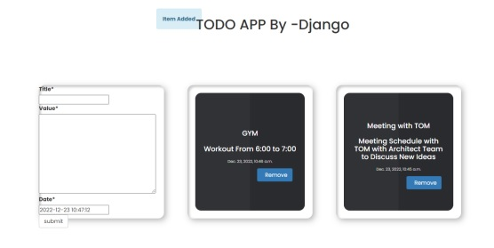</kbd>
</br>

#### 2. Launch an EC2 Ubuntu Instance with access of HTTP & HTTPS
#### 3. Install Jenkins on Ubuntu Machine
#### 4. Setup Jenkins & Connect with GIT by Installing Github Integration
#### 5. Finally Enable the Jenkins Script for CI/CD of Docker Provision Django Application


### Step 1:

Clone the Django TODO app by running below command & push that code to your Personal Repository

```
git clone https://github.com/apotitech/DEVOPS_101_PROJECTS.git
```

Note: You need to push this application to your personal repository so you can add SSH keys & add webhooks to implement CI/CD Integration.


### Step 2:

Go to your AWS Account & Launch an Ubuntu Instance
Open EC2 -> Instances --> Launch an EC2 Instance
Select Ubuntu Image

</br>
<kbd align="center">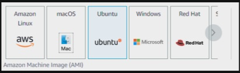</kbd>
</br>

Provide Following Details

Name = SampleDjangoApp

Instance Type = t2.micro

Allow HTTP & HTTPS Traffic From Internet

Once Done Launch Your EC2 Instance

Note: Please Create a new key pair or use existing one to login


### Step 3: 

Connect to your EC2 Instance to Install Jenkins 
Run below Commands One by One

Update Your System
```
sudo apt update
```

Install JAVA
```
sudo apt install openjdk-11-jre
```

Check JAVA Version by running below command
```
java -version
```

Now Install Jenkins

```
curl -fsSL https://pkg.jenkins.io/debian/jenkins.io.key | sudo tee \   /usr/share/keyrings/jenkins-keyring.asc > /dev/null
```

```
echo deb [signed-by=/usr/share/keyrings/jenkins-keyring.asc] \   https://pkg.jenkins.io/debian binary/ | sudo tee \   /etc/apt/sources.list.d/jenkins.list > /dev/null
```


```
sudo apt-get update 
```


```
sudo apt-get install jenkins
```


Once Done Enable & Start the Jenkins Service


```
sudo systemctl enable jenkins
```

Starts the Jenkins Service
```
sudo systemctl start jenkins
```

Check the Service Status
```
sudo systemctl status jenkins
```


Now Goto Security Group of your EC2 Instance & provide below Inbound Rules & Save Changes

</br>
<kbd align="center">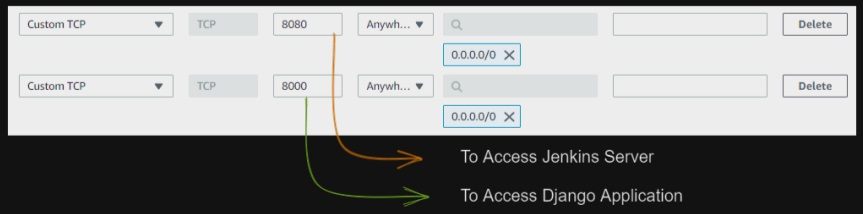</kbd>
</br>

Now Open your Jenkins Server by Below Address

```
http:// [public-ip]:8080 /
```

You can see below screen 

</br>
<kbd align="center">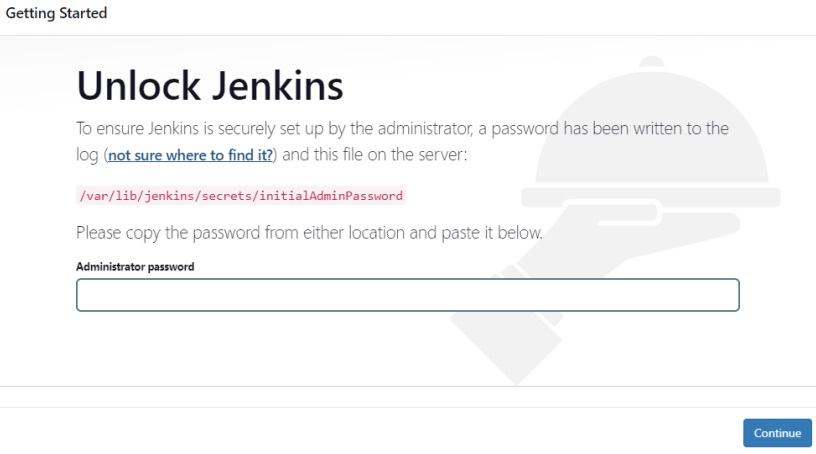</kbd>
</br>


### Step 4:

Now Locate your Jenkins Administrator password by command


```
sudo cat /var/lib/jenkins/secrets/initialAdminPassword
```


Enter that password & select Install Suggested Plugins Once Done Provide the Necessary Details & click on Save & Continue

Check the Jenkins URL & click on Save & Finish

Now Click on Start Using Jenkins you can see below screen 

</br>
<kbd align="center">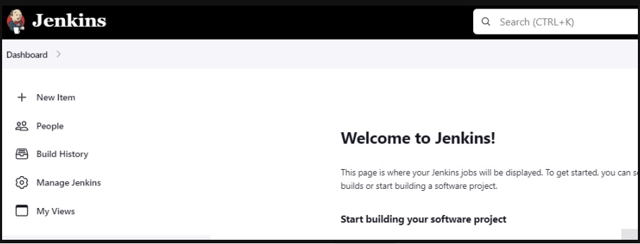</kbd>
</br>

Provide Item Name, we are using freestyle pipeline so choose freestyle project

</br>
<kbd align="center">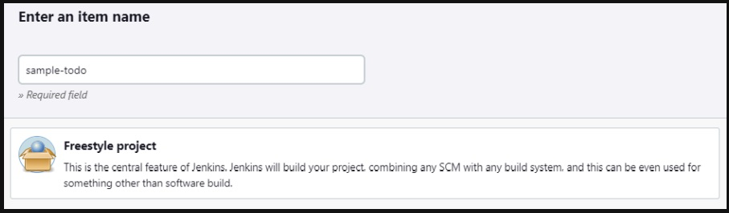</kbd>
</br>

Once Done Click on save

Before Configuring lets connect Jenkins with GIT using SSH

Go to your EC2 Instance & run below command

```
ssh-keygen
```


It will generate public & private key provide public key to GitHub & provide private key for Jenkins
Access the keys changing the directory to

```
cd .ssh
ls
```


Now Go to your GitHub & provide the public key as
```
cat id_rsa.pub
```

</br>
<kbd align="center">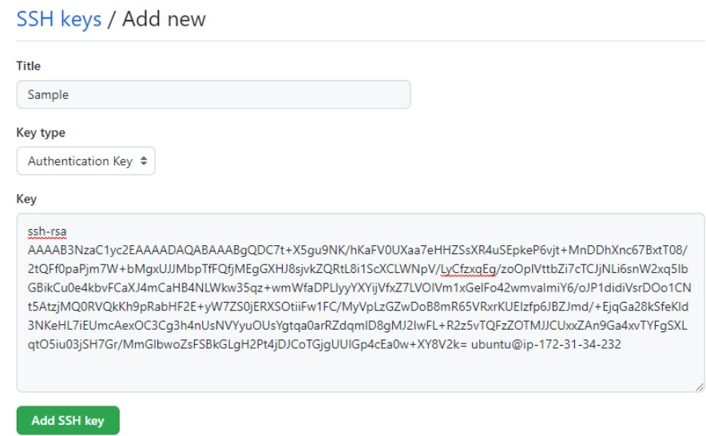</kbd>
</br>

Copy that key and add to your GitHub SSH Keys Section


As you can see i have added the SSH key for the GitHub
Now similarly add private key to your Jenkins
Go to your Project -->  Configure

Check Github Project & Provide the Project URL

</br>
<kbd align="center">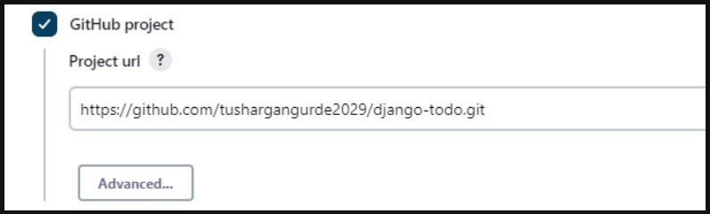</kbd>
</br>

In Source Code Management select GIT and paste the repository URL 

</br>
<kbd align="center">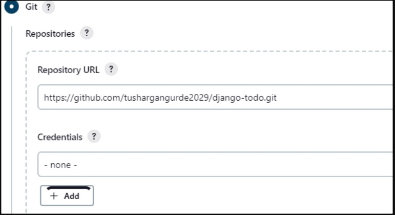</kbd>
</br>

Now in credentials click on add

Provide the Details
In kind select SSH with Private Key
Username select as Ubuntu  -->  Username of EC2 Instance

In Private key select Entire Directly & paste your Private Key as we copied public key

```
cat id_rsa
```
</br>
<kbd align="center">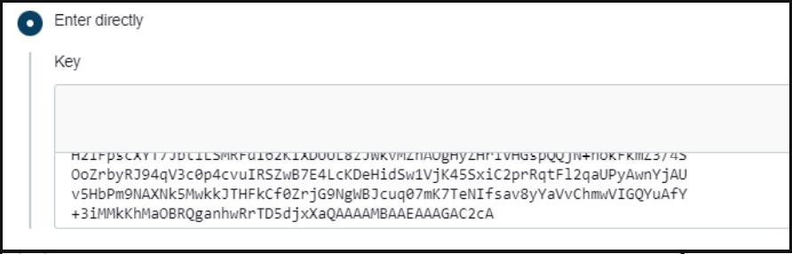</kbd>
</br>

Once Done Check Specifier For me it's main

</br>
<kbd align="center">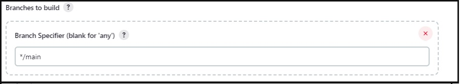</kbd>
</br>

Now click on Save

After that click on Build Now

You can see build is started Once Done open that build 

Go to console output & copy the address

</br>
<kbd align="center">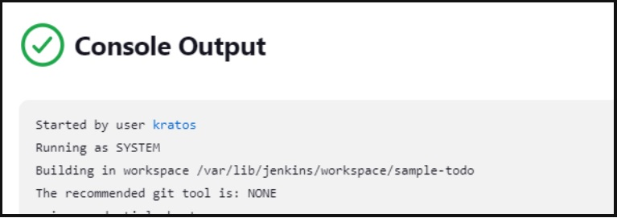</kbd>
</br>

Now open your Instance & change Directory with

```
cd /var/lib/jenkins/workspace/Item-Name(For me its sample-todo)
```

After that run ls you can see our project is present now lets install docker and build the docker image by following commands 


```
sudo apt install docker.io
```

Once Docker is Installed build Image by following Command

```
sudo docker build . -t todo
```

After Successfully image is built run the image by

```
sudo docker run --name todo -d -p 8000:8000 todo
```

Here Container-name --> todo , -d --> detached mode , -p -->Expose port 8000


Verify the application is running or not by below URL

```
http:// [public-ip]:8000
```

As you can see our application is running successfully 

</br>
<kbd align="center">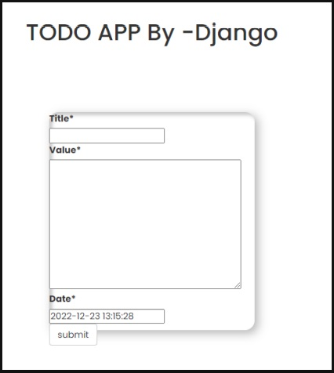</kbd>
</br>

### Step 5:

Let's add a git webhook to implement Continuous Delivery

First Install GitHub Integration Plugin For Jenkins
Go to Jenkins --> Manage Jenkins --> Manage Plugins

In Available Plugins search for GitHub Integration select the plugin & click on Install without restart

</br>
<kbd align="center">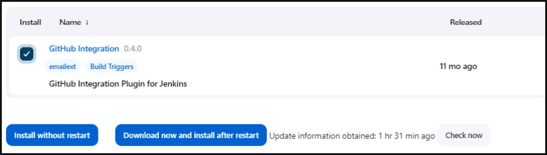</kbd>
</br>

Once Installation is done go to your Jenkins & configure After Opening Configuration check the dialog box as shown in the image

</br>
<kbd align="center"></kbd>
</br>

Check the Dialog Box in build triggers section

Once Done go to Build Steps section click on add build step 
select execute shell
And add the below commands as shown in the image

</br>
<kbd align="center"></kbd>
</br>


```
docker kill todo
docker rm todo
docker build . -t todo
docker run --name todo -p 8000:8000 -d todo
```


After that click on save 

Now go to your GitHub open project repository click on Settings
In settings click on --> WebHook --> Add Webhook
Provide the Payload URL as

Jenkins-URL/github-webhook/


Refet the below Image for Configurations

</br>
<kbd align="center">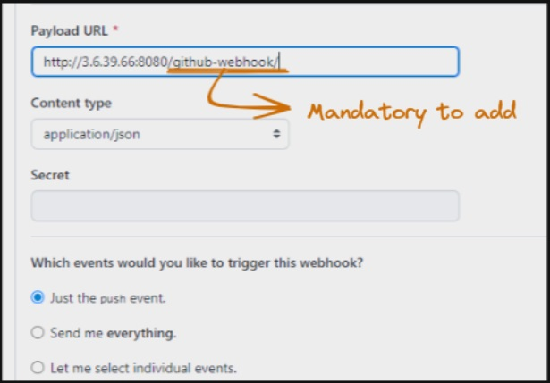</kbd>
</br>

After that click on Add Webhook

Once Webhook is added go to your EC2 Instance give 
Jenkins access to run Docker commands by below command 

```
sudo usermod -a -G docker jenkins
```

After that restart the jenkins server by below command

```
sudo systemctl restart jenkins
```

All the steps are successfully completed

Now try to change the code and push the changes to GIT
it will run a build and new docker image will be created & it will be automatically going to deploy on your EC2 Instance

</br>
<kbd align="center">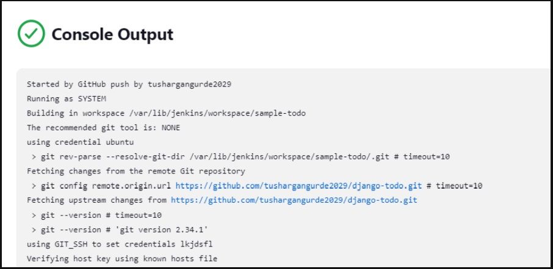</kbd>
</br>

As you can see in the above image build successfully run by github after pushing code and also title has been change and new image is deployed successfully.

</br>
<kbd align="center">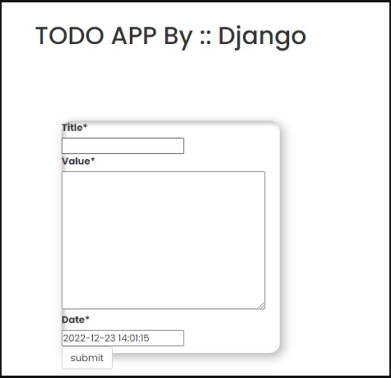</kbd>
</br>


Follow For More Devops: - Please check our website

<https://devcloudninjas.com>
