# Project: Host a Static Website (RESUME) on AWS with S3, Cloud-Front, Route53    

 
<kbd align="center">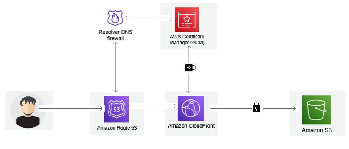</kbd>
 

## Pre-requisites:-

* AWS Account
* GitHub Account
* Custom Domain
* Basic Knowledge About CloudFront, S3, Route53, AWS Certificate Manager

### Steps:

#### 1. Create your own Resume/Portfolio Website or Clone the sample repository created for this project.

 
<kbd align="center">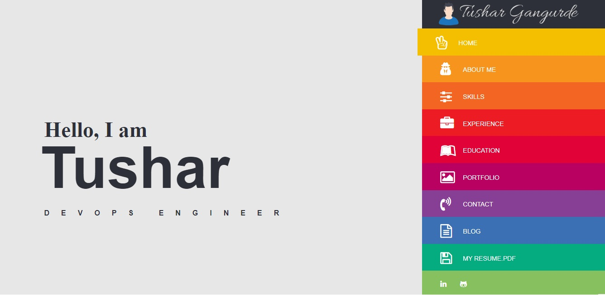</kbd>
 

#### 2. Create a New S3 Bucket & Upload your Resume Website Files.

#### 3. Enable S3 Static Website Hosting Feature

#### 4. Connect your Domain to Route53 by Creating a Hosted Zone.

#### 5. Obtain a SSL Certificate 

#### 6. Create a CloudFront Distribution & Connect it with your S3 Bucket 

#### 7. Set Bucket Policy to Allow Cloudfront to access S3

#### 8. Connect CloudFront to Route53 to redirect Traffic

#### 9. Finally Visit your Website to See the Resume

### Step 1:-
If you have not any Project Please use Below GitHub Repository it contains a Sample Resume Website

Note:Before Proceeding you should have your custom Domain you can buy a new domain or you can get a free  domain from Freenom.com

### Step 2:
Let's Create a new S3 Bucket and upload our Resume Files Go to your AWS Console & Open S3 & click on Create Bucket

 
<kbd align="center">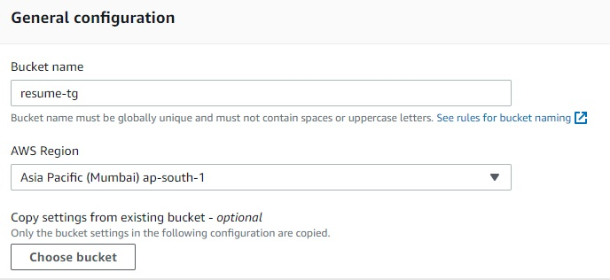</kbd>
 

Provide Bucket Name & choose Your Region 

 
<kbd align="center">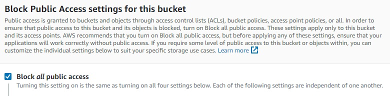</kbd>
 

For Security reasons block Public Access we are going to use CloudFront for Serve the Website

 
<kbd align="center">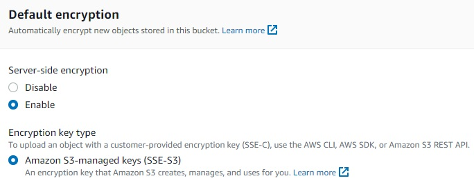</kbd>
 

We are using Server-Side encryption with Amazon S3-Manged  Keys to reduce overhead of key management

After that click on Create Bucket & open your Bucket

Upload your Resume Website Files

 
<kbd align="center">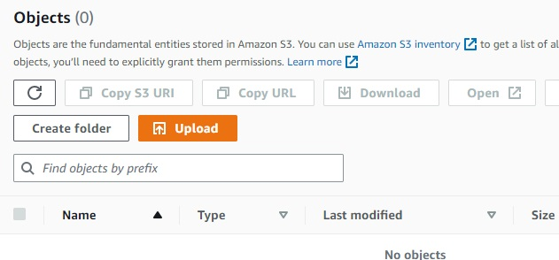</kbd>
 

Finally Upload your Website Files

 
<kbd align="center"></kbd>
 

You can see I have Successfully Uploaded My Website Files

### Step 3:-

Now Let's Enable S3 Static Website Hosting Feature

Go to your Bucket -> Properties -> Static Website Hosting

as shown in below image edit & enable feature

 
<kbd align="center">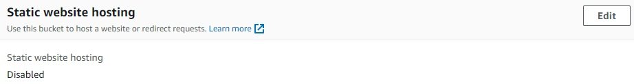</kbd>
 

Provide Your Index Document for me its index.html

After that click on Save Changes.

### Step 4:-

Let's Connect our Domain to Route53

Go to Route53 in AWS -> Hosted Zone 

Create a new Hosted Zone

 
<kbd align="center">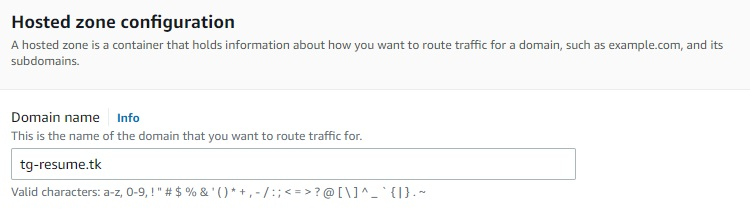</kbd>
 

Provide Your Domain Name & Click on Create Hosted Zone

Now Let's Connect our domain to Route53

Open your Hosted Zone You can see 4 NS Records , we

need to add that in our Domain Fields.

Go to your Domain Management & add 4 NameServers

as shown in the below image

 
<kbd align="center">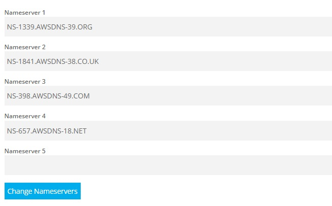</kbd>
 

You have successfully created your domain to Route53

### Step 5:-

Let's Obtain a SSL Certificate from AWS Certificate Manager

Go to your AWS Console -> Certificate Manager

Click on List Certificates -> Request

You can see below screen click on next

 
<kbd align="center">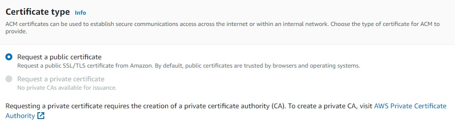</kbd>
 

Provide your domain name let all the configurations as it is and click on Request

You can see your Request status as "Pending Validation"

Open that Certificate & click on created records in Route53 as shown in the below image

 
<kbd align="center">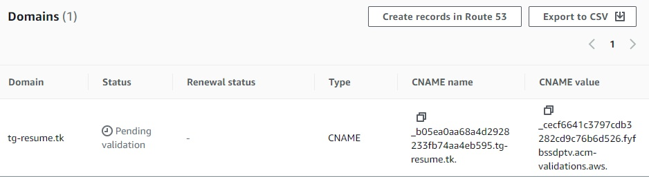</kbd>
 

After that click on Create Records

 
<kbd align="center">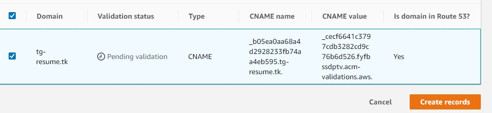</kbd>
 

After few minutes you can see your Certificate status as "Issued"

### Step 6:-

Let's Create a CloudFront distribution with S3 bucket origin and SSL Certificate

Go to your AWS Console -> CloudFront -> Create Distribution

Provide the Origin Domain as your S3 Bucket 

 
<kbd align="center">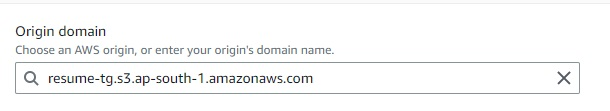</kbd>
 

Provide the Origin Access as shown in image & select your Bucket

 
<kbd align="center">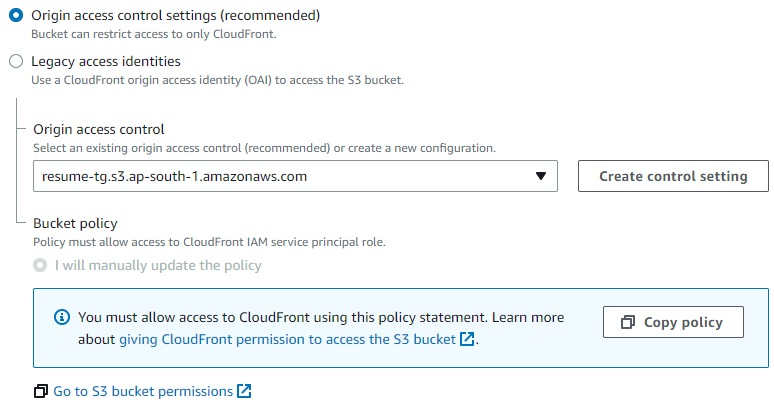</kbd>
 

Provide the Viewer protocol policy as shown in the image as we are going to redirect the traffic to HTTPS

 
<kbd align="center">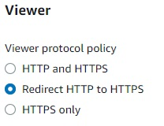</kbd>
 

Add your Alternate Domain Name 

 
<kbd align="center">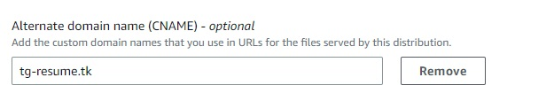</kbd>
 

Add your SSL Certificate

 
<kbd align="center">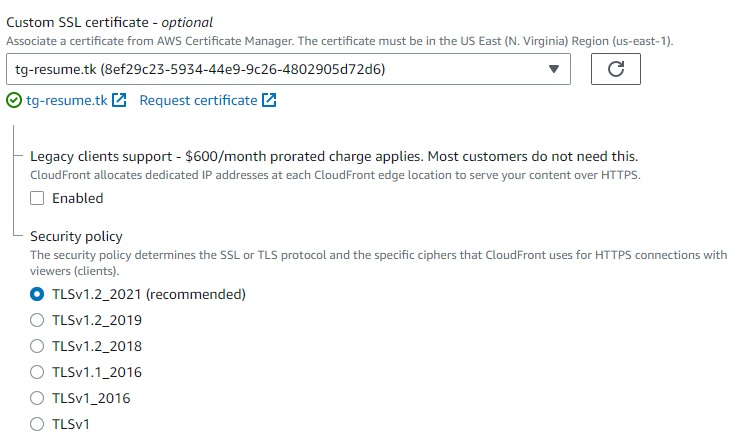</kbd>
 

Finally click on Create Distribution

### Step 7:

Let's Set Bucket Policy to allow cloudfront to access s3

Go to Buckets -> Open the Bucket we have created

Go to Permission -> Edit Bucket Policy

 
<kbd align="center">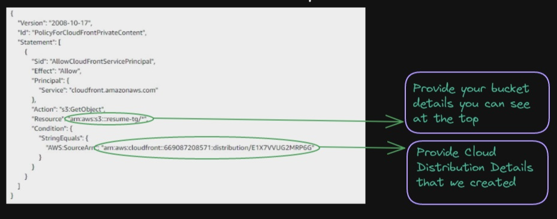</kbd>
 

As shown in the image give the same policy edit the provided info as per your bucket and cloudfront distribution

After that click on Save Changes 

### Step 8:

Now Let's Connect our CloudFront to Route53

Go to Route53 -> Hosted Zone -> Open hosted zone that

we have created

After that click on Create Record

Record Type -> A

Alias -> should be enable

Route Traffic to -> Alias to cloudfront distribution

choose distribution that we have created

Finally click on Create Records 

 
<kbd align="center">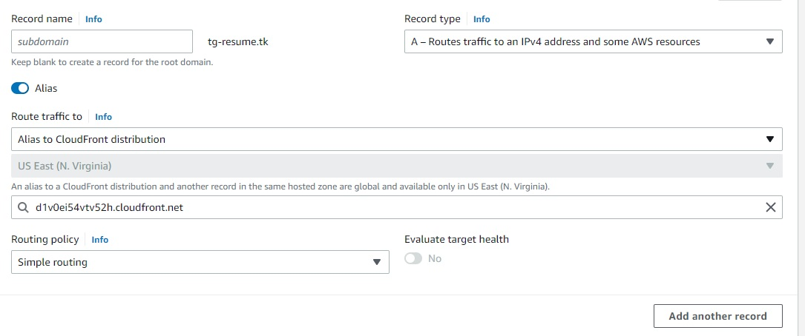</kbd>
 

Refer the above Image for Configurations

### Step 9:-

Let's add a error page so that if any error request occurs users should redirect to error page

Go to CloudFront -> Open the CloudFront Distribution that

we have created

Open Error Pages click on Create custom error response

 
<kbd align="center">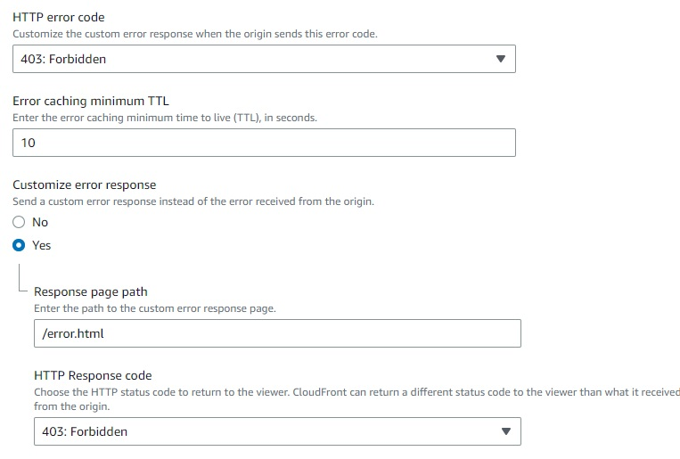</kbd>
 

After that click on Save Changes if we anything like

URL/random_string

we can see the error Page

 
<kbd align="center"></kbd>
 

Now you can visit your Website & its Completely hostedby the AWS.

Follow For More Devops: -
https://www.linkedin.com/in/devops-learning
