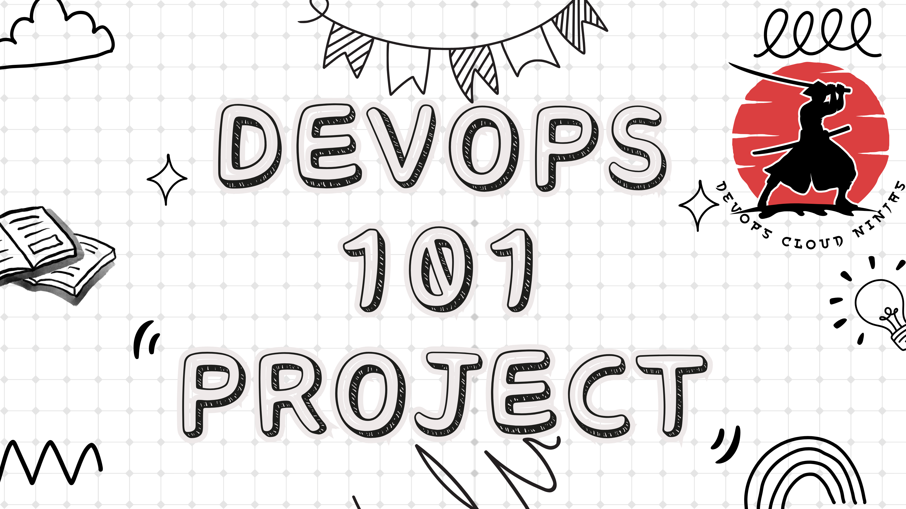

# DevOps_101_Projects
A detailed track on my DevOps AWS journey with System Architecture

| Projects | Description    |
| :---:   | :---: |
| [Project 1](https://github.com/DevOpsCloudNinjas/DevOps_101_Projects/tree/main/PROJECT_1) | Multi Tier Web Application Setup On A Local Machine Using A Manual Process   |
| [Project 2](https://github.com/DevOpsCloudNinjas/DevOps_101_Projects/tree/main/PROJECT_2) | Automated setup of Multi Tier Application   |
| [Project 3](https://github.com/DevOpsCloudNinjas/DevOps_101_Projects/tree/main/PROJECT_3) | Amazon Web Service (AWS) Cloud For Web Application Setup [LIFT AND SHIFT]   |
| [Project 4](https://github.com/DevOpsCloudNinjas/DevOps_101_Projects/tree/main/PROJECT_4) | Refactoring with Amazon Web Service (AWS)   |
| [Project 5](https://github.com/DevOpsCloudNinjas/DevOps_101_Projects/tree/main/PROJECT_5) | Continuous integration using Jenkins, Nexus, Sonarqube AND Slack   |
| [Project 6](https://github.com/DevOpsCloudNinjas/DevOps_101_Projects/tree/main/PROJECT_6) | Continuous Integration On AWS   |
| [Project 7](https://github.com/DevOpsCloudNinjas/DevOps_101_Projects/tree/main/PROJECT_7) | Continuous Delivery With Jenkins And Tools On AWS   |
| [Project 8](https://github.com/DevOpsCloudNinjas/DevOps_101_Projects/tree/main/PROJECT_8) | Continuous Delivery On AWS Using Its Managed Services   |
| [Project 9](https://github.com/DevOpsCloudNinjas/DevOps_101_Projects/tree/main/PROJECT_9) | Ansible For AWS Virtual Private Cloud (VPC)   |
| [Project 10](https://github.com/DevOpsCloudNinjas/DevOps_101_Projects/tree/main/PROJECT_10) | Continuous Delivery Using Jenkins And Ansible On Amazon Web Service (AWS)   |
| [Project 11](https://github.com/DevOpsCloudNinjas/DevOps_101_Projects/tree/main/PROJECT_11) | Hybrid Continuous Delivery Using Jenkins And Amazon Web Service (AWS)  |
| [Project 12](https://github.com/DevOpsCloudNinjas/DevOps_101_Projects/tree/main/PROJECT_12) | Containerization Of Java Project Using Docker  |
| [Project 13](https://github.com/DevOpsCloudNinjas/DevOps_101_Projects/tree/main/PROJECT_13) | Java App Deployment on Kubernetes Cluster  |
| [Project 14](https://github.com/DevOpsCloudNinjas/DevOps_101_Projects/tree/main/PROJECT_14) | Terraform For Cloud State Management  |
| [Project 15](https://github.com/DevOpsCloudNinjas/DevOps_101_Projects/tree/main/PROJECT_15) | Continuous Delivery For Docker Containers And Kubernetes On AWS Managed Kubernetes Cluster  |
| [Project 16](https://github.com/DevOpsCloudNinjas/DevOps_101_Projects/tree/main/PROJECT_16_Django_App_Docker_Jenkins_CI-CD) | Deploying a Django App using Jenkins |
| [Project 17](https://github.com/DevOpsCloudNinjas/DevOps_101_Projects/tree/main/PROJECT_17_Host_a_Static_Website_(RESUME)_AWS) | Hosting our Static Website in S3 Bucket  |
| [Project 18](https://github.com/DevOpsCloudNinjas/DevOps_101_Projects/tree/main/Pipeline-As-A-Code) | Building Our Project using Pipeline |

