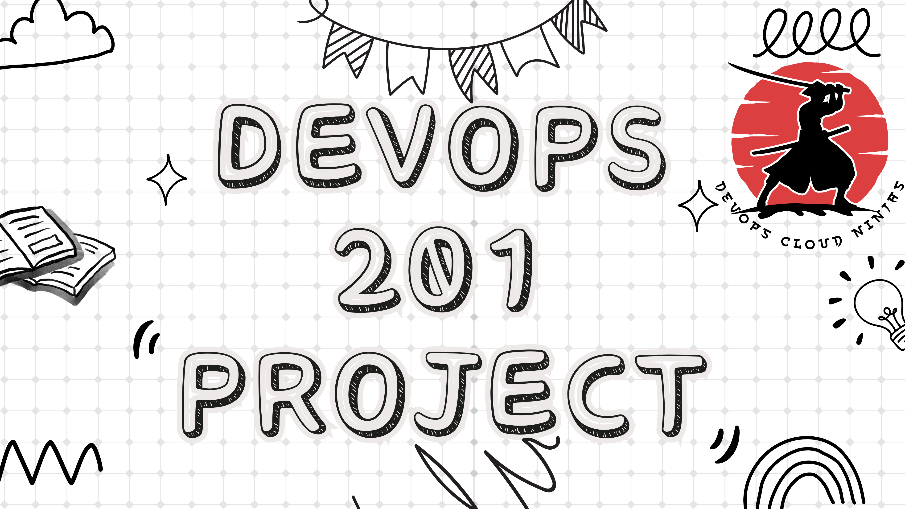

# DevOps_201_Projects

DevOps Cloud Ninjas Project Based Learning

| Projects | Description    |
| :---:   | :---: |
| [project-1](https://github.com/DevOpsCloudNinjas/DevOps_201_Projects/tree/main/project-1) | ***AWS-LAMP-STACK IMPLEMENTATION***   |
| [project-2](https://github.com/DevOpsCloudNinjas/DevOps_201_Projects/tree/main/project-2) | ***LEMP STACK IMPLEMENTATION***   |
| [project-3](https://github.com/DevOpsCloudNinjas/DevOps_201_Projects/tree/main/project-3) | ***MERN WEB STACK IMPLEMENTATION***   |
| [project-4](https://github.com/DevOpsCloudNinjas/DevOps_201_Projects/tree/main/project-4) | ***MEAN STACK IMPLEMENTATION***   |
| [project-5](https://github.com/DevOpsCloudNinjas/DevOps_201_Projects/tree/main/project-5) | ***IMPLEMENT A CLIENT SERVER ARCHITECTURE USING MYSQL DATABASE MANAGEMENT SYSTEM (DBMS)***   |
| [project-6](https://github.com/DevOpsCloudNinjas/DevOps_201_Projects/tree/main/project-6) | ***WEB SOLUTION WITH WORDPRESS***   |
| [project-7](https://github.com/DevOpsCloudNinjas/DevOps_201_Projects/tree/main/project-7) | ***DEVOPS TOOLING WEBSITE SOLUTION***   |
| [project-8](https://github.com/DevOpsCloudNinjas/DevOps_201_Projects/tree/main/project-8) | ***LOAD BALANCER SOLUTION WITH APACHE***   |
| [project-9](https://github.com/DevOpsCloudNinjas/DevOps_201_Projects/tree/main/project-9) | ***CONTINOUS INTEGRATION PIPELINE FOR TOOLING WEBSITE***   |
| [project-10](https://github.com/DevOpsCloudNinjas/DevOps_201_Projects/tree/main/project-10) | ***LOAD BALANCER SOLUTION WITH NGINX AND SSL/TLS***   |
| [project-11](https://github.com/DevOpsCloudNinjas/DevOps_201_Projects/tree/main/project-11) | ***ANSIBLE CONFIGURATION MANAGEMENT (Automate project 7 to 10)***  |
| [project-12](https://github.com/DevOpsCloudNinjas/DevOps_201_Projects/tree/main/project-12) | ***ANSIBLE REFACTORING AND STATIC ASSIGNMENTS (IMPORTS AND ROLES)***  |
| [project-13](https://github.com/DevOpsCloudNinjas/DevOps_201_Projects/tree/main/project-13) | ***ANSIBLE DYNAMIC ASSIGNMENTS (INCLUDE) AND COMMUNITY ROLES***  |
| [project-14](https://github.com/DevOpsCloudNinjas/DevOps_201_Projects/tree/main/project-14) | ***EXPERIENCE CONTINUOUS INTEGRATION WITH JENKINS | ANSIBLE | ARTIFACTORY | SONARQUBE | PHP***  |
| [project-15](https://github.com/DevOpsCloudNinjas/DevOps_201_Projects/tree/main/project-15) | ***AWS CLOUD SOLUTION FOR 2 COMPANY WEBSITES USING A REVERSE PROXY TECHNOLOGY***  |
| [project-16](https://github.com/DevOpsCloudNinjas/DevOps_201_Projects/tree/main/project-16) | ***AUTOMATE INFRASTRUCTURE WITH IAC USING TERRAFORM PART 1*** |
| [project-17](https://github.com/DevOpsCloudNinjas/DevOps_201_Projects/tree/main/project-17) | ***AUTOMATE INFRASTRUCTURE WITH IAC USING TERRAFORM. PART 2***  |
| [project-18](https://github.com/DevOpsCloudNinjas/DevOps_201_Projects/tree/main/project-18) | ***AUTOMATE INFRASTRUCTURE WITH IAC USING TERRAFORM. PART 3 --Refactoring*** |
| [project-19](https://github.com/DevOpsCloudNinjas/DevOps_201_Projects/tree/main/project-19) | ***Automate Infrastructure With IaC using Terraform – Terraform Cloud*** |
| [project-20](https://github.com/DevOpsCloudNinjas/DevOps_201_Projects/tree/main/project-20) | ***MIGRATION TO THE СLOUD WITH CONTAINERIZATION PART 1 - DOCKER & DOCKER COMPOSE*** |
| [project-21](https://github.com/DevOpsCloudNinjas/DevOps_201_Projects/tree/main/project-21) | ***ORCHESTRATING CONTAINERS ACROSS MULTIPLE VIRTUAL SERVERS WITH KUBERNETES. PART 1*** |
| [project-22](https://github.com/DevOpsCloudNinjas/DevOps_201_Projects/tree/main/project-22) | ***DEPLOYING APPLICATIONS INTO KUBERNETES CLUSTER*** |
| [project-23](https://github.com/DevOpsCloudNinjas/DevOps_201_Projects/tree/main/project-23) | ***PERSISTING DATA IN KUBERNETES*** |
| [project-24](https://github.com/DevOpsCloudNinjas/DevOps_201_Projects/tree/main/project-24) | ***BUILDING ELASTIC KUBERNETES SERVICE (EKS) WITH TERRAFORM*** |
| [project-25](https://github.com/DevOpsCloudNinjas/DevOps_201_Projects/tree/main/project-25) | ***PACKAGING CONTAINERIZED APPLICATIONS INTO HELM CHARTS*** |

