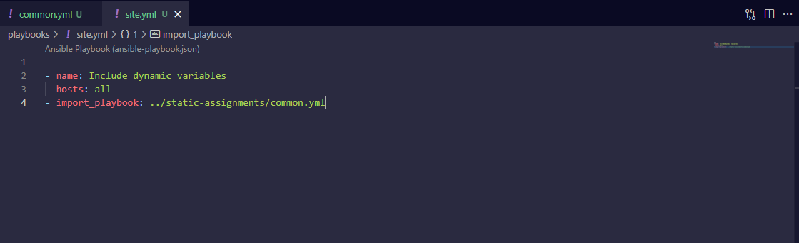
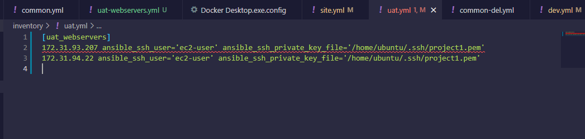
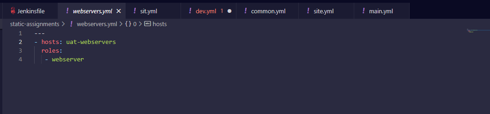

# ANSIBLE REFACTORING AND STATIC ASSIGNMENT (IMPORTS AND ROLES)
## INTRODUCTION

In continuation of [project 11](./project11.md), the ansible code in my ansible-config-mgt repository is refactored into making use of the import functionality– which allows us to effectively re-use previously created playbooks in a new playbook, and assigning task in the playbook with role functionality.

The following outlines the steps taken:

## STEP 1: Enhancing The Jenkins Job

- Since artifacts stored in Jenkins server changes directory at each build. Inorder to keep tabs on recent artifacts, copy-artifacts plugin is implemented to copy recent artifacts from a build and paste it automatically to a specified directory where ansible playbook can be run with ease.
- Creating a new directory on the Jenkins-ansible server where the artifacts will be copied to:`$ sudo mkdir /home/ubuntu/ansible-config-artifact`
- Changing the permissions: `$ chmod -R 0777 /home/ubuntu/ansible-config-artifact`


- From the Jenkins web console, onto the manage plugin, then on the available tab, searching for copy-artifact plugin and installing the plugin


- Creating a new freestyle job ‘save-artifact’ and configuring it to be triggered on the completion of the existing ‘ansible’ job:


**On the general tab**


**On the build trigger tab**


**On the build tab**


- Testing the configuration by making a change in the README.md file:

**Ansible build triggered with save_artifacts**


**Artifacts successfully saved on the /home/ubuntu/ansible-config-artifact**


## STEP 2: Refactoring Ansible Code

- Pulling the latest changes from the main branch: `git pull`
Checkout to new branch ‘refactor’: `git checkout -b refactor`


- Creating site.yml file in the playbooks folder. The file will be considered as an entry point into the entire infrastructure, ie, site.yml will be the parent to all other playbook
- Creating ‘static-assignments’ folder in the root of the repository. This is where all the children playbooks are stored 
- Moving the common.yml file to the static-assignments folder
- Configuring the site.yml file to import common.yml file
```
---
- hosts: all
- import_playbook: ../static-assignments/common.yml

```


**The ansible-config-mgt folder structure**


- Since the wireshark has been installed on the webservers, so common-del.yml is used instead of common.yml to uninstall wireshark

**common-del.yml playbook file**
```
---
- name: update web, nfs and db servers
  hosts: webservers, nfs
  remote_user: ec2-user
  become: yes
  become_user: root
  tasks:
  - name: delete wireshark
    yum:
      name: wireshark
      state: removed

- name: update LB server
  hosts: lb, db
  remote_user: ubuntu
  become: yes
  become_user: root
  tasks:
  - name: delete wireshark
    apt:
      name: wireshark-qt
      state: absent
      autoremove: yes
      purge: yes
      autoclean: yes
      
```


**updating site.yml playbook file**

```
---
- hosts: all
- import_playbook: ../static-assignments/common-del.yml

```


- Running the ansible-playbook command against dev.yml inventory file: `$ sudo ansible-playbook -i /home/ubuntu/ansible-config-artifact/inventory/dev.yml /home/ubuntu/ansible-config-artifact/playbooks/site.yml`


## STEP 3: Making Use Of Role Functionalities

- To demonstrate the role functions, 2 new Red Hat servers are launched and are used as UAT(User Acceptance Testing).
- Configuring the uat.yml in the inventory folder with the ip address of the 2 new servers launched
```

[uat-webservers]
<Web1-UAT-Server-Private-IP-Address> ansible_ssh_user='ec2-user' ansible_ssh_private_key_file=<path-to-.pem-private-key>
<Web2-UAT-Server-Private-IP-Address> ansible_ssh_user='ec2-user' ansible_ssh_private_key_file=<path-to-.pem-private-key>

```


- To create a role for the UAT webservers, the folder ‘role’ is created in the playbooks directory
- Creating a dummy role structure ‘webserver’ with ansible-galaxy command: `$ sudo ansible-galaxy init webserver`


**webserver role folder structure**


- Inorder to make ansible locate the role directory, editing the role section and specifying the role path in the ansible.cfg file: `$ sudo vi /etc/ansible/ansible.cfg`


- Configuring the task file of the webserver role and adding the following task in the main.yml: `$ sudo vi ansible-config-artifact/playbooks/role/webserver/task/main.yml`

```
---
- name: install apache
  become: true
  ansible.builtin.yum:
    name: "httpd"
    state: present

- name: install git
  become: true
  ansible.builtin.yum:
    name: "git"
    state: present

- name: clone a repo
  become: true
  ansible.builtin.git:
    repo: https://github.com/apotitech/tooling.git
    dest: /var/www/html
    force: yes

- name: copy html content to one level up
  become: true
  command: cp -r /var/www/html/html/ /var/www/

- name: Start service httpd, if not started
  become: true
  ansible.builtin.service:
    name: httpd
    state: started

- name: recursively remove /var/www/html/html/ directory
  become: true
  ansible.builtin.file:
    path: /var/www/html/html
    state: absent
    
```


The task file does the following:
1) Install and configure Apache (httpd service)
2) Clone Tooling website from GitHub https://github.com/apotitech/tooling.git.
3) Ensuring the tooling website code is deployed to /var/www/html on each of 2 UAT Web servers.
4) Ensuring httpd service is started

- Creating a new assignment in the static-assignments folder ‘uat-webservers’: `$ sudo vi ansible-config-artifact/static-assignments/uat-webservers.yml`
- Entering the following codes in the uat-webservers.yml file:

```
---
- hosts: uat-webservers
  roles:
     - webserver
     
 ```
 


- Updating the site.yml file to be able to import uat-webservers role

```
- hosts: uat_webservers
- import_playbook: ../static-assignments/uat-webservers.yml

```


## STEP 4: Commit And Running the playbook

- Commiting the changes and pushing the code to the main branch to create a merge request


- Merging the request

**Pull request created**


**Pull request merged**


- Ensuring that Jenkins build is triggered


- Running the ansible playbook: `sudo ansible-playbook -i /home/ubuntu/ansible-config-artifact/inventory/uat.yml /home/ubuntu/ansible-config-artifact/playbooks/site.yml`


