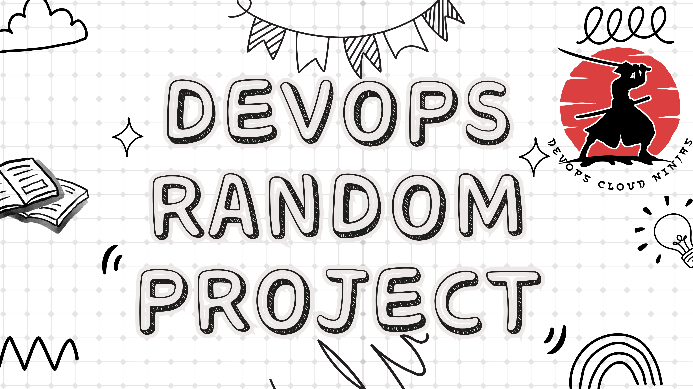

# DEVOPS RANDOM PROJECTS

This repository contains some random real-life projects I carried out during my DevOps career journey!

## Table Of Contents

**Project 1:**    [SETTING UP A LAMP STACK WEB SERVER IN THE AWS CLOUD](./project1.md)

**Project 2:**    [SETTING UP A LEMP STACK WEB SERVER ON AWS CLOUD](./project2.md)

**Project 3:**    [SETTING UP A MERN STACK AND DEPLOYING A TODO APPLICATION ON AWS CLOUD](./project3.md)

**Project 4:**    [DEPLOYING A SIMPLE BOOK REGISTER APPLICATION WITH MEAN STACK IN AWS CLOUD](./project4.md)

**Project 5:**    [IMPLEMENTING A CLIENT SERVER ARCHITECTURE USING MYSQL DATABASE MANAGEMENT SYSTEM (DBMS)](./project5.md)

**Project 6:**    [IMPLEMENTING LOGICAL VOLUME MANAGEMENT AND WORDPRESS WEB SOLUTION PROJECT](./project6.md)

**Project 7:**    [IMPLEMENTATION OF WEB APPLICATION ARCHITECTURE WITH A SINGLE DATABASE AND NFS SERVER](./project7.md)

**Project 8:**    [LOAD BALANCER SOLUTION WITH APACHE](./project8.md)

**Project 9:**    [WORKING WITH JENKINS - CI/CD PROJECT](./project9.md)

**Project 10:**   [LOAD BALANCER SOLUTION WITH NGINX AND SSL/TLS](./project10.md)

**Project 11:**   [AUTOMATING PROJECTS WITH ANSIBLE CONFIGURATION MANAGEMENT](./project11.md)

**Project 12:**   [ANSIBLE REFACTORING AND STATIC ASSIGNMENT (IMPORTS AND ROLES)](./Project12.md)

**Project 13:**   [INTRODUCING ANSIBLE DYNAMIC ASSIGNMENTS(INCLUDE) AND COMMUNITY ROLES](./project13.md)

**Project 14:**   [CONTINOUS INTEGRATION WITH JENKINS, ANSIBLE, ARTIFACTORY SONARQUBE AND PHP](./project14.md)

**Project 15:**   [AWS CLOUD SOLUTION FOR 2 COMPANY WEBSITES USING A REVERSE PROXY TECHNOLOGY](./project15.md)

**Project 16:**   [AUTOMATING INFRASTRUCTURE WITH IAC USING TERRAFORM PART 1](./project16.md)

**Project 17:**   [AUTOMATING INFRASTRUCTURE WITH IAC USING TERRAFORM PART 2](./project17.md)

**Project 18:**   [AUTOMATING INFRASTRUCTURE WITH IAC USING TERRAFORM PART 3 – REFACTORING](./project18.md)

**Project 19:**   [AUTOMATING INFRASTRUCTURE WITH IAC USING TERRAFORM PART 4 – TERRAFORM CLOUD](./project19.md)

**Project 20:**   [MIGRATION TO THE CLOUD WITH CONTAINERIZATION - DOCKER](./project20.md)

**Project 21:**   [SETTING UP A KUBERNETES CLUSTER FROM GROUND UP (THE HARD WAY)](./project21.md)

**Project 22:**   [DEPLOYING APPLICATIONS INTO KUBERNETES CLUSTER](./project22.md)

**Project 23:**   [PERSISTING DATA IN KUBERNETES](./project23.md)

**Project 24:**   [BUILDING ELASTIC KUBERNETES SERVICE (EKS) WITH TERRAFORM](./project24.md)

**Aux Project:**  [ONBOARDING NEW LINUX USERS ONTO A SERVER WITH SHELL SCRIPT](./auxillary-projects.md)

