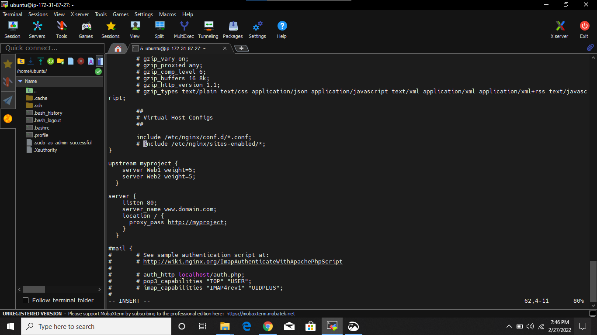
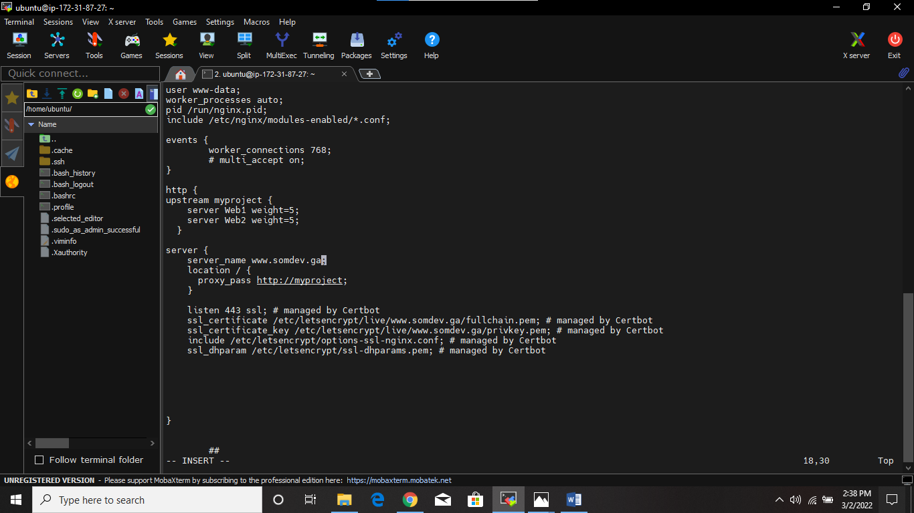
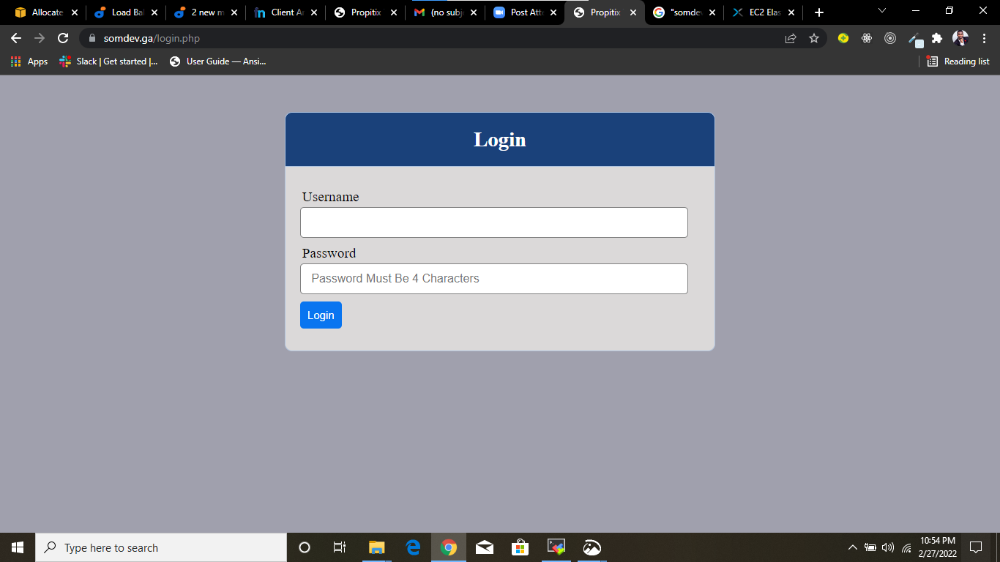

# LOAD BALANCER SOLUTION WITH NGINX AND SSL/TLS
## INTRODUCTION

In this project, the web application architecture in [project 8](./project8.md) is improved by replacing Apache load balancer with a powerful load balancer server called NGINX and also configuring a secure connection using SSL/TLS certificates.

The following outlines the steps I took:

## STEP 0: Launching A New Instance
I terminated the apache load balancer server and launched a new EC2 Instance(Ubuntu 20.04) which will be used as Nginx load balancer and also started all the EC2 instances that was setup in [project 7](./project7.md). 
Then I connected to the Ubuntu server on my terminal via ssh connection.

## STEP 1: Configuring Nginx As A Load Balancer
-	Updating and upgrading the server:

`$ sudo apt update`


`$ sudo apt upgrade`


-	Installing Nginx: `$ sudo apt install nginx`


-	Assigning names to the 2 Webservers IP address ‘’Web1’’ and ‘’Web2’’ in the host files: `$ sudo vi /etc/hosts`


-	Configuring the Nginx LB to make use of the Webserver’s names defined in the **/etc/hosts**: `$ sudo vi /etc/nginx/nginx.conf`
-	Adding the following configuration in the http section:
```	
	 upstream myproject {
	    server Web1 weight=5;
	    server Web2 weight=5;
	  }
	
	server {
	    listen 80;
	    server_name www.domain.com;
	    location / {
	      proxy_pass http://myproject;
    }
  }
 ``` 


-	Restarting the Nginx service: `$ sudo systemctl restart nginx`
-	To ensure that the Nginx service is up and running: `$ sudo systemctl status nginx`


-	Opening TCP port 80 for HTTP and 443 for HTTPS on the security group


## STEP 2: Configuring Secured Connection Using SSL/TLS

-	Configuring nginx to recognize my new domain name: `$ sudo vi /etc/nginx/nginx.conf`



-	Ensuring that snapd service is active and running inorder to install certbot: `$ sudo systemctl status snapd`


-	Installing certbot that will be used to request for SSL/TLS certificate: `$ sudo snap install - -classic certbot`


-	Creating a symlink for the certbot from /snap/bin to /usr/bin: `$ sudo ln -s /snap/bin/certbot /usr/bin/certbot`


-	Requesting for my certificate and selecting my domain name: `$ sudo certbot - -nginx`


-	Testing the tooling website on my web browser with my domain name: https://www.somdev.ga 




## STEP 3: Setting Up A Periodical Renewal of My SSL/TSL Certificate

-	Testing the renewal command in a dry-run mode: `$ sudo certbot renew - -dry-run`


-	Configuring a cronjob to run renew command for my SSL/TSL certificate twice a day: `$ crontab -e`


-	Adding the following line:

`	* */12 * * *   root /usr/bin/certbot renew > /dev/null 2>&1`


