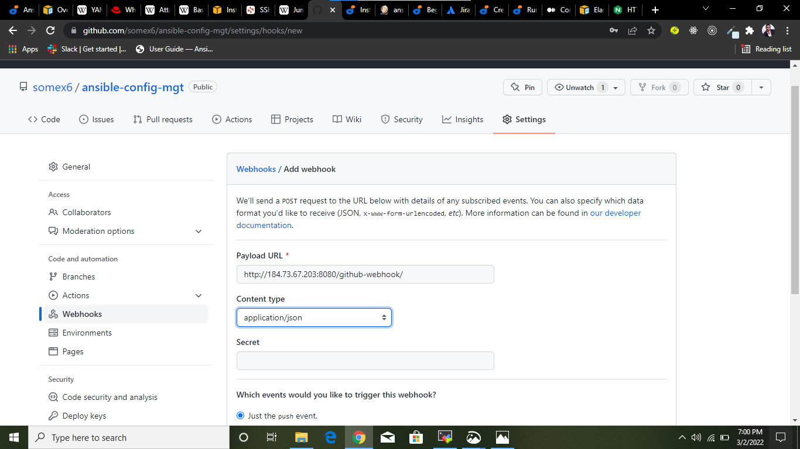
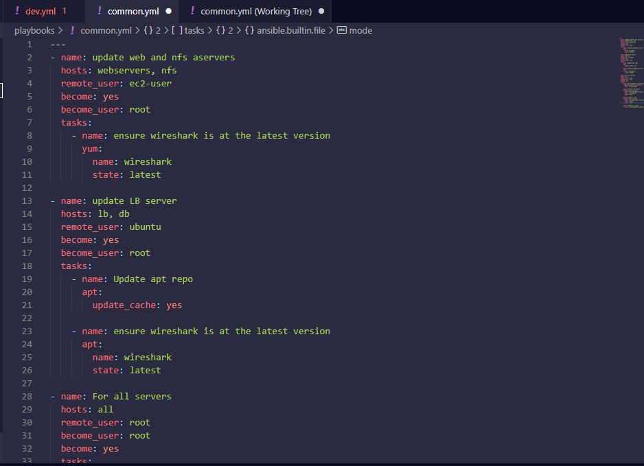
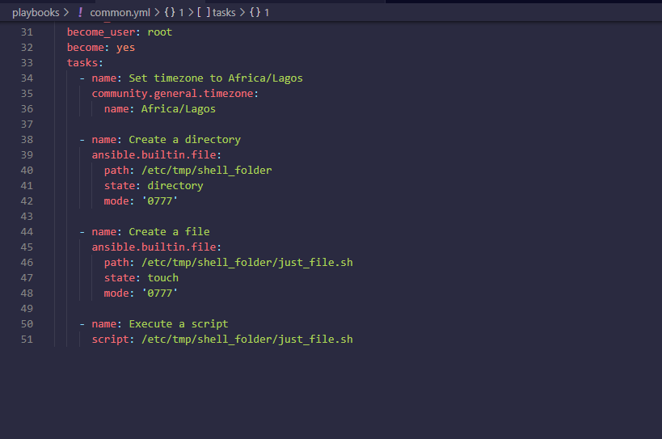
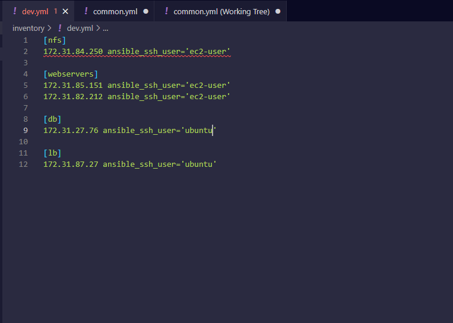

# AUTOMATING PROJECTS WITH ANSIBLE CONFIGURATION MANAGEMENT
## INTRODUCTION
In this project, the Jenkins server from [project 9](./project9.md) Web Architecture is setup and configured to function as a **Jump Server or Bastion Host** by using Ansible Configuration Management which helps to automate most of repetitive tasks done in previous projects.

The following outlines the steps I took in configuring an Ansible server and also configuring a build task in Jenkins job that is linked to my Github repository to trigger whenever there is a change in the main branch by the use of webhooks, of which the artifacts from the build are used to automate tasks with Ansible playbook.

## STEP 0: Connecting To The Jenkins Server
I updated the tag name of the Jenkins server to **Jenkins-Ansible** and connecting to it from my terminal via ssh connection and also starting the whole servers setup in project 7-8 for ansible playbook to perform task on them.

## STEP 1: Configuring Ansible In The Jenkins-Ansible Server
-	Updating the server: `$ sudo apt update`


-	Installing Ansible package: `$ sudo apt install ansible`


-	Checking the Ansible version: `$ ansible --version`


## STEP 3: Creating A Freestyle Job
-	Creating a new Github repository **ansible-config-mgt** where the Jenkins-Ansible server will build job from.


-	Activating webhook in the repository setting in order to trigger a build whenever there is a change in the main branch. Using the Jenkins-Ansible server public IP as the payload url



-	Opening the Jenkins web console from my web browser with the Jenkins server IP address and creating a freestyle job called **ansible**


-	Inputting the ansible-config-mgt repository url and adding my credentials


-	Selecting “GitHub hook trigger for GITScm polling” option to trigger build whenever a change occurs in the main branch


-	Clicking on “Add post-build action” and selecting “Archive the artifacts” to archive all the files(artifacts) resulted from the build and hit save 


-	Making a change in the ReadMe file in my repository and pushing it the main branch to test the configuration. Going back to the Jenkins web console to confirm that **ansible** build is triggered.


-	Verifying the location of the stored artifacts:`$ ls /var/lib/jenkins/jobs/ansible/builds/<build_number>/archive/`


## STEP 4: Working With Visual Studio Code Application
A VS code application is setup that will help in better coding experience and debugging and for pushing and pulling codes easily from Github.
-	I connected to the ansible-config-mgt repository from VSCode application
-	Creating a new branch from the ansible-config-mgt repository called **feature** on the VS Code terminal that will be used for development of a new feature.


-	Creating a directory **playbooks** which will be used to store all playbook files


-	Creating a directory **inventory** which will be used to keep my hosts servers.


-	Creating a playbook file **common.yml** in the playbooks folder


-	Inputting the following code:
```
---
- name: update web and nfs aservers
  hosts: webservers, nfs
  remote_user: ec2-user
  become: yes
  become_user: root
  tasks:
    - name: ensure wireshark is at the latest version
      yum:
        name: wireshark
        state: latest

- name: update LB server
  hosts: lb, db
  remote_user: ubuntu
  become: yes
  become_user: root
  tasks:
    - name: Update apt repo
      apt: 
        update_cache: yes

    - name: ensure wireshark is at the latest version
      apt:
        name: wireshark
        state: latest

- name: For all servers
  hosts: all
  remote_user: root
  become: yes
  tasks:
    - name: Set timezone to Africa/Lagos
      community.general.timezone:
        name: Africa/Lagos
   
    - name: Create a directory
      ansible.builtin.file:
        path: /etc/tmp/shell_folder
        state: directory
        mode: '0777'

    - name: Create a file
      ansible.builtin.file:
        path: /etc/tmp/shell_folder/just_file.sh
        state: touch
        mode: '0777'
        
    - name: Execute a script
      script: /etc/tmp/shell_folder/just_file.sh
```



-	Creating an inventory file **dev.yml** for development environment in the inventory folder


-	Inputting the following code:
```
	[nfs]
	<NFS-Server-Private-IP-Address> ansible_ssh_user='ec2-user'
	
	[webservers]
	<Web-Server1-Private-IP-Address> ansible_ssh_user='ec2-user'
	<Web-Server2-Private-IP-Address> ansible_ssh_user='ec2-user'
	
	[db]
	<Database-Private-IP-Address> ansible_ssh_user='ubuntu' 
	
	[lb]
	<Load-Balancer-Private-IP-Address> ansible_ssh_user='ubuntu'
```


## STEP 5: Implementing SSH-Agent On Jenkins-Ansible Server
-	Importing my private key into ssh-agent with following commands:
```
	eval `ssh-agent -s`
	ssh-add <path-to-private-key>
```


-	Confirming that the key is added: `ssh-add -l`


-	Connecting to Jenkins-Ansible server using ssh-agent: ` $ ssh -A ubuntu@public-ip`


## STEP 6: Updating The Git With The Latest Code
-	Committing the code from the feature branch
	
**git status and git add command**


**git commit**


-	Pushing the code which will create a push request "**git push upstream**"


- Pull request created


-	Merging the code to the main branch


-	On the Jenkins web console, ansible build is also triggered


-	Heading back to my VSCode terminal to checkout to the main branch:


- pulling down the changes


## STEP 7: Running Ansible Command
- Installing community general that will be used for setting timezones on the servers:


-	Executing the ansible-playbook command:

`$ ansible-playbook -i /var/lib/jenkins/jobs/ansible/builds/<build-number>/archive/inventory/dev.yml /var/lib/jenkins/jobs/ansible/builds/<build-number>/archive/playbooks/common.yml`


- Testing the result on the Webservers by checking for wireshark installation:

**Webserver1**


**Webserver2**

