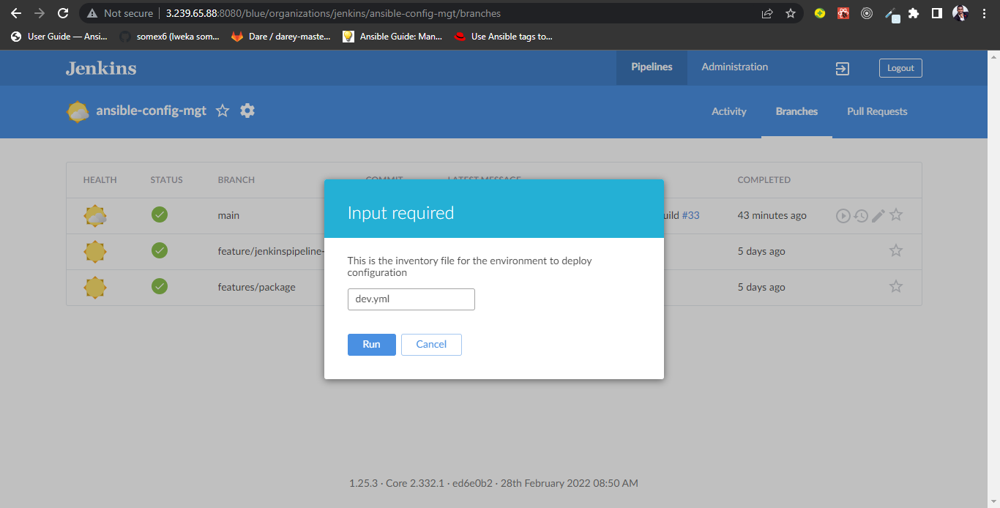
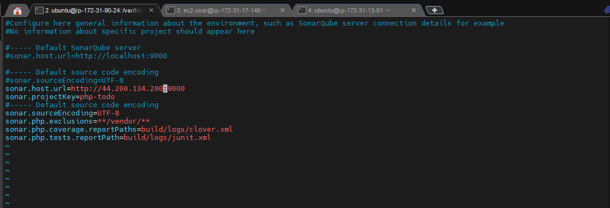
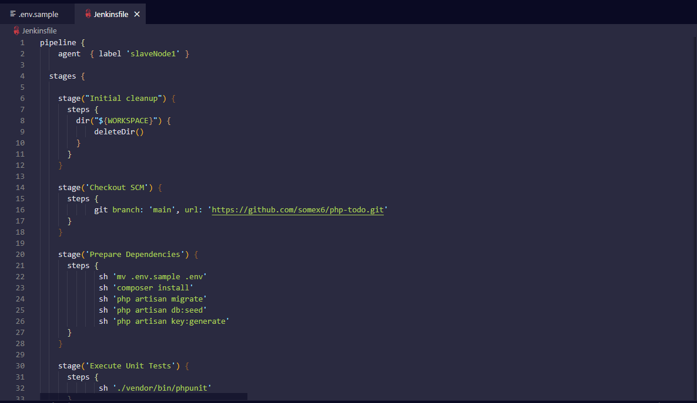
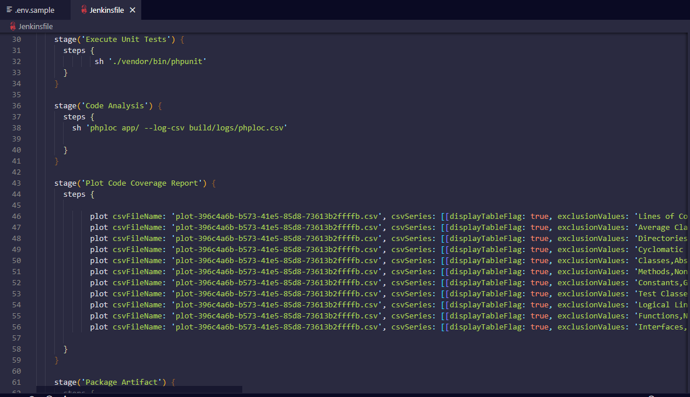
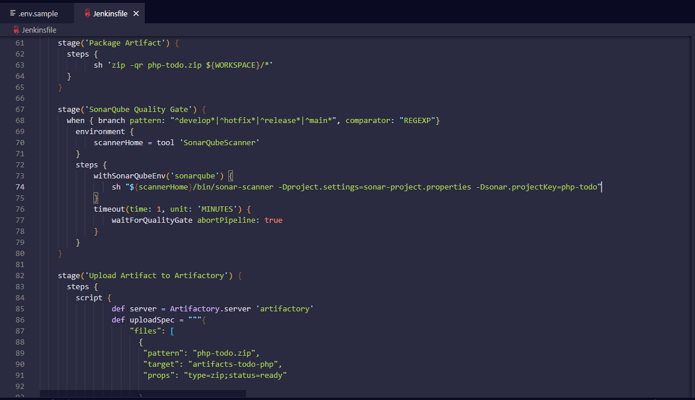
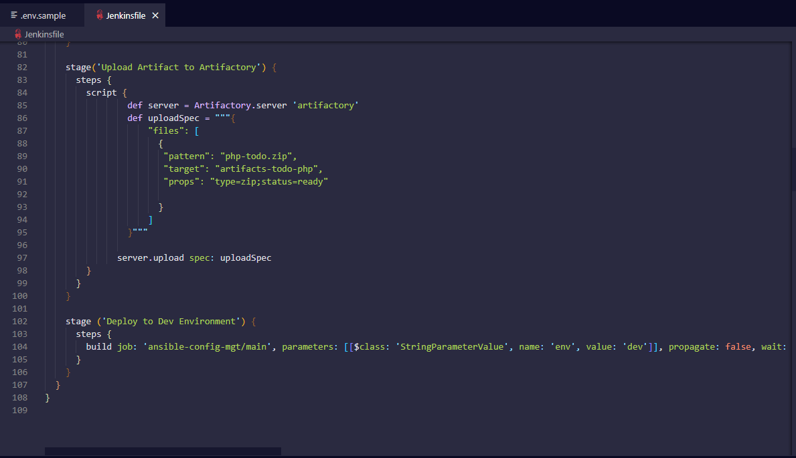

# CONTINOUS INTEGRATION WITH JENKINS, ANSIBLE, ARTIFACTORY SONARQUBE AND PHP
## INTRODUTION

In this project, the concept of CI/CD is implemented whereby php application from github are pushed to Jenkins to run a multi-branch pipeline job(build job is run on each branches of a repository simultaneously) which is better viewed from Blue Ocean plugin.  This is done in order to achieve continuous integration of codes from different developers. After which the artifacts from the build job is packaged and pushed to sonarqube server for testing before it is deployed to artifactory from which ansible job is triggered to deploy the application to production environment.

The following are the steps taken to achieve this:

## STEP 0: Setting Up Servers

I launched 3 EC2 Instances, one for Jenkins server, another for MySQL database(RedHat) and another is used for SonarQube Server

## STEP 1:  Configuring Ansible For Jenkins Deployment

In order to run ansible commands from Jenkins UI, the following outlines the steps taken:
- Installing Blue Ocean plugin from ‘manage plugins’ on Jenkins:
- Creating new pipeline job on the Blue Ocean UI from Github
- Generating new personal access token in order to full access to the repository
- Pasting the token and selecting ansible-config-mgt repository to create a new pipeline job


- Creating a directory in the root of ansible-config-mgt directory called **deploy**, and creating a file in it called **Jenkinsfile**.
- Switching to new branch called **feature/Jenkinspipeline-stages**


- Entering the following codes in the Jenkinsfile which does nothing but echo with shell script:
```
pipeline {
  agent any

  stages {
    stage('Build') {
      steps {
        script {
          sh 'echo "Building Stage"'
        }
      }
    }

    stage('Test') {
      steps {
        script {
          sh 'echo "Testing Stage"'
        }
      }
    }

    stage('Package') {
      steps {
        script {
          sh 'echo "Testing Stage"'
        }
      }
    }

    stage('Deploy') {
      steps {
        script {
          sh 'echo "Testing Stage"'
        }
      }
    }

    stage('Clean up') {
      steps {
        script {
          sh 'echo "Testing Stage"'
        }
      }
    }
  }
}
```
- Committing the changes and heading over to the Jenkins console


- Clicking on **Configure** to set the location of the Jenkinsfile.


- Then clicking on **scan repository now** will scan both the changes pushed to github and also the branches created in the repository and made them visible which means that this job is multibranch job which will trigger a build for each branch.


- Clicking on **Build now** to trigger the build


- Installing Ansible plugin from **manage plugins** on Jenkins to run ansible commands
- Clearing the codes in the Jenkinsfile to start from the scratch
- For ansible to be able to locate the roles in my playbook, the ansible.cfg is copied to '/deploy' folder and then exported from the Jenkinsfile code

**The structure of the ansible-config-mgt**


- Using the jenkins pipeline syntax Ansible tool to generate syntax for executing playbook which runs with tags 'webserver'.


**common.yml file**


- Introducing parameterization which enables us to input the appropriate values for the inventory file we want playbook to run against:
```
 parameters {
      string(name: 'inventory', defaultValue: 'dev.yml',  description: 'This is the inventory file for the environment to deploy configuration')
    }
```


**Complete Jenkinsfile code for ansible-config-mgt job**

```
pipeline {
    agent any

    parameters {
      string(name: 'inventory', defaultValue: 'dev.yml',  description: 'This is the inventory file for the environment to deploy configuration')
    }

  stages {
    stage("Initial Clean Up") {
      steps {
        dir("${WORKSPACE}") {
           deleteDir()
        }
      }
    }

    stage('SCM Checkout') {
      steps {
        git branch: 'main', url: 'https://github.com/apotitech/ansible-config-mgt.git'
      }
    }
    
    stage('Execute Playbook') {
      steps {
        withEnv(['ANSIBLE_CONFIG = ${WORKSPACE}/deploy/.ansible.cfg']) {
          ansiblePlaybook credentialsId: 'private-key', disableHostKeyChecking: true, installation: 'ansible2', inventory: 'inventory/${inventory}', playbook: 'playbooks/site.yml', tags: 'webservers'
        }
      }
    }
  }
}

```

## STEP 2: Setting Up The Artifactory Server

Since the goal here is to deploy applications directory from Artifactory rather than git, the following step is taken:
- Creating account on the artifactory site `https://artifactory.jfrog.io`


- Creating the repository where the artifacts will be uploaded to from the Jenkins server


## STEP 3: Integrating Artifactory Repository With Jenkins

- Installing plot plugin to display tests reports and code coverage and Artifactory plugins to easily upload code artifacts into an Artifactory server


- Configuring Artifactory in Jenkins on ‘configure systems’


- Forking the repository into my Github account: `https://github.com/darey-devops/php-todo.git`
- On database server, installing mysql: `$ sudo yum install mysql-server`


- Creating a database and a remote user:
```
Create database homestead;
CREATE USER 'homestead'@'<Jenkins-ip-address>' IDENTIFIED BY 'sePret^i';
GRANT ALL PRIVILEGES ON * . * TO 'homestead'@'<Jenkins-ip-address>';

```


- Starting the mysqld server:


- Configuring the bind_address in the my.cnf file:


- Opening port 3306 in the database security group


- On the Jenkins server, installing PHP, its dependencies


- Installing Composer tool:

**Downloading the Installer:** `$ php -r "copy('https://getcomposer.org/installer', 'composer-setup.php');"`


**Verifying the installer:** `$ php -r "if (hash_file('sha384', 'composer-setup.php') === '906a84df04cea2aa72f40b5f787e49f22d4c2f19492ac310e8cba5b96ac8b64115ac402c8cd292b8a03482574915d1a8') { echo 'Installer verified'; } else { echo 'Installer corrupt'; unlink('composer-setup.php'); } echo PHP_EOL;"`


**Running the Installer:** `$ php composer-setup.php
`


**Removing the Installer:** `$ php -r "unlink('composer-setup.php');"`


- Updating the .env.sample with database server ip address


- On VSCode, Creating Jenkinsfile for the php-todo repository on the main branch
- Entering the following codes:
```
pipeline {
    agent  { label 'slaveNode1' }

  stages {

    stage("Initial cleanup") {
      steps {
        dir("${WORKSPACE}") {
            deleteDir()
        }
      }
    }

    stage('Checkout SCM') {
      steps {
            git branch: 'main', url: 'https://github.com/apotitech/php-todo.git'
      }
    }

    stage('Prepare Dependencies') {
      steps {
             sh 'mv .env.sample .env'
             sh 'composer install'
             sh 'php artisan migrate'
             sh 'php artisan db:seed'
             sh 'php artisan key:generate'
      }
    }
  }
}
```
 The first stage performs a clean-up which always deletes the previous workspace before running a new one
 
 The second stage connects to the php-todo repository
 
 The third stage performs a shell scripting which renames .env.sample file to .env, then composer is used by PHP to install all the dependent libraries used by the application and then php artisan uses the .env to setup the required database objects

- Pushing the changes to the main branch: `git push`
- Creating php-todo pipeline job from the Blue Ocean UI


- Running the pipeline job


- After a successful run of the pipeline job, confirming on the database server by running SHOW TABLES command to see the tables being created


## STEP 4: Structuring The Jenkinsfile

- Including unit test stage in the Jenkinsfile:
```
stage('Execute Unit Tests') {
      steps {
             sh './vendor/bin/phpunit'
      } 
    }
```


- Adding Code Quality stage with phploc tool and will save the output in build/logs/phploc.csv:
```
stage('Code Analysis') {
      steps {
        sh 'phploc app/ --log-csv build/logs/phploc.csv'

      }
    }
``` 


- Adding the plot code coverage report stage:
```
 stage('Plot Code Coverage Report') {
      steps {

            plot csvFileName: 'plot-396c4a6b-b573-41e5-85d8-73613b2ffffb.csv', csvSeries: [[displayTableFlag: true, exclusionValues: 'Lines of Code (LOC),Comment Lines of Code (CLOC),Non-Comment Lines of Code (NCLOC),Logical Lines of Code (LLOC)                          ', file: 'build/logs/phploc.csv', inclusionFlag: 'INCLUDE_BY_STRING', url: '']], group: 'phploc', numBuilds: '100', style: 'line', title: 'A - Lines of code', yaxis: 'Lines of Code'
            plot csvFileName: 'plot-396c4a6b-b573-41e5-85d8-73613b2ffffb.csv', csvSeries: [[displayTableFlag: true, exclusionValues: 'Average Class Length (LLOC),Average Method Length (LLOC),Average Function Length (LLOC)', file: 'build/logs/phploc.csv', inclusionFlag: 'INCLUDE_BY_STRING', url: '']], group: 'phploc', numBuilds: '100', style: 'line', title: 'C - Average Length', yaxis: 'Average Lines of Code'
            plot csvFileName: 'plot-396c4a6b-b573-41e5-85d8-73613b2ffffb.csv', csvSeries: [[displayTableFlag: true, exclusionValues: 'Directories,Files,Namespaces', file: 'build/logs/phploc.csv', inclusionFlag: 'INCLUDE_BY_STRING', url: '']], group: 'phploc', numBuilds: '100', style: 'line', title: 'B - Structures Containers', yaxis: 'Count'
            plot csvFileName: 'plot-396c4a6b-b573-41e5-85d8-73613b2ffffb.csv', csvSeries: [[displayTableFlag: true, exclusionValues: 'Cyclomatic Complexity / Lines of Code,Cyclomatic Complexity / Number of Methods ', file: 'build/logs/phploc.csv', inclusionFlag: 'INCLUDE_BY_STRING', url: '']], group: 'phploc', numBuilds: '100', style: 'line', title: 'D - Relative Cyclomatic Complexity', yaxis: 'Cyclomatic Complexity by Structure'      
            plot csvFileName: 'plot-396c4a6b-b573-41e5-85d8-73613b2ffffb.csv', csvSeries: [[displayTableFlag: true, exclusionValues: 'Classes,Abstract Classes,Concrete Classes', file: 'build/logs/phploc.csv', inclusionFlag: 'INCLUDE_BY_STRING', url: '']], group: 'phploc', numBuilds: '100', style: 'line', title: 'E - Types of Classes', yaxis: 'Count'
            plot csvFileName: 'plot-396c4a6b-b573-41e5-85d8-73613b2ffffb.csv', csvSeries: [[displayTableFlag: true, exclusionValues: 'Methods,Non-Static Methods,Static Methods,Public Methods,Non-Public Methods', file: 'build/logs/phploc.csv', inclusionFlag: 'INCLUDE_BY_STRING', url: '']], group: 'phploc', numBuilds: '100', style: 'line', title: 'F - Types of Methods', yaxis: 'Count'
            plot csvFileName: 'plot-396c4a6b-b573-41e5-85d8-73613b2ffffb.csv', csvSeries: [[displayTableFlag: true, exclusionValues: 'Constants,Global Constants,Class Constants', file: 'build/logs/phploc.csv', inclusionFlag: 'INCLUDE_BY_STRING', url: '']], group: 'phploc', numBuilds: '100', style: 'line', title: 'G - Types of Constants', yaxis: 'Count'
            plot csvFileName: 'plot-396c4a6b-b573-41e5-85d8-73613b2ffffb.csv', csvSeries: [[displayTableFlag: true, exclusionValues: 'Test Classes,Test Methods', file: 'build/logs/phploc.csv', inclusionFlag: 'INCLUDE_BY_STRING', url: '']], group: 'phploc', numBuilds: '100', style: 'line', title: 'I - Testing', yaxis: 'Count'
            plot csvFileName: 'plot-396c4a6b-b573-41e5-85d8-73613b2ffffb.csv', csvSeries: [[displayTableFlag: true, exclusionValues: 'Logical Lines of Code (LLOC),Classes Length (LLOC),Functions Length (LLOC),LLOC outside functions or classes ', file: 'build/logs/phploc.csv', inclusionFlag: 'INCLUDE_BY_STRING', url: '']], group: 'phploc', numBuilds: '100', style: 'line', title: 'AB - Code Structure by Logical Lines of Code', yaxis: 'Logical Lines of Code'
            plot csvFileName: 'plot-396c4a6b-b573-41e5-85d8-73613b2ffffb.csv', csvSeries: [[displayTableFlag: true, exclusionValues: 'Functions,Named Functions,Anonymous Functions', file: 'build/logs/phploc.csv', inclusionFlag: 'INCLUDE_BY_STRING', url: '']], group: 'phploc', numBuilds: '100', style: 'line', title: 'H - Types of Functions', yaxis: 'Count'
            plot csvFileName: 'plot-396c4a6b-b573-41e5-85d8-73613b2ffffb.csv', csvSeries: [[displayTableFlag: true, exclusionValues: 'Interfaces,Traits,Classes,Methods,Functions,Constants', file: 'build/logs/phploc.csv', inclusionFlag: 'INCLUDE_BY_STRING', url: '']], group: 'phploc', numBuilds: '100', style: 'line', title: 'BB - Structure Objects', yaxis: 'Count'

      }
    }
```


- Adding the package artifacts stage which archives the application code
```
    stage('Package Artifact') {
      steps {
            sh 'zip -qr php-todo.zip ${WORKSPACE}/*'
      }
    }
```


- Uploading the artifacts to the Artifactory repository in this stage:
```
    stage('Upload Artifact to Artifactory') {
      steps {
        script { 
                def server = Artifactory.server 'artifactory'                 
                def uploadSpec = """{
                    "files": [
                      {
                       "pattern": "php-todo.zip",
                       "target": "artifacts-todo-php",
                       "props": "type=zip;status=ready"

                      }
                    ]
                }""" 

              server.upload spec: uploadSpec
        }
      }
    }
```


- Deploying the application to the dev environment by launching Ansible pipeline job(ansible-config-mgt)
```
    stage ('Deploy to Dev Environment') {
      steps {
        build job: 'ansible-config-mgt/main', parameters: [[$class: 'StringParameterValue', name: 'env', value: 'dev']], propagate: false, wait: true
      }
    }
```


## STEP 5: Setting Up The SonarQube Server

To ensure that only code with the required code coverage and other quality standards gets to make it through to the dev environment, SonarQube server is setup and  configured:

- On the SonarQube server, performing the following command on the terminal which makes the session changes persist beyond the current session terminal to ensure optimal performance of the tool

```
$ sudo sysctl -w vm.max_map_count=262144
$ sudo sysctl -w fs.file-max=65536
$ ulimit -n 65536
$ ulimit -u 4096

```


- To make the changes permanent, editing limits.conf file:`$ sudo vi /etc/security/limits.conf`
- Entering the following configuration:

```
sonarqube   -   nofile   65536
sonarqube   -   nproc    4096

```


- Updating and upgrading the server: 

`$ sudo apt-get update`

`$ sudo apt-get upgrade`


- Installing the wget and unzip packages: `$ sudo apt-get install wget unzip -y`


- Installing OpenJDK and Java Runtime Environment(JRE) 11: ` $ sudo apt-get install openjdk-11-jdk -y`


- Verifying the java version that is in use: `$ java --version`


- To install postgresql database, adding the postgresql repo to the repo list: `$ sudo sh -c 'echo "deb http://apt.postgresql.org/pub/repos/apt/ `lsb_release -cs`-pgdg main" >> /etc/apt/sources.list.d/pgdg.list'`


- Downloading Postgresql software key: `$ wget -q https://www.postgresql.org/media/keys/ACCC4CF8.asc -O - | sudo apt-key add -`


- Installing postgresql database server: `$ sudo apt-get -y install postgresql postgresql-contrib`


- Starting postgresql server: `$ sudo systemctl start postgresql`
- Enabling it to start automatically: `$ sudo systemctl enable postgresql`


- Changing the password for the default postgres user: `$ sudo passwd postgres`


- Switching to the postgres user: `$ su – postgres`
- Creating a new user ‘sonar’: `$ createuser sonar`


- Activating postgresql shell:`$ psql`
- Setting password for the newly created user for the SonarQube databases: `ALTER USER sonar WITH ENCRYPTED password 'sonar';`
- Creating a new database for Postgresql database: `CREATE DATABASE sonarqube OWNER sonar;`
- Granting all privileges to the user sonar on sonarqube database: `grant all privileges on DATABASE sonarqube to sonar;`
- Exiting from the shell


- Switching back to sudo user: `exit`
- To install SonarQube software, navigating to the '/tmp' folder to temporarily download the installation files: `$ cd /tmp && sudo wget https://binaries.sonarsource.com/Distribution/sonarqube/sonarqube-7.9.3.zip`


- Unzipping the archive setup to the '/opt' directory: `$ sudo unzip sonarqube-7.9.3.zip -d /opt`


- Renaming the extracted setup folder: `$ sudo mv /opt/sonarqube-7.9.3 /opt/sonarqube`


- Creating the group ‘sonar’: `$ sudo groupadd sonar`
- Adding a user with control over /opt/sonarqube directory: 

`$ sudo useradd -c "user to run SonarQube" -d /opt/sonarqube -g sonar sonar `

`$ sudo chown sonar:sonar /opt/sonarqube -R`


- Openinig SonarQube configuration file: `$ sudo vim /opt/sonarqube/conf/sonar.properties`
- Entering the following configurations under Database section:
```
sonar.jdbc.username=sonar
sonar.jdbc.password=sonar
sonar.jdbc.url=jdbc:postgresql://localhost:5432/sonarqube
```


- Editing the sonar script file and set RUN_AS_USER: `$ sudo nano /opt/sonarqube/bin/linux-x86-64/sonar.sh`


- In order to start SonarQube, the following is done: 
- Switching to 'sonar' user: `$ sudo su sonar`
- Moving to the script directory: `cd /opt/sonarqube/bin/linux-x86-64/`


- Running the script to start SonarQube: `./sonar.sh start`
- Checking whether SonarQube is in running state: `./sonar.sh status`


- To check SonarQube logs: `tail /opt/sonarqube/logs/sonar.log`


- To Configure SonarQube as a service, the SonarQube server is stopped first: `cd /opt/sonarqube/bin/linux-x86-64/`
- Stopping the server: `./sonar.sh stop`


- Exiting to sudo user: `exit`
- Creating a systemd service file for SonarQube to run as System Startup: `$ sudo nano /etc/systemd/system/sonar.service`
- Entering the following configurations:
 ```
 [Unit]
Description=SonarQube service
After=syslog.target network.target

[Service]
Type=forking

ExecStart=/opt/sonarqube/bin/linux-x86-64/sonar.sh start
ExecStop=/opt/sonarqube/bin/linux-x86-64/sonar.sh stop

User=sonar
Group=sonar
Restart=always

LimitNOFILE=65536
LimitNPROC=4096

[Install]
WantedBy=multi-user.target

```


- Starting the SonarQube service and enabling it:

`$ sudo systemctl start sonar`

`$ sudo systemctl enable sonar`

`$ sudo systemctl status sonar`


- Opening TCP port 9000 on the security group


- Accessing SonarQube through the browser by entering the SonarQube server’s IP address followed by port 9000: `http://<server's_IP_adress>:9000`


**Logging in as admin**


## STEP 6: Configuring Jenkins For SonarQube Quality Gate

- Generating authentication token in the SonarQube server by navigating from 'My Account' to 'security':


- Configuring Quality Gate Jenkins Webhook in SonarQube by navigating from 'Administration' to 'Configuration' to 'webhook' and 'create' and then specifying the URL as this: `http://<Jenkins ip address>/sonarqube-webhook/`


- Installing SonarScanner plugin in jenkins:


- Navigating to 'Configure System' in Jenkins to add SonarQube server details with the generated token:


- Setting the SonarQube scanner by navigating from 'manage jenkins' to 'Global Tool Configuration':


- Updating the Jenkinsfile to include SonarQube Scanning and Quality Gate:
```

stage('SonarQube Quality Gate') {
      environment {
          scannerHome = tool 'SonarQubeScanner'
      }
        steps {
          withSonarQubeEnv('sonarqube') {
              sh "${scannerHome}/bin/sonar-scanner"
          }

        }
    }
    
```
- Configuring the sonar-scanner.properties file in which SonarQube will require to function during pipeline execution: `$ cd /var/lib/jenkins/tools/hudson.plugins.sonar.SonarRunnerInstallation/SonarQubeScanner/conf/`
- Editing and entering the following configuration: `$ sudo vi sonar-scanner.properties`
```
sonar.host.url=http://<SonarQube-Server-IP-address>:9000
sonar.projectKey=php-todo
#----- Default source code encoding
sonar.sourceEncoding=UTF-8
sonar.php.exclusions=**/vendor/**
sonar.php.coverage.reportPaths=build/logs/clover.xml
sonar.php.tests.reportPath=build/logs/junit.xml

```


- To list the content in the scanner tool **sonar-scanner** to see what we are calling in the pipeline script: `$ cd /var/lib/jenkins/tools/hudson.plugins.sonar.SonarRunnerInstallation/SonarQubeScanner/bin` and `$ ls -latr`


## STEP 7: Running The Pipeline Job

- After uploading the code from VSCode to github and clicking 'scan the repository now' will activate the pipeline job.

**End-to-End Pipeline Overview**


**The reason for the failure**


**After a restart**


**Results from the SonarQube Server**


From the result it shows that there are bugs, and there is 0.0% code coverage(code coverage is a percentage of unit tests added by developers to test functions and objects in the code) and there is 6 hours’ worth of technical debt, code smells and security issues in the code. And therefore as DevOps Engineer working on the pipeline, we must ensure that the quality gate step causes the pipeline to fail if the conditions for quality are not met.
- To ensure that only pipeline job that is run on either 'main' or 'develop' or 'hotfix' or 'release' branch gets to make it to the deploy stage, the Jenkinsfile is updated and a timeout step is also added to wait for SonarQube to complete analysis and successfully finish the pipeline only when code quality is acceptable.:
 
```
 stage('SonarQube Quality Gate') {
      when { branch pattern: "^develop*|^hotfix*|^release*|^main*", comparator: "REGEXP"}
        environment {
            scannerHome = tool 'SonarQubeScanner'
        }
        steps {
            withSonarQubeEnv('sonarqube') {
                sh "${scannerHome}/bin/sonar-scanner -Dproject.settings=sonar-project.properties -Dsonar.projectKey=php-todo"
            }
            timeout(time: 1, unit: 'MINUTES') {
                waitForQualityGate abortPipeline: true
            }
        }
    }

```

**The complete Jenkinsfile code**
```

pipeline {
    agent any

  stages {

    stage("Initial cleanup") {
      steps {
        dir("${WORKSPACE}") {
            deleteDir()
        }
      }
    }

    stage('Checkout SCM') {
      steps {
            git branch: 'main', url: 'https://github.com/apotitech/php-todo.git'
      }
    }

    stage('Prepare Dependencies') {
      steps {
             sh 'mv .env.sample .env'
             sh 'composer install'
             sh 'php artisan migrate'
             sh 'php artisan db:seed'
             sh 'php artisan key:generate'
      }
    }

    stage('Execute Unit Tests') {
      steps {
             sh './vendor/bin/phpunit'
      } 
    }

    stage('Code Analysis') {
      steps {
        sh 'phploc app/ --log-csv build/logs/phploc.csv'

      }
    }

    stage('Plot Code Coverage Report') {
      steps {

            plot csvFileName: 'plot-396c4a6b-b573-41e5-85d8-73613b2ffffb.csv', csvSeries: [[displayTableFlag: true, exclusionValues: 'Lines of Code (LOC),Comment Lines of Code (CLOC),Non-Comment Lines of Code (NCLOC),Logical Lines of Code (LLOC)                          ', file: 'build/logs/phploc.csv', inclusionFlag: 'INCLUDE_BY_STRING', url: '']], group: 'phploc', numBuilds: '100', style: 'line', title: 'A - Lines of code', yaxis: 'Lines of Code'
            plot csvFileName: 'plot-396c4a6b-b573-41e5-85d8-73613b2ffffb.csv', csvSeries: [[displayTableFlag: true, exclusionValues: 'Average Class Length (LLOC),Average Method Length (LLOC),Average Function Length (LLOC)', file: 'build/logs/phploc.csv', inclusionFlag: 'INCLUDE_BY_STRING', url: '']], group: 'phploc', numBuilds: '100', style: 'line', title: 'C - Average Length', yaxis: 'Average Lines of Code'
            plot csvFileName: 'plot-396c4a6b-b573-41e5-85d8-73613b2ffffb.csv', csvSeries: [[displayTableFlag: true, exclusionValues: 'Directories,Files,Namespaces', file: 'build/logs/phploc.csv', inclusionFlag: 'INCLUDE_BY_STRING', url: '']], group: 'phploc', numBuilds: '100', style: 'line', title: 'B - Structures Containers', yaxis: 'Count'
            plot csvFileName: 'plot-396c4a6b-b573-41e5-85d8-73613b2ffffb.csv', csvSeries: [[displayTableFlag: true, exclusionValues: 'Cyclomatic Complexity / Lines of Code,Cyclomatic Complexity / Number of Methods ', file: 'build/logs/phploc.csv', inclusionFlag: 'INCLUDE_BY_STRING', url: '']], group: 'phploc', numBuilds: '100', style: 'line', title: 'D - Relative Cyclomatic Complexity', yaxis: 'Cyclomatic Complexity by Structure'      
            plot csvFileName: 'plot-396c4a6b-b573-41e5-85d8-73613b2ffffb.csv', csvSeries: [[displayTableFlag: true, exclusionValues: 'Classes,Abstract Classes,Concrete Classes', file: 'build/logs/phploc.csv', inclusionFlag: 'INCLUDE_BY_STRING', url: '']], group: 'phploc', numBuilds: '100', style: 'line', title: 'E - Types of Classes', yaxis: 'Count'
            plot csvFileName: 'plot-396c4a6b-b573-41e5-85d8-73613b2ffffb.csv', csvSeries: [[displayTableFlag: true, exclusionValues: 'Methods,Non-Static Methods,Static Methods,Public Methods,Non-Public Methods', file: 'build/logs/phploc.csv', inclusionFlag: 'INCLUDE_BY_STRING', url: '']], group: 'phploc', numBuilds: '100', style: 'line', title: 'F - Types of Methods', yaxis: 'Count'
            plot csvFileName: 'plot-396c4a6b-b573-41e5-85d8-73613b2ffffb.csv', csvSeries: [[displayTableFlag: true, exclusionValues: 'Constants,Global Constants,Class Constants', file: 'build/logs/phploc.csv', inclusionFlag: 'INCLUDE_BY_STRING', url: '']], group: 'phploc', numBuilds: '100', style: 'line', title: 'G - Types of Constants', yaxis: 'Count'
            plot csvFileName: 'plot-396c4a6b-b573-41e5-85d8-73613b2ffffb.csv', csvSeries: [[displayTableFlag: true, exclusionValues: 'Test Classes,Test Methods', file: 'build/logs/phploc.csv', inclusionFlag: 'INCLUDE_BY_STRING', url: '']], group: 'phploc', numBuilds: '100', style: 'line', title: 'I - Testing', yaxis: 'Count'
            plot csvFileName: 'plot-396c4a6b-b573-41e5-85d8-73613b2ffffb.csv', csvSeries: [[displayTableFlag: true, exclusionValues: 'Logical Lines of Code (LLOC),Classes Length (LLOC),Functions Length (LLOC),LLOC outside functions or classes ', file: 'build/logs/phploc.csv', inclusionFlag: 'INCLUDE_BY_STRING', url: '']], group: 'phploc', numBuilds: '100', style: 'line', title: 'AB - Code Structure by Logical Lines of Code', yaxis: 'Logical Lines of Code'
            plot csvFileName: 'plot-396c4a6b-b573-41e5-85d8-73613b2ffffb.csv', csvSeries: [[displayTableFlag: true, exclusionValues: 'Functions,Named Functions,Anonymous Functions', file: 'build/logs/phploc.csv', inclusionFlag: 'INCLUDE_BY_STRING', url: '']], group: 'phploc', numBuilds: '100', style: 'line', title: 'H - Types of Functions', yaxis: 'Count'
            plot csvFileName: 'plot-396c4a6b-b573-41e5-85d8-73613b2ffffb.csv', csvSeries: [[displayTableFlag: true, exclusionValues: 'Interfaces,Traits,Classes,Methods,Functions,Constants', file: 'build/logs/phploc.csv', inclusionFlag: 'INCLUDE_BY_STRING', url: '']], group: 'phploc', numBuilds: '100', style: 'line', title: 'BB - Structure Objects', yaxis: 'Count'

      }
    }
  
    stage('Package Artifact') {
      steps {
            sh 'zip -qr php-todo.zip ${WORKSPACE}/*'
      }
    }
    
    stage('SonarQube Quality Gate') {
      when { branch pattern: "^develop*|^hotfix*|^release*|^main*", comparator: "REGEXP"}
        environment {
            scannerHome = tool 'SonarQubeScanner'
        }
        steps {
            withSonarQubeEnv('sonarqube') {
                sh "${scannerHome}/bin/sonar-scanner -Dproject.settings=sonar-project.properties -Dsonar.projectKey=php-todo"
            }
            timeout(time: 1, unit: 'MINUTES') {
                waitForQualityGate abortPipeline: true
            }
        }
    }
    
    stage('Upload Artifact to Artifactory') {
      steps {
        script { 
                def server = Artifactory.server 'artifactory'                 
                def uploadSpec = """{
                    "files": [
                      {
                       "pattern": "php-todo.zip",
                       "target": "artifacts-todo-php",
                       "props": "type=zip;status=ready"

                      }
                    ]
                }""" 

              server.upload spec: uploadSpec
        }
      }
    }

    stage ('Deploy to Dev Environment') {
      steps {
        build job: 'ansible-config-mgt/main', parameters: [[$class: 'StringParameterValue', name: 'env', value: 'dev']], propagate: false, wait: true
      }
    }
  }
}

```





## STEP 7: Running the Pipeline Job with 2 Jenkins agents/slaves(Nodes)
- Creating a new node and naming it 'sonar'
- Configuring the settings and labelling it 'slaveNode1'


- Setting the credentials for the jenkins host


- Creating the second node and configuring the same

**The two nodes created**


- Launching the node


- Updating the Jenkinsfile in the agent section to be able to run the pipeline on the two nodes
```
pipeline {
    agent  { label 'slaveNode1' }
```


- Executing the pipeline job and monitoring how the two nodes is activated and run
 
 
 
 
 
 
 
