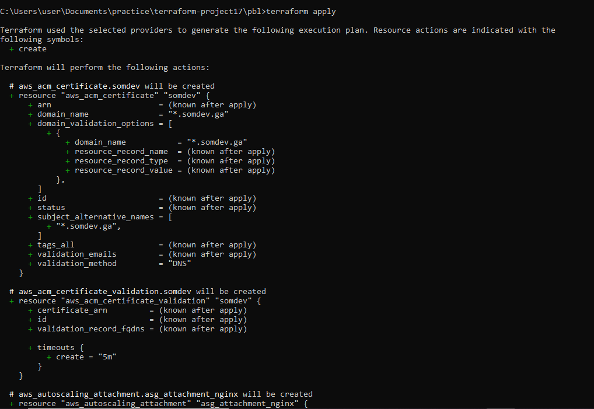
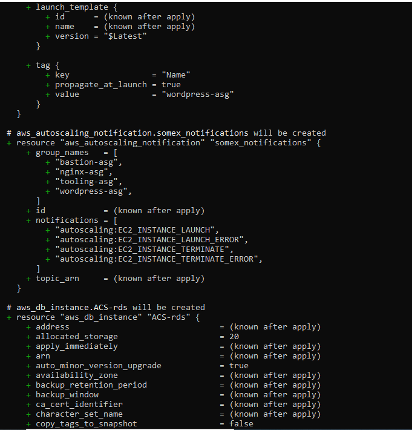
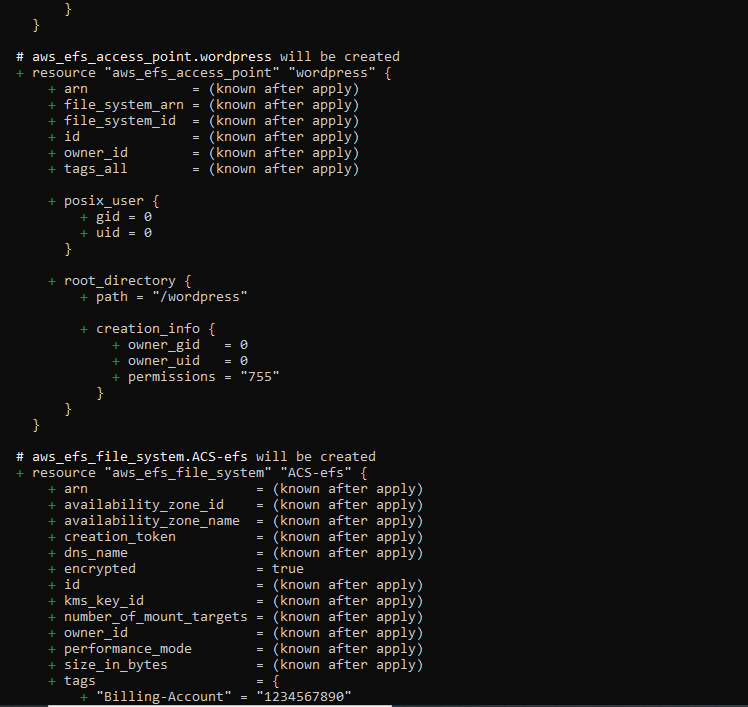
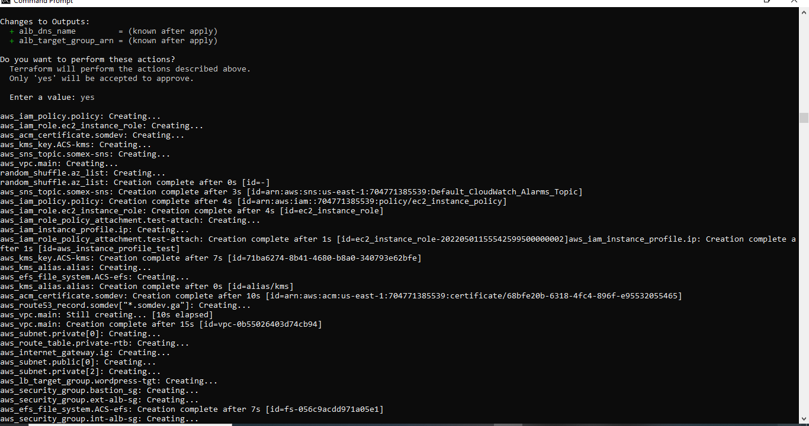
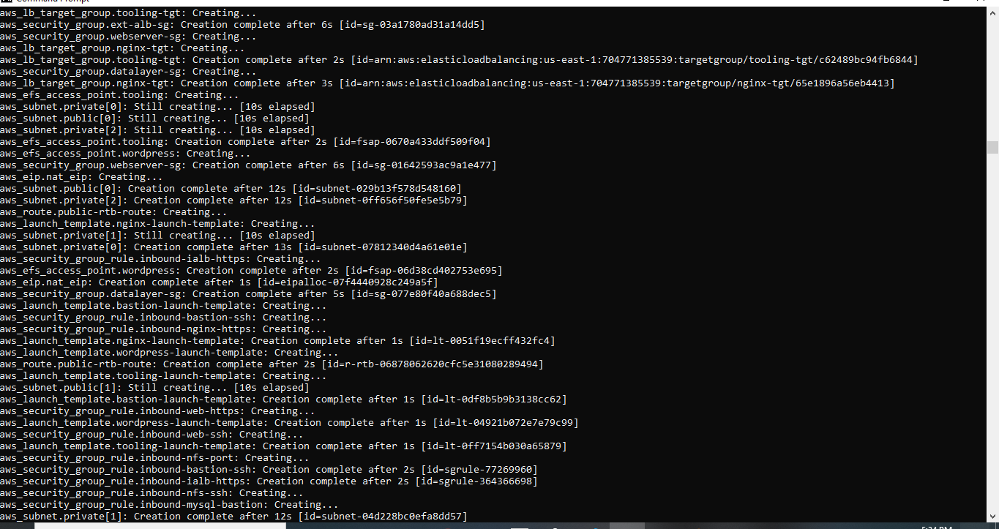
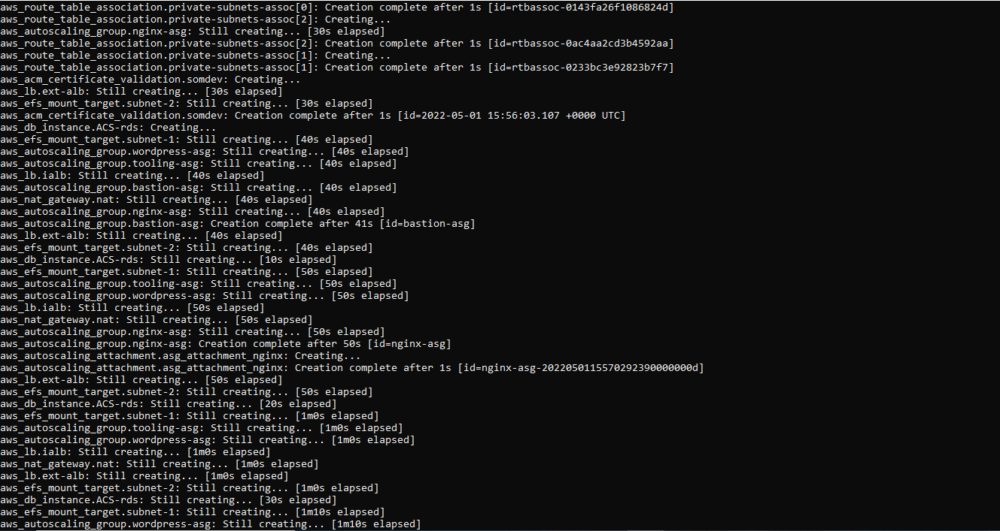
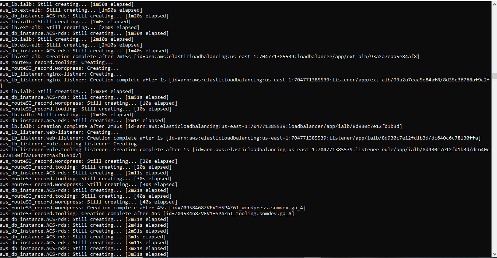

# AUTOMATING INFRASTRUCTURE WITH IAC USING TERRAFORM - PART 2
## INTRODUCTION
In continuation to [project 16](./project16.md), the remaining resources are created in this project in order to set up a secured infrastructure with Terraform

## STEP 1: Creating Private Subnet
- Due to the AZ of eu-central-1 region is not up to 4 which will return error since it is 4 private subnet that is needed, therefore **random_shuffle** resource is introduced and then specifying the maximum subnet:
```
resource "random_shuffle" "az_list" {
  input        = data.aws_availability_zones.available.names
  result_count = var.max_subnets
}
```
- Creating the private subnet
```
# Create private subnets
resource "aws_subnet" "private" {
  count                   = var.preferred_number_of_private_subnets == null ? length(data.aws_availability_zones.available.names) : var.preferred_number_of_private_subnets
  vpc_id                  = aws_vpc.main.id
  cidr_block              = cidrsubnet(var.vpc_cidr, 4, count.index)
  map_public_ip_on_launch = true
  availability_zone       = random_shuffle.az_list.result[count.index]

  tags = merge(
    var.tags,
    {
      Name = format("PrivateSubnet-%s", count.index)
    }
  )
}
```

## STEP 2: Creating Internet Gateway
- Creating a file called **internet_gateway.tf** and entering the following codes:
```
resource "aws_internet_gateway" "ig" {
  vpc_id = aws_vpc.main.id

  tags = merge(
    var.tags,
    {
      Name = format("%s-%s!", aws_vpc.main.id,"IG")
    } 
  )
}
```
## STEP 3: Creating NAT Gateway
- Creating a file called **nat_gateway.tf** and entering the following codes to create a NAT gateway and assign an elastic IP to it:
```
resource "aws_eip" "nat_eip" {
  vpc        = true
  depends_on = [aws_internet_gateway.ig]

  tags = merge(
    var.tags,
    {
      Name = format("%s-EIP", var.name)
    },
  )
}

resource "aws_nat_gateway" "nat" {
  allocation_id = aws_eip.nat_eip.id
  subnet_id     = element(aws_subnet.public.*.id, 0)
  depends_on    = [aws_internet_gateway.ig]

  tags = merge(
    var.tags,
    {
      Name = format("%s-Nat", var.name)
    },
  )
}
```

## STEP 4: Creating Routes

- Creating a file called **route_tables.tf** and entering the following codes to create routes for both public and private subnets:
```
# create private route table
resource "aws_route_table" "private-rtb" {
  vpc_id = aws_vpc.main.id

  tags = merge(
    var.tags,
    {
      Name = format("%s-Private-Route-Table", var.name)
    },
  )
}

# create route for the public route table and attach the internet gateway
resource "aws_route" "private-rtb-route" {
  route_table_id         = aws_route_table.private-rtb.id
  destination_cidr_block = "0.0.0.0/0"
  gateway_id             = aws_nat_gateway.nat.id
}

# associate all private subnets to the private route table
resource "aws_route_table_association" "private-subnets-assoc" {
  count          = length(aws_subnet.private[*].id)
  subnet_id      = element(aws_subnet.private[*].id, count.index)
  route_table_id = aws_route_table.private-rtb.id
}

# create route table for the public subnets
resource "aws_route_table" "public-rtb" {
  vpc_id = aws_vpc.main.id

  tags = merge(
    var.tags,
    {
      Name = format("%s-Public-Route-Table", var.name)
    },
  )
}

# create route for the public route table and attach the internet gateway
resource "aws_route" "public-rtb-route" {
  route_table_id         = aws_route_table.public-rtb.id
  destination_cidr_block = "0.0.0.0/0"
  gateway_id             = aws_internet_gateway.ig.id
}

# associate all public subnets to the public route table
resource "aws_route_table_association" "public-subnets-assoc" {
  count          = length(aws_subnet.public[*].id)
  subnet_id      = element(aws_subnet.public[*].id, count.index)
  route_table_id = aws_route_table.public-rtb.id
}
```
## STEP 5: Creating IAM Roles
- An IAM role is passed to the EC2 instances to give them access to some specific resources by first of all creating an **AssumeRole** and **AssumeRole policy**.
- Creating a file named **roles.tf** and entering the following codes:
```
resource "aws_iam_role" "ec2_instance_role" {
name = "ec2_instance_role"
  assume_role_policy = jsonencode({
    Version = "2012-10-17"
    Statement = [
      {
        Action = "sts:AssumeRole"
        Effect = "Allow"
        Sid    = ""
        Principal = {
          Service = "ec2.amazonaws.com"
        }
      },
    ]
  })

  tags = merge(
    var.tags,
    {
      Name = "aws assume role"
    },
  )
}
```
- Creating an IAM policy which allows an IAM role to perform action **describe** to EC2 instances:
```
resource "aws_iam_policy" "policy" {
  name        = "ec2_instance_policy"
  description = "A test policy"
  policy = jsonencode({
    Version = "2012-10-17"
    Statement = [
      {
        Action = [
          "ec2:Describe*",
        ]
        Effect   = "Allow"
        Resource = "*"
      },
    ]

  })

  tags = merge(
    var.tags,
    {
      Name =  "aws assume policy"
    },
  )

}
```
- Attaching the policy to the IAM role created:
```
resource "aws_iam_role_policy_attachment" "test-attach" {
        role       = aws_iam_role.ec2_instance_role.name
        policy_arn = aws_iam_policy.policy.arn
    }
```
- Creating an Instance Profile and interpolating the IAM Role
```
 resource "aws_iam_instance_profile" "ip" {
        name = "aws_instance_profile_test"
        role =  aws_iam_role.ec2_instance_role.name
    }
```

## STEP 6: Creating Security Groups
- Creating a new file and called **security.tf** and entering the following commands to create security group for the Internal and External load balancer, the bastion server, Nginx server, the tooling and wordpress webserver and the data layer:
```
# security group for alb, to allow acess from any where for HTTP and HTTPS traffic
resource "aws_security_group" "ext-alb-sg" {
  name        = "ext-alb-sg"
  vpc_id      = aws_vpc.main.id
  description = "Allow TLS inbound traffic"

  ingress {
    description = "HTTP"
    from_port   = 80
    to_port     = 80
    protocol    = "tcp"
    cidr_blocks = ["0.0.0.0/0"]
  }

  ingress {
    description = "HTTPS"
    from_port   = 22
    to_port     = 22
    protocol    = "tcp"
    cidr_blocks = ["0.0.0.0/0"]
  }

  egress {
    from_port   = 0
    to_port     = 0
    protocol    = "-1"
    cidr_blocks = ["0.0.0.0/0"]
  }

 tags = merge(
    var.tags,
    {
      Name = "ext-alb-sg"
    },
  )

}

# security group for bastion, to allow access into the bastion host from you IP
resource "aws_security_group" "bastion_sg" {
  name        = "vpc_web_sg"
  vpc_id = aws_vpc.main.id
  description = "Allow incoming HTTP connections."

  ingress {
    description = "SSH"
    from_port   = 22
    to_port     = 22
    protocol    = "tcp"
    cidr_blocks = ["0.0.0.0/0"]
  }

  egress {
    from_port   = 0
    to_port     = 0
    protocol    = "-1"
    cidr_blocks = ["0.0.0.0/0"]
  }

   tags = merge(
    var.tags,
    {
      Name = "Bastion-SG"
    },
  )
}

#security group for nginx reverse proxy, to allow access only from the extaernal load balancer and bastion instance
resource "aws_security_group" "nginx-sg" {
  name   = "nginx-sg"
  vpc_id = aws_vpc.main.id

  egress {
    from_port   = 0
    to_port     = 0
    protocol    = "-1"
    cidr_blocks = ["0.0.0.0/0"]
  }

   tags = merge(
    var.tags,
    {
      Name = "nginx-SG"
    },
  )
}

resource "aws_security_group_rule" "inbound-nginx-http" {
  type                     = "ingress"
  from_port                = 443
  to_port                  = 443
  protocol                 = "tcp"
  source_security_group_id = aws_security_group.ext-alb-sg.id
  security_group_id        = aws_security_group.nginx-sg.id
}

resource "aws_security_group_rule" "inbound-bastion-ssh" {
  type                     = "ingress"
  from_port                = 22
  to_port                  = 22
  protocol                 = "tcp"
  source_security_group_id = aws_security_group.bastion_sg.id
  security_group_id        = aws_security_group.nginx-sg.id
}

# security group for ialb, to have acces only from nginx reverser proxy server
resource "aws_security_group" "int-alb-sg" {
  name   = "my-alb-sg"
  vpc_id = aws_vpc.main.id

  egress {
    from_port   = 0
    to_port     = 0
    protocol    = "-1"
    cidr_blocks = ["0.0.0.0/0"]
  }

  tags = merge(
    var.tags,
    {
      Name = "int-alb-sg"
    },
  )

}

resource "aws_security_group_rule" "inbound-ialb-https" {
  type                     = "ingress"
  from_port                = 443
  to_port                  = 443
  protocol                 = "tcp"
  source_security_group_id = aws_security_group.nginx-sg.id
  security_group_id        = aws_security_group.int-alb-sg.id
}

# security group for webservers, to have access only from the internal load balancer and bastion instance
resource "aws_security_group" "webserver-sg" {
  name   = "my-asg-sg"
  vpc_id = aws_vpc.main.id

  egress {
    from_port   = 0
    to_port     = 0
    protocol    = "-1"
    cidr_blocks = ["0.0.0.0/0"]
  }

  tags = merge(
    var.tags,
    {
      Name = "webserver-sg"
    },
  )

}

resource "aws_security_group_rule" "inbound-web-https" {
  type                     = "ingress"
  from_port                = 443
  to_port                  = 443
  protocol                 = "tcp"
  source_security_group_id = aws_security_group.int-alb-sg.id
  security_group_id        = aws_security_group.webserver-sg.id
}

resource "aws_security_group_rule" "inbound-web-ssh" {
  type                     = "ingress"
  from_port                = 22
  to_port                  = 22
  protocol                 = "tcp"
  source_security_group_id = aws_security_group.bastion_sg.id
  security_group_id        = aws_security_group.webserver-sg.id
}

# security group for datalayer to alow traffic from websever on nfs and mysql port and bastiopn host on mysql port
resource "aws_security_group" "datalayer-sg" {
  name   = "datalayer-sg"
  vpc_id = aws_vpc.main.id

  egress {
    from_port   = 0
    to_port     = 0
    protocol    = "-1"
    cidr_blocks = ["0.0.0.0/0"]
  }

 tags = merge(
    var.tags,
    {
      Name = "datalayer-sg"
    },
  )
}

resource "aws_security_group_rule" "inbound-nfs-port" {
  type                     = "ingress"
  from_port                = 2049
  to_port                  = 2049
  protocol                 = "tcp"
  source_security_group_id = aws_security_group.webserver-sg.id
  security_group_id        = aws_security_group.datalayer-sg.id
}

resource "aws_security_group_rule" "inbound-mysql-bastion" {
  type                     = "ingress"
  from_port                = 3306
  to_port                  = 3306
  protocol                 = "tcp"
  source_security_group_id = aws_security_group.bastion_sg.id
  security_group_id        = aws_security_group.datalayer-sg.id
}

resource "aws_security_group_rule" "inbound-mysql-webserver" {
  type                     = "ingress"
  from_port                = 3306
  to_port                  = 3306
  protocol                 = "tcp"
  source_security_group_id = aws_security_group.webserver-sg.id
  security_group_id        = aws_security_group.datalayer-sg.id
}
```
- The **aws_security_group_rule** is used to reference another security group in a security group.

## STEP 7: Creating Certificate From Amazon Certificate Manager

- Creating a new file called **cert.tf** and entering the following codes to create and validate a certificate AWS:
```
# The entire section create a certiface, public zone, and validate the certificate using DNS method

# Create the certificate using a wildcard for all the domains created in somexdev.ga
resource "aws_acm_certificate" "somdev" {
  domain_name       = "*.somdev.ga"
  validation_method = "DNS"
}

# calling the hosted zone
data "aws_route53_zone" "somdev" {
  name         = "somexdev.ga"
  private_zone = false
}

# selecting validation method
resource "aws_route53_record" "somdev" {
  for_each = {
    for dvo in aws_acm_certificate.somdev.domain_validation_options : dvo.domain_name => {
      name   = dvo.resource_record_name
      record = dvo.resource_record_value
      type   = dvo.resource_record_type
    }
  }

  allow_overwrite = false
  name            = each.value.name
  records         = [each.value.record]
  ttl             = 60
  type            = each.value.type
  zone_id         = data.aws_route53_zone.somdev.zone_id
}

# validate the certificate through DNS method
resource "aws_acm_certificate_validation" "somdev" {
  certificate_arn         = aws_acm_certificate.somdev.arn
  validation_record_fqdns = [for record in aws_route53_record.somdev : record.fqdn]

   timeouts {
    create = "60m"
  }
}

# create records for tooling
resource "aws_route53_record" "tooling" {
  zone_id = data.aws_route53_zone.somdev.zone_id
  name    = "tooling.somdev.ga"
  type    = "A"

  alias {
    name                   = aws_lb.ext-alb.dns_name
    zone_id                = aws_lb.ext-alb.zone_id
    evaluate_target_health = true
  }
}

# create records for wordpress
resource "aws_route53_record" "wordpress" {
  zone_id = data.aws_route53_zone.somdev.zone_id
  name    = "wordpress.somdev.ga"
  type    = "A"

  alias {
    name                   = aws_lb.ext-alb.dns_name
    zone_id                = aws_lb.ext-alb.zone_id
    evaluate_target_health = true
  }
}
```

## STEP 8: Creating Application Load Balancer
- Creating a file called **alb.tf**
- Entering the following codes to create external(internet-facing) load balancer which balances traffic for the Nginx servers:
```
resource "aws_lb" "ext-alb" {
  name     = "ext-alb"
  internal = false
  security_groups = [
    aws_security_group.ext-alb-sg.id,
  ]

  subnets = [
    aws_subnet.public[0].id,
    aws_subnet.public[1].id
  ]

  tags = merge(
    var.tags,
    {
      Name = "ACS-ext-alb"
    },
  )

  ip_address_type    = "ipv4"
  load_balancer_type = "application"
}
```
- Creating a Target Group for the Nginx server which informs the ALB where to route the traffic:
```
# create Target group for nginx
resource "aws_lb_target_group" "nginx-tgt" {
  health_check {
    interval            = 10
    path                = "/healthstatus"
    protocol            = "HTTPS"
    timeout             = 5
    healthy_threshold   = 5
    unhealthy_threshold = 2
  }
  name        = "nginx-tgt"
  port        = 443
  protocol    = "HTTPS"
  target_type = "instance"
  vpc_id      = aws_vpc.main.id
}
```
- Creating a listener for the Nginx target group:
```
# create a listener for nginx
resource "aws_lb_listener" "nginx-listner" {
  load_balancer_arn = aws_lb.ext-alb.arn
  port              = 443
  protocol          = "HTTPS"
  certificate_arn   = aws_acm_certificate_validation.somdev.certificate_arn

  default_action {
    type             = "forward"
    target_group_arn = aws_lb_target_group.nginx-tgt.arn
  }
}
```
- Creating a file called **output.tf** and entering the following codes which outputs the DNS name of the external load balancer
```
output "alb_dns_name" {
  value = aws_lb.ext-alb.dns_name
}

output "alb_target_group_arn" {
  value = aws_lb_target_group.nginx-tgt.arn
}
```
- In the **alb.tf** file, entering the following codes to create an internal Application Load Balancer:
```
#Internal Load Balancers for webservers
resource "aws_lb" "ialb" {
  name     = "ialb"
  internal = true
  security_groups = [
    aws_security_group.int-alb-sg.id,
  ]

  subnets = [
    aws_subnet.private[0].id,
    aws_subnet.private[1].id
  ]

  tags = merge(
    var.tags,
    {
      Name = "ACS-int-alb"
    },
  )

  ip_address_type    = "ipv4"
  load_balancer_type = "application"
}
```
- Creating the Target Group for the Wordpress and Tooling server to inform the ALB where to route the traffic:
```
# --- target group  for wordpress -------

resource "aws_lb_target_group" "wordpress-tgt" {
  health_check {
    interval            = 10
    path                = "/healthstatus"
    protocol            = "HTTPS"
    timeout             = 5
    healthy_threshold   = 5
    unhealthy_threshold = 2
  }

  name        = "wordpress-tgt"
  port        = 443
  protocol    = "HTTPS"
  target_type = "instance"
  vpc_id      = aws_vpc.main.id
}

# --- target group for tooling -------

resource "aws_lb_target_group" "tooling-tgt" {
  health_check {
    interval            = 10
    path                = "/healthstatus"
    protocol            = "HTTPS"
    timeout             = 5
    healthy_threshold   = 5
    unhealthy_threshold = 2
  }

  name        = "tooling-tgt"
  port        = 443
  protocol    = "HTTPS"
  target_type = "instance"
  vpc_id      = aws_vpc.main.id
}
```
- Creating a listener for these Target Group:
```
# For this aspect a single listener was created for the wordpress which is default,
# A rule was created to route traffic to tooling when the host header changes

resource "aws_lb_listener" "web-listener" {
  load_balancer_arn = aws_lb.ialb.arn
  port              = 443
  protocol          = "HTTPS"
  certificate_arn   = aws_acm_certificate_validation.somdev.certificate_arn

  default_action {
    type             = "forward"
    target_group_arn = aws_lb_target_group.wordpress-tgt.arn
  }
}

# listener rule for tooling target

resource "aws_lb_listener_rule" "tooling-listener" {
  listener_arn = aws_lb_listener.web-listener.arn
  priority     = 99

  action {
    type             = "forward"
    target_group_arn = aws_lb_target_group.tooling-tgt.arn
  }

  condition {
    host_header {
      values = ["tooling.somdev.ga"]
    }
  }
}
```

## STEP 9: Creating An Auto Scaling Group

- Creating a file called **asg-bastion-nginx.tf** which will be used to create an auto scaling group for the bastion and the Nginx server.
- Entering the following codes which creates notification for all the auto scaling group:
```
#### creating sns topic for all the auto scaling groups
resource "aws_sns_topic" "somex-sns" {
  name = "Default_CloudWatch_Alarms_Topic"
}

resource "aws_autoscaling_notification" "somex_notifications" {
  group_names = [
    aws_autoscaling_group.bastion-asg.name,
    aws_autoscaling_group.nginx-asg.name,
    aws_autoscaling_group.wordpress-asg.name,
    aws_autoscaling_group.tooling-asg.name,
  ]
  notifications = [
    "autoscaling:EC2_INSTANCE_LAUNCH",
    "autoscaling:EC2_INSTANCE_TERMINATE",
    "autoscaling:EC2_INSTANCE_LAUNCH_ERROR",
    "autoscaling:EC2_INSTANCE_TERMINATE_ERROR",
  ]

  topic_arn = aws_sns_topic.somex-sns.arn
}

# Create Launch Template for bastion
resource "aws_launch_template" "bastion-launch-template" {
  image_id               = var.ami
  instance_type          = "t2.micro"
  vpc_security_group_ids = [aws_security_group.bastion_sg.id]

  iam_instance_profile {
    name = aws_iam_instance_profile.ip.id
  }

  key_name = var.keypair

  placement {
    availability_zone = "random_shuffle.az_list.result"
  }

  lifecycle {
    create_before_destroy = true
  }

  tag_specifications {
    resource_type = "instance"

    tags = merge(
      var.tags,
      {
        Name = "bastion-launch-template"
      },
    )
  }

  user_data = filebase64("${path.module}/bastion.sh")
}

# ---- Autoscaling for bastion  hosts

resource "aws_autoscaling_group" "bastion-asg" {
  name                      = "bastion-asg"
  max_size                  = 2
  min_size                  = 1
  health_check_grace_period = 300
  health_check_type         = "ELB"
  desired_capacity          = 1

  vpc_zone_identifier = [
    aws_subnet.public[0].id,
    aws_subnet.public[1].id
  ]

  launch_template {
    id      = aws_launch_template.bastion-launch-template.id
    version = "$Latest"
  }
  tag {
    key                 = "Name"
    value               = "bastion-launch-template"
    propagate_at_launch = true
  }

}

# launch template for nginx

resource "aws_launch_template" "nginx-launch-template" {
  image_id               = var.ami
  instance_type          = "t2.micro"
  vpc_security_group_ids = [aws_security_group.nginx-sg.id]

  iam_instance_profile {
    name = aws_iam_instance_profile.ip.id
  }

  key_name = var.keypair

  placement {
    availability_zone = "random_shuffle.az_list.result"
  }

  lifecycle {
    create_before_destroy = true
  }

  tag_specifications {
    resource_type = "instance"

    tags = merge(
      var.tags,
      {
        Name = "nginx-launch-template"
      },
    )
  }

  user_data = filebase64("${path.module}/nginx.sh")
}

# ------ Autoscslaling group for reverse proxy nginx ---------

resource "aws_autoscaling_group" "nginx-asg" {
  name                      = "nginx-asg"
  max_size                  = 2
  min_size                  = 1
  health_check_grace_period = 300
  health_check_type         = "ELB"
  desired_capacity          = 1

  vpc_zone_identifier = [
    aws_subnet.public[0].id,
    aws_subnet.public[1].id
  ]

  launch_template {
    id      = aws_launch_template.nginx-launch-template.id
    version = "$Latest"
  }

  tag {
    key                 = "Name"
    value               = "nginx-launch-template"
    propagate_at_launch = true
  }

}

# attaching autoscaling group of nginx to external load balancer
resource "aws_autoscaling_attachment" "asg_attachment_nginx" {
  autoscaling_group_name = aws_autoscaling_group.nginx-asg.id
  lb_target_group_arn    = aws_lb_target_group.nginx-tgt.arn
}
```
- Creating a new file called **asg-wordpress-tooling.tf** and entering the following codes which creates launch templates and Auto Scaling Group for both the wordpress and tooling webserver:
```
# launch template for wordpress

resource "aws_launch_template" "wordpress-launch-template" {
  image_id               = var.ami
  instance_type          = "t2.micro"
  vpc_security_group_ids = [aws_security_group.webserver-sg.id]

  iam_instance_profile {
    name = aws_iam_instance_profile.ip.id
  }

  key_name = var.keypair

  placement {
    availability_zone = "random_shuffle.az_list.result"
  }

  lifecycle {
    create_before_destroy = true
  }

  tag_specifications {
    resource_type = "instance"

    tags = merge(
      var.tags,
      {
        Name = "wordpress-launch-template"
      },
    )

  }

  user_data = filebase64("${path.module}/wordpress.sh")
}

# ---- Autoscaling for wordpress application

resource "aws_autoscaling_group" "wordpress-asg" {
  name                      = "wordpress-asg"
  max_size                  = 2
  min_size                  = 1
  health_check_grace_period = 300
  health_check_type         = "ELB"
  desired_capacity          = 1
  vpc_zone_identifier = [

    aws_subnet.private[0].id,
    aws_subnet.private[1].id
  ]

  launch_template {
    id      = aws_launch_template.wordpress-launch-template.id
    version = "$Latest"
  }
  tag {
    key                 = "Name"
    value               = "wordpress-asg"
    propagate_at_launch = true
  }
}

# attaching autoscaling group of  wordpress application to internal loadbalancer
resource "aws_autoscaling_attachment" "asg_attachment_wordpress" {
  autoscaling_group_name = aws_autoscaling_group.wordpress-asg.id
  lb_target_group_arn    = aws_lb_target_group.wordpress-tgt.arn
}

# launch template for toooling
resource "aws_launch_template" "tooling-launch-template" {
  image_id               = var.ami
  instance_type          = "t2.micro"
  vpc_security_group_ids = [aws_security_group.webserver-sg.id]

  iam_instance_profile {
    name = aws_iam_instance_profile.ip.id
  }

  key_name = var.keypair

  placement {
    availability_zone = "random_shuffle.az_list.result"
  }

  lifecycle {
    create_before_destroy = true
  }

  tag_specifications {
    resource_type = "instance"

    tags = merge(
      var.tags,
      {
        Name = "tooling-launch-template"
      },
    )

  }
  user_data = filebase64("${path.module}/tooling.sh")
}

# ---- Autoscaling for tooling -----

resource "aws_autoscaling_group" "tooling-asg" {
  name                      = "tooling-asg"
  max_size                  = 2
  min_size                  = 1
  health_check_grace_period = 300
  health_check_type         = "ELB"
  desired_capacity          = 1

  vpc_zone_identifier = [

    aws_subnet.private[0].id,
    aws_subnet.private[1].id
  ]

  launch_template {
    id      = aws_launch_template.tooling-launch-template.id
    version = "$Latest"
  }

  tag {
    key                 = "Name"
    value               = "tooling-launch-template"
    propagate_at_launch = true
  }
}
# attaching autoscaling group of  tooling application to internal loadbalancer
resource "aws_autoscaling_attachment" "asg_attachment_tooling" {
  autoscaling_group_name = aws_autoscaling_group.tooling-asg.id
  lb_target_group_arn    = aws_lb_target_group.tooling-tgt.arn
}
```
- Creating four files that will be used as user data for launching the four different servers:

**For the bastion server bastion.sh**
```
#!/bin/bash 
yum install -y mysql 
yum install -y 
git tmux 
yum install -y ansible
```
**For the Nginx server nginx.sh**
```
#!/bin/bash
yum install -y nginx
systemctl start nginx
systemctl enable nginx
git clone https://github.com/apotitech/ACS-project-config.git
mv /ACS-project-config/reverse.conf /etc/nginx/
mv /etc/nginx/nginx.conf /etc/nginx/nginx.conf-distro
cd /etc/nginx/
touch nginx.conf
sed -n 'w nginx.conf' reverse.conf
systemctl restart nginx
rm -rf reverse.conf
rm -rf /ACS-project-config
```
**For the Wordpress server wordpress.sh**
```
#!/bin/bash
mkdir /var/www/
sudo mount -t efs -o tls,accesspoint=fsap-0f9364679383ffbc0 fs-8b501d3f:/ /var/www/
yum install -y httpd 
systemctl start httpd
systemctl enable httpd
yum module reset php -y
yum module enable php:remi-7.4 -y
yum install -y php php-common php-mbstring php-opcache php-intl php-xml php-gd php-curl php-mysqlnd php-fpm php-json
systemctl start php-fpm
systemctl enable php-fpm
wget http://wordpress.org/latest.tar.gz
tar xzvf latest.tar.gz
rm -rf latest.tar.gz
cp wordpress/wp-config-sample.php wordpress/wp-config.php
mkdir /var/www/html/
cp -R /wordpress/* /var/www/html/
cd /var/www/html/
touch healthstatus
sed -i "s/localhost/acs-database.cdqpbjkethv0.us-east-1.rds.amazonaws.com/g" wp-config.php 
sed -i "s/username_here/ACSadmin/g" wp-config.php 
sed -i "s/password_here/admin12345/g" wp-config.php 
sed -i "s/database_name_here/wordpressdb/g" wp-config.php 
chcon -t httpd_sys_rw_content_t /var/www/html/ -R
systemctl restart httpd
```
**For Tooling Webserver**
```
#!/bin/bash
mkdir /var/www/
sudo mount -t efs -o tls,accesspoint=fsap-01c13a4019ca59dbe fs-8b501d3f:/ /var/www/
yum install -y httpd 
systemctl start httpd
systemctl enable httpd
yum module reset php -y
yum module enable php:remi-7.4 -y
yum install -y php php-common php-mbstring php-opcache php-intl php-xml php-gd php-curl php-mysqlnd php-fpm php-json
systemctl start php-fpm
systemctl enable php-fpm
git clone https://github.com/Livingstone95/tooling-1.git
mkdir /var/www/html
cp -R /tooling-1/html/*  /var/www/html/
cd /tooling-1
mysql -h acs-database.cdqpbjkethv0.us-east-1.rds.amazonaws.com -u ACSadmin -p toolingdb < tooling-db.sql
cd /var/www/html/
touch healthstatus
sed -i "s/$db = mysqli_connect('mysql.tooling.svc.cluster.local', 'admin', 'admin', 'tooling');/$db = mysqli_connect('acs-database.cdqpbjkethv0.us-east-1.rds.amazonaws.com', 'ACSadmin', 'admin12345', 'toolingdb');/g" functions.php
chcon -t httpd_sys_rw_content_t /var/www/html/ -R
systemctl restart httpd
```

## STEP 10: Creating Database And EFS Rwsources
- Creating a new file called **efs.tf**.
- Entering the following code to create KMS key to encrypt EFS resource:
```
# create key from key management system
resource "aws_kms_key" "ACS-kms" {
  description = "KMS key "
  policy      = <<EOF
  {
  "Version": "2012-10-17",
  "Id": "kms-key-policy",
  "Statement": [
    {
      "Sid": "Enable IAM User Permissions",
      "Effect": "Allow",
      "Principal": { "AWS": "arn:aws:iam::${var.account_no}:user/somex-terraform" },
      "Action": "kms:*",
      "Resource": "*"
    }
  ]
}
EOF
}

```
- Adding the following code which creates EFS, creates access point and mounts it to right subnet:
```
# create key alias
resource "aws_kms_alias" "alias" {
  name          = "alias/kms"
  target_key_id = aws_kms_key.ACS-kms.key_id
}

# create Elastic file system
resource "aws_efs_file_system" "ACS-efs" {
  encrypted  = true
  kms_key_id = aws_kms_key.ACS-kms.arn

  tags = merge(
    var.tags,
    {
      Name = "ACS-efs"
    },
  )
}

# set first mount target for the EFS 
resource "aws_efs_mount_target" "subnet-1" {
  file_system_id  = aws_efs_file_system.ACS-efs.id
  subnet_id       = aws_subnet.private[2].id
  security_groups = [aws_security_group.datalayer-sg.id]
}

# set second mount target for the EFS 
resource "aws_efs_mount_target" "subnet-2" {
  file_system_id  = aws_efs_file_system.ACS-efs.id
  subnet_id       = aws_subnet.private[3].id
  security_groups = [aws_security_group.datalayer-sg.id]
}

# create access point for wordpress
resource "aws_efs_access_point" "wordpress" {
  file_system_id = aws_efs_file_system.ACS-efs.id

  posix_user {
    gid = 0
    uid = 0
  }

  root_directory {
    path = "/wordpress"

    creation_info {
      owner_gid   = 0
      owner_uid   = 0
      permissions = 0755
    }

  }

}

# create access point for tooling
resource "aws_efs_access_point" "tooling" {
  file_system_id = aws_efs_file_system.ACS-efs.id
  posix_user {
    gid = 0
    uid = 0
  }

  root_directory {

    path = "/tooling"

    creation_info {
      owner_gid   = 0
      owner_uid   = 0
      permissions = 0755
    }

  }
}

```
- Creating a new file called **rds.tf** and entering the following code which creates MySQL Relational Database System:
```
# This section will create the subnet group for the RDS  instance using the private subnet
resource "aws_db_subnet_group" "ACS-rds" {
  name       = "acs-rds"
  subnet_ids = [aws_subnet.private[2].id, aws_subnet.private[3].id]

  tags = merge(
    var.tags,
    {
      Name = "ACS-rds"
    },
  )
}

# create the RDS instance with the subnets group
resource "aws_db_instance" "ACS-rds" {
  allocated_storage      = 20
  storage_type           = "gp2"
  engine                 = "mysql"
  engine_version         = "5.7"
  instance_class         = "db.t2.micro"
  db_name                = "somex"
  username               = var.master-username
  password               = var.master-password
  parameter_group_name   = "default.mysql5.7"
  db_subnet_group_name   = aws_db_subnet_group.ACS-rds.name
  skip_final_snapshot    = true
  vpc_security_group_ids = [aws_security_group.datalayer-sg.id]
  multi_az               = "true"
}
```

## STEP 12: Executing Terraform Apply










This [link](https://github.com/apotitech/terraform-project17) contains the repo of the codes used in this project 17
