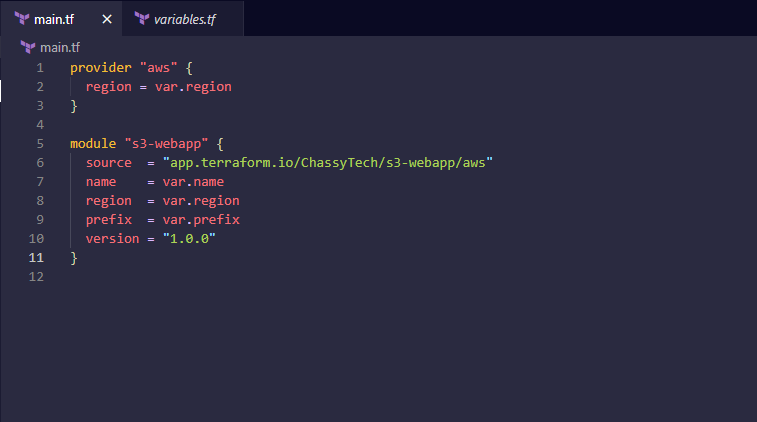
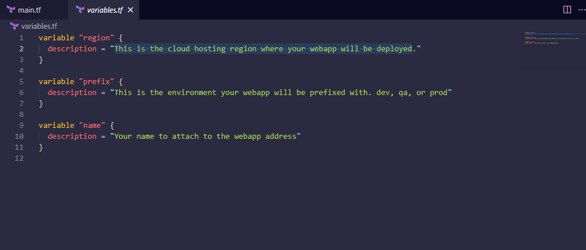
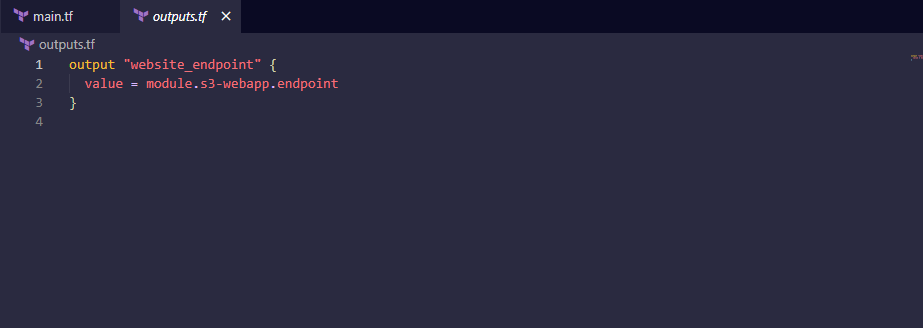

# AUTOMATING INFRASTRUCTURE WITH IAC USING TERRAFORM PART 4 – TERRAFORM CLOUD
## INTRODUCTION
In this project, instead of running the Terraform codes in project 18 from a command line, rather it is being executed from Terraform cloud console. The AMI is built differently with packer while Ansible is used to configure the infrastructure after its been provisioned by Terraform.

The following outlines the steps:

## STEP 1: Setting Up A Terraform Account

- After verifying my email and creating an organisation in the terraform cloud site, then on the **configure workspace** page, selecting **version control workflow** option inorder to run Terraform commands triggered from my git repository.
- Creating a new repository called terraform-cloud and pushing my terraform codes developed in project 18 into the repository
- Connecting the workspace to the new repository created and clicking on **create workspace**

- Clicking on **configure variables** on the next page to setup my AWS credentials as environment variables.

- Now my Terraform cloud is all set to apply the codes from GitHub and create all necessary AWS resources.

## STEP 2: Building AMI With Packer

- Installing **packer** on my local machine:

- Cloning the [repository](https://github.com/darey-devops/PBL-project-19.git) and changing directory to the AMI folder

- Running the packer commands to build AMI for Bastion server, Nginx server and webserver

**For Bastion Server**

**For Nginx Server**

**For Tooling and Wordpress Server**

**For Jenkins, Artifactory and sonarqube Server**

## STEP 3: Running The Terraform Cloud To Provision Resources

- Inputing the AMI ID in my **terraform.tfvars** file for the servers built with packer which terraform will use to provision Bastion, Nginx, Tooling and Wordpress server

- Pushing the codes to my repository will cause terraform cloud to trigger a plan
- Accepting the plan to to trigger an apply command

## STEP 4: Configuring The Infrastructure With Ansible

- After a successful execution of terraform apply, connecting to the bastion server through ssh-agent to run ansible against the infrastructure

- Updating the **nginx.conf.j2** file to input the internal load balancer dns name generated via terraform:

- Updating the RDS endpoints, Database name, password and username in the **setup-db.yml** file for both the tooling and wordpress role

**EFS Details**

**For Tooling**

**For Wordpress**

- Updating the EFS Access point ID for both the wordpress and tooling role in the **main.yml**

**For Tooling**

**For Wordpress**

- Verifying the inventory

- Exporting the environment variable **ANSIBLE_CONFIG** to point to the ansible.cfg from the repo and running the ansible-playbook command: `$ ansible-playbook -i inventory/aws_ec2.yml playbook/site.yml`

## STEP 5: Setting Slack Notification For trigger Events

- From the notification option in the settings tab, selecting slack option

- Creating the webhook to use to setup the notification

## STEP 6: Setting The Terraform Cloud To Execute Only From 'Dev' Branch

- Creating 3 branches dev, prod and test 

- On the version control page in the settings tab, setting the **VCS branch** to **dev**

- After pushing the code to the dev branch the terraform plan command is triggered and notifications received from slack:

- Destroying the infrastructure by clicking on **Destruction and Delete** option in the settings tab:

## STEP 7: Working With Terraform Private Module Registry

- Forking the repo from [hashicorp](https://github.com/hashicorp/learn-private-module-aws-s3-webapp)
- Then under my repository's tab, clicking on **tag** to create tag, clicking 'Create a new release' and adding 1.0.0 to the tag version field setting the release title to "First module release"

- Clicking **Publish release** to create the release
- To create a Terraform module for my private module registry in the [terraform registry site]
(), navigating to the Registry header in Terraform Cloud and selecting **Publish private module** from the upper right corner.
- Selecting the GitHub(Custom) VCS provider that I configured and choosing the name of the module repository **terraform-aws-s3-webapp** and clicking the **Publish module** button.

- To create a configuration that uses the module; forking the repo [learn private module](https://github.com/hashicorp/learn-private-module-root/) which will access the module published and Terraform will use it to create the infrastructure.

**main.tf**

**variables.tf**

**outputs.tf**

- Creating a new workspace and selecting the **learn-private-module-root** repository

- Clicking on **Configure Variable** to set my AWS credentials as environment variable and also set the values of these variables;**region, prefix and name**, which is specified in the root module configuration

- Deploying the infrastructure by clicking on **start new plan**

**Testing the Infrastructure**

- Destroying the Infrastructure

