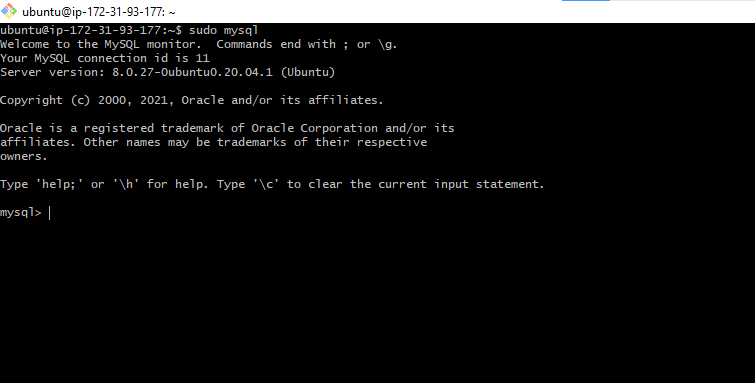

# SETTING UP A LEMP STACK WEB SERVER ON AWS CLOUD

A LEMP stack is a set of tools used to deploying a web application. Similar to the LAMP stack project covered in the [project1](./project1.md) of my repo but with an alternative Web Server called **NGINX**, which is also very popular and widely used by many websites in the Internet.
The following are the steps I took to setting up a LEMP stack:

## STEP 1: Launching an EC2 Instance

-	 I created a new EC2 Instance of t2.nano family with Ubuntu Server 20.04 LTS (HVM) image from my aws account. After a successful launch of the EC2 instance(ubuntu server), I connected to the EC2 instance from my Git bash (as a windows user) terminal with my private key(.pem file) by entering these command in the terminal:
	`ssh -i <Your-private-key.pem> ubuntu@<EC2-Public-IP-address>`
**which will look like this:**


## Step 2: Installing the Nginx Web Server

In order to display web pages to the site visitors, Nginx has to be employed- a high-performance web server. 
After a successful connection to the EC2 machine, entering the following command:
-	Updating the server’s package: `$ sudo apt update`


-	Installing Nginx: `$ sudo apt install nginx`


-	To verify that nginx was successfully installed and is running as a service in Ubuntu: `$ sudo systemctl status nginx`


-	Configuring the EC2 machine to be able to receive traffic by the web server, by adding an inbound rule to the security group of the EC2 machine to listen to port 80.


-	To access the server locally from Git bash terminal: `$ curl http://localhost:80 Or $ curl http://127.0.0.1:80`


-	To test how our Nginx server can respond to requests from the Internet is by entering my public IP address `http://<Public-IP-Address>:80` on a web browser which will look like this: 


**This shows that the web server is now correctly installed and accessible through my firewall**

## Step 3: Installing MySQL

Now that the server is running,  next is installing MySQL for storing and managing data for the site in a relational database.
-	Installing MySQL: `$ sudo apt install mysql-server`


- After a successful installation,  it’s recommended that one runs a security script that comes pre-installed with MySQL which removes insecure default settings and lock down access to my database system. The following command is entered;	`$ sudo mysql_secure_installation`
- Next is accepting to configure the VALIDATE PASSWORD PLUGIN when prompted, and selecting any of the three levels of the password validation policy and then typing a new password that corresponds to the level of password validation policy selected.
- And finally typing Y and hitting Enter key at the subsequent prompt that follow after which will remove some anonymous users and the test database, disable remote root logins, and load these new rules so that MySQL immediately respects the changes I have made.


-	Testing if I am able to log into MySQL console: `$ sudo mysql` 



## Step 4: Installing PHP
Next is to install PHP to process code and generate dynamic content for the web server and a PHP module called php-mysql that allows PHP to communicate with MySQL-based databases:
-	Installing the both at once: `$ sudo apt install php-fpm php-mysql`


## Step 5 — Configuring Nginx to Use PHP Processor

On Ubuntu 20.04, Nginx has one server block enabled by default and is configured to serve documents out of a directory at /var/www/html. The following steps are taken to setup a web directory called projectLEMP and configure Nginx to use PHP processor:
-	Creating a root web directory: `$ sudo mkdir /var/www/projectLEMP`
-	Assigning ownership of the directory with the $USER environment variable, which will reference your current system user: `$ sudo chown -R $USER:$USER /var/www/projectLEMP`
-	 opening a new configuration file in Nginx’s sites-available directory called projectLEMP: `$ sudo nano /etc/nginx/sites-available/projectLEMP`
-	Adding the following script in the file created:
```
#/etc/nginx/sites-available/projectLEMP

server {
    listen 80;
    server_name projectLEMP www.projectLEMP;
    root /var/www/projectLEMP;

    index index.html index.htm index.php;

    location / {
        try_files $uri $uri/ =404;
    }

    location ~ \.php$ {
        include snippets/fastcgi-php.conf;
        fastcgi_pass unix:/var/run/php/php7.4-fpm.sock;
     }

    location ~ /\.ht {
        deny all;
    }

}
```

-	Activating the configuration by linking to the config file from Nginx’s sites-enabled directory: `$ sudo ln -s /etc/nginx/sites-available/projectLEMP /etc/nginx/sites-enabled/`
-	Testing the configuration for syntax errors by typing: `$ sudo nginx -t`
-	 Disabling default Nginx host that is currently configured to listen on port 80:`$ sudo unlink /etc/nginx/sites-enabled/default`
-	Reloading Nginx to apply the changes: `$ sudo systemctl reload nginx`
-	Creating an index.html file in the root web directory inorder to test that the new server block works as expected:
`sudo echo 'Hello LEMP from hostname' $(curl -s http://169.254.169.254/latest/meta-data/public-hostname) 'with public IP' $(curl -s http://169.254.169.254/latest/meta-data/public-ipv4) > /var/www/projectLEMP/index.html`


-	Testing  the website URL using my IP address: `http://<Public-IP-Address>:80`


## Step 6 – Testing PHP with Nginx

To validate that Nginx can correctly hand .php files off to my PHP processor is by creating a test PHP file in the root web document:
-	Creating a file called info.php: `$ nano /var/www/projectLEMP/info.php`
-	Adding the following script:
```
<?php
phpinfo();
```
-	To access this page in the web browser: `http://Public_IP_address/info.php`


-	Removing the file since it contain seneitive information about my PHP environment: `$ sudo rm /var/www/your_domain/info.php`

## Step 7 — Retrieving data from MySQL database with PHP

Next is creating a simple ‘To do list’ to test how data is retrieved from the MySQL database with PHP:
-	First is connecting to MySQL console: `$ sudo mysql`
-	Creating a new database: `mysql> CREATE DATABASE `example_database`;`
-	Creating a new user and granting him full privileges on the database  using mysql_native_password as default authentication method: 
  `mysql>  CREATE USER 'example_user'@'%' IDENTIFIED WITH mysql_native_password BY 'password';`
  `mysql> GRANT ALL ON example_database.* TO 'example_user'@'%';`
-	Exiting from MySQL console: `mysql> exit`


-	Testing if the new user has the proper permissions by logging in to the MySQL console again using the custom user credentials: `$ mysql -u example_user -p`
-	To see the database created: `mysql> SHOW DATABASES;`
-	`mysql> SHOW DATABASES;`


-	 creating a test table named todo_list:
  ```
  mysql>     CREATE TABLE example_database.todo_list (
	mysql>     item_id INT AUTO_INCREMENT,
	mysql>     content VARCHAR(255),
	mysql>     PRIMARY KEY(item_id)
	mysql>     );
  ```
-	Inserting a few rows of content in the test table: `mysql> INSERT INTO example_database.todo_list (content) VALUES ("My first important item");`
-	To confirm that the data was successfully created: `mysql>  SELECT * FROM example_database.todo_list;`
-	Exit the MySQL console: `$ mysql> exit`
-	Creating a new PHP file called todo_list.php in my custom web root directory and creating a PHP script that will connect to MySQL and query for my content: `$ nano /var/www/projectLEMP/todo_list.php`
-	Adding the following PHP script:
```
<?php
$user = "example_user";
$password = "password";
$database = "example_database";
$table = "todo_list";

try {
  $db = new PDO("mysql:host=localhost;dbname=$database", $user, $password);
  echo "<h2>TODO</h2><ol>";
  foreach($db->query("SELECT content FROM $table") as $row) {
    echo "<li>" . $row['content'] . "</li>";
  }
  echo "</ol>";
} catch (PDOException $e) {
    print "Error!: " . $e->getMessage() . "<br/>";
    die();
}
```

-	To access this page in my web browser is by visiting my public IP address followed by /todo_list.php
`http://<Public_domain_or_IP>/todo_list.php`


