#  MIGRATION TO THE CLOUD WITH CONTAINERIZATION - DOCKER
## INTRODUCTION

In this project, the frontend and the backend(MySQL) of **tooling** application is built and containerized using **DOCKER** of which its image is pushed to Docker registry. And further in the project, the **php-todo** application is also built into a container and pushed into the AWS Elastic Container Registry using a CI/CD tool known as Jenkins and **Docker Compose** is also implemented.

The following outlines the steps:

## STEP 1: Creating MySQL Container For Tooling App Backend
- Creating a custom network with a subnet dedicated for both MySQL and the Tooling application so that they connect: ` $ docker network create --subnet=172.18.0.0/24 tooling_app_network`
- Creating an environment variable to store the root password: `$ export MYSQL_PW=password1234`
- Pulling the MySQL image and running the container: `$ docker run --network tooling_app_network -h mysqlserverhost --name=mysql-server -e MYSQL_ROOT_PASSWORD=$MYSQL_PW  -d mysql/mysql-server:latest`
- To verify the container is created:`$ docker ps -a`

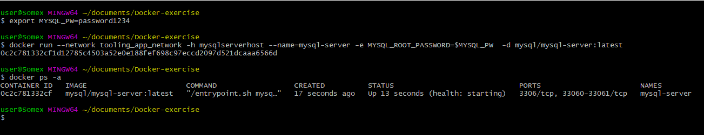

- Because it's not a good practice to connect to MySQL server remotely using the root user. Creating a file **create_user.sql** and adding the following code in order to create a user:
`CREATE USER 'somex'@'%' IDENTIFIED BY 'password123'; GRANT ALL PRIVILEGES ON * . * TO 'somex'@'%';`
- Running the script to create the new user:` $ docker exec -i mysql-server mysql -uroot -p$MYSQL_PW < create_user.sql`

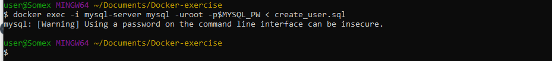

- Connecting to the MySQL server from a second container running the MySQL client utility:` $ docker run --network tooling_app_network --name mysql-client -it --rm mysql mysql -h mysqlserverhost -u  -p`

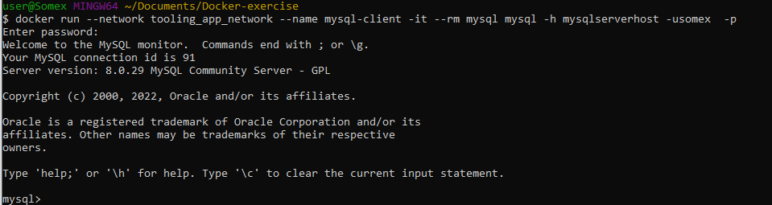

## STEP 2: Preparing The Database Schema

- Cloning the Tooling-app repository: ` $ git clone https://github.com/darey-devops/tooling.git`

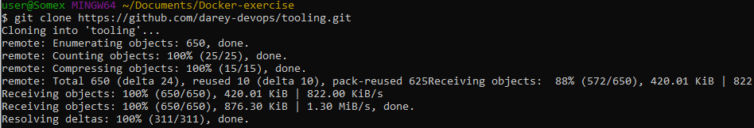

- Exporting the location of the SQL file that contains data for setting up the MySQL database:` $ export tooling_db_schema=~/tooling_db_schema.sql `
- Using the SQL script to create the database and prepare the schema:` $ docker exec -i mysql-server mysql -uroot -p$MYSQL_PW < $tooling_db_schema`

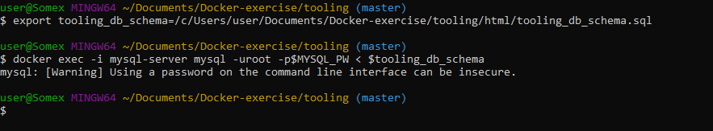

## STEP 3: Running The Tooling App

- From the tooling app directory where the Dockerfile is, running the following command to build the docker image: `$ docker build -t tooling:0.0.1 .`

**Dockerfile**
```
FROM php:7-apache
LABEL MAINTAINER somex

RUN docker-php-ext-install mysqli
RUN echo "ServerName localhost" >> /etc/apache2/apache2.conf
RUN curl -sS https://getcomposer.org/installer | php -- --install-dir=/usr/local/bin --filename=composer
COPY apache-config.conf /etc/apache2/sites-available/000-default.conf
COPY start-apache /usr/local/bin
RUN a2enmod rewrite

# Copy application source
COPY html /var/www
RUN chown -R www-data:www-data /var/www

ENV MYSQL_IP=db
ENV MYSQL_USER=somex
ENV MYSQL_PASS=password123
ENV MYSQL_DBNAME=toolingdb

CMD ["start-apache"]
```
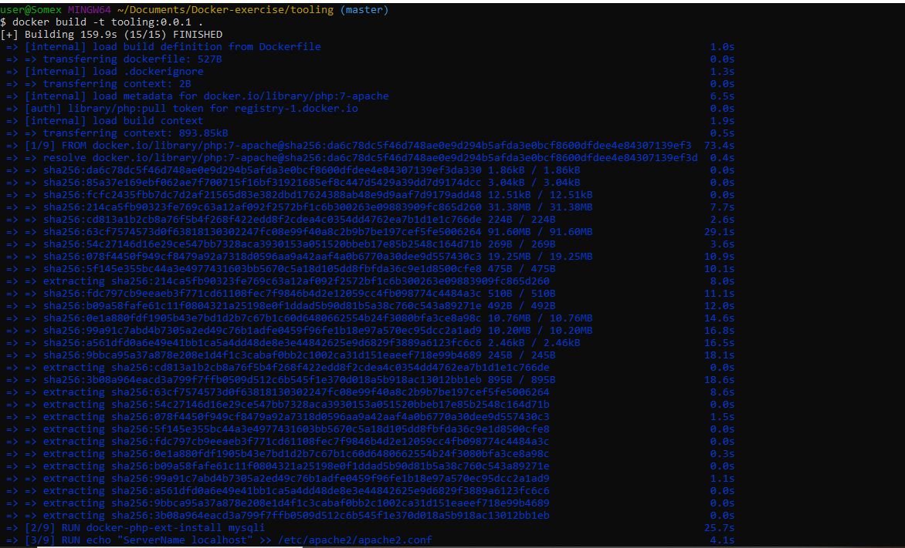

- Running the container: ` $ docker run --network tooling_app_network -p 8085:80 -it tooling:0.0.1 `

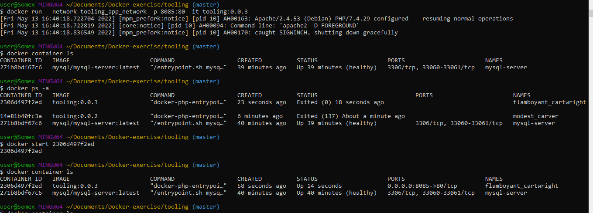

- Testing the tooling app in the browser:`http://localhost:8085`

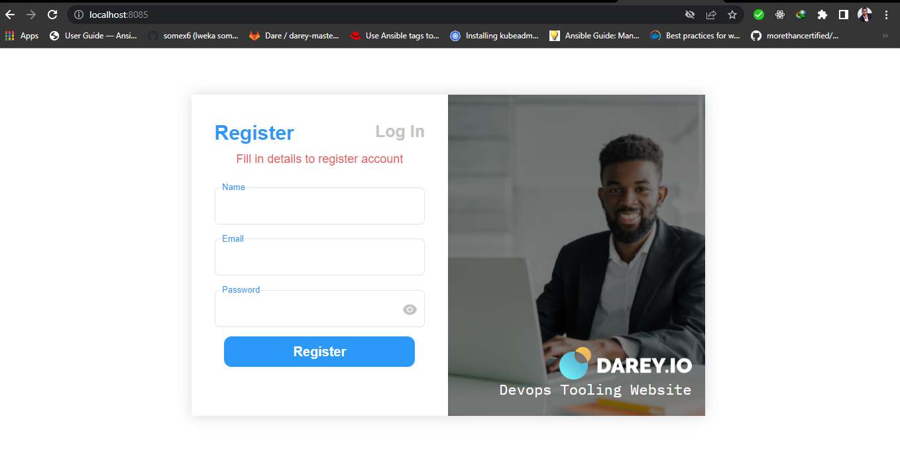

## STEP 4: Migrating PHP-Todo App Into A Containerized Application

- Cloning the php-todo app repository https://github.com/apotitech/php-todo :
- Writing a Dockerfile for the application
```
FROM php:7-apache
LABEL MAINTAINER Somex

RUN apt update
RUN apt install zip git nginx -y
RUN docker-php-ext-install pdo_mysql mysqli
RUN curl -sS https://getcomposer.org/installer | php -- --install-dir=/usr/local/bin --filename=composer

WORKDIR /var/www/html

COPY . .
RUN mv /var/www/html/.env.sample /var/www/html/.env 
RUN chmod +x artisan

RUN composer install
RUN php artisan db:seed
RUN php artisan key:generate

CMD php artisan migrate
ENTRYPOINT php artisan serve --host 0.0.0.0 --port 5001
```
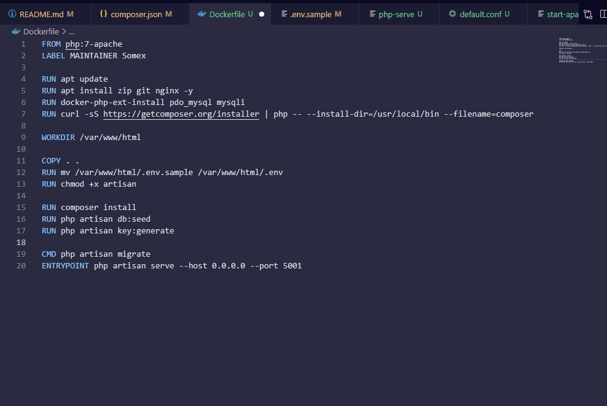

- Creating a MySQL container for the php-todo frontend

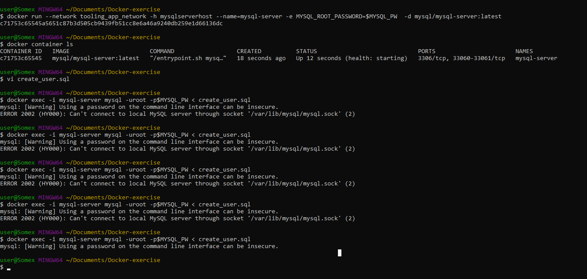

- Running the build command to create the Docker image of the app

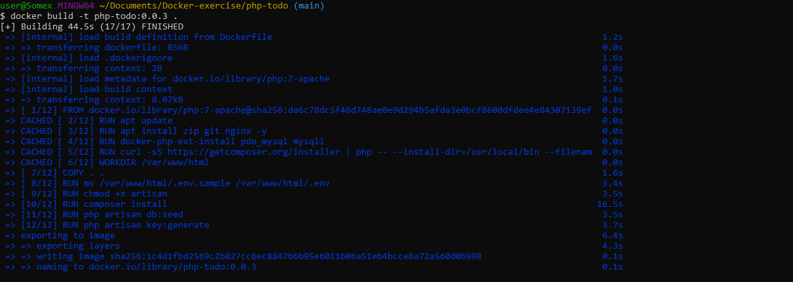

- Running the container

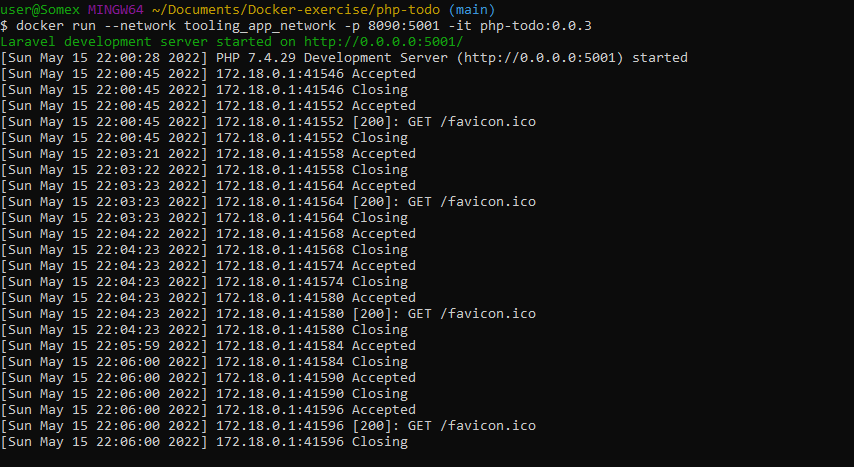

- Running the **artisan migrate** command inside the php-todo container since it was ignored during the build process


- Testing the php-todo app in the browser

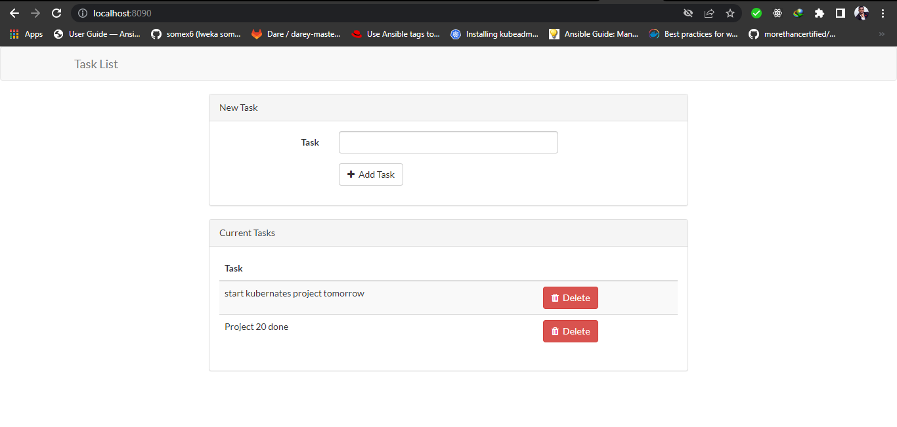

## STEP 5: Pushing The Docker Image To Docker Registry

- Creating a new repository in the Docker registry

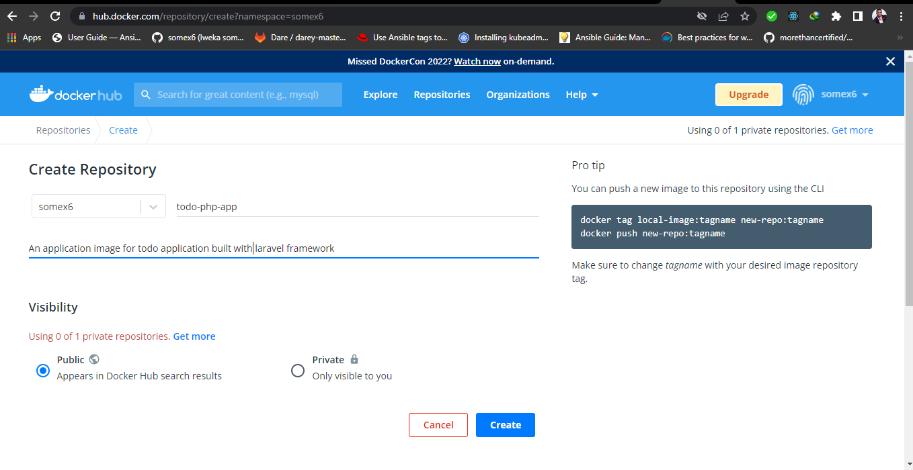

- Logging in from the commandline and changing the name of the php-todo image and giving it a tag
- Running the following command to push the php-todo app image to my Docker repository

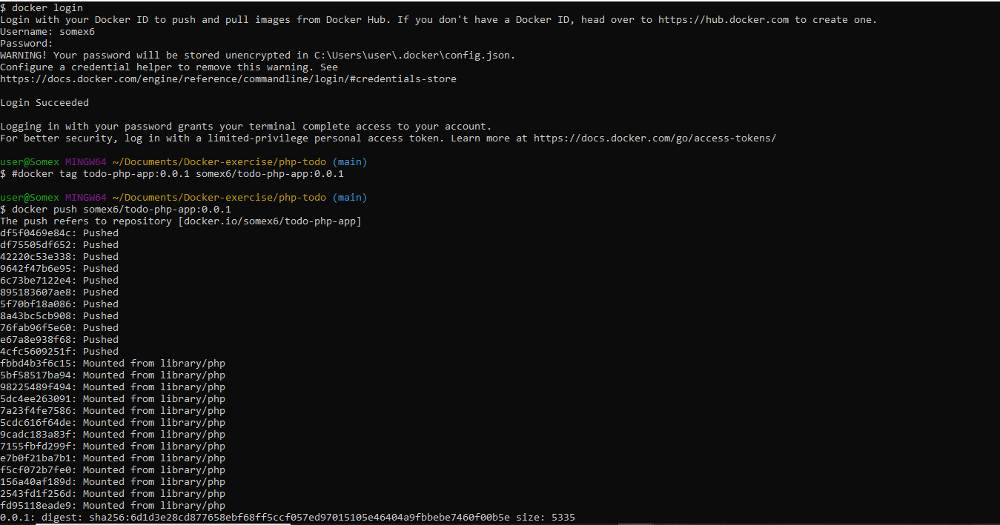

## STEP 6: Running Docker Build And Docker Push on Jenkins

- Creating a repository in AWS Elastic Container Registry


- Setting up the Jenkins server: 

Installing Docker plugin in Jenkins to run Docker job


- Giving Jenkins permission on .aws configuration file: Moving the .aws folder to /var/lib/jenkins directory and running the following command:`$ sudo chown jenkins:jenkins .aws`


- And also running the command: `$ sudo chmod 666 /var/run/docker.run`
- Logging in from the commandline


- Creating two branches in my php-todo github repo: **develop** and **feature**
- Creating the Jenkinsfile for the two branches which will run docker build and push the image to my AWS ECR repository
```
pipeline {
  agent any

      environment 
    {
        PROJECT     = 'php-todo'
        ECRURL      = '704771385539.dkr.ecr.us-east-1.amazonaws.com/php-todo'
        DEPLOY_TO = 'development'
    }

  stages {

    stage("Initial cleanup") {
        steps {
        dir("${WORKSPACE}") {
            deleteDir()
        }
        }
    }

    stage('Checkout')
    {
      steps {
      checkout([
        $class: 'GitSCM', 
        doGenerateSubmoduleConfigurations: false, 
        extensions: [],
        submoduleCfg: [], 
        branches: [[name: 'develop']],
        userRemoteConfigs: [[url: "https://github.com/apotitech/php-todo.git ",credentialsId:'46403133-dd7c-4075-ad1e-090584927bac']] 	
        ])
        
      }
        }

    stage('Build preparations')
      {
        steps
          {
              script 
                {
                    // calculate GIT lastest commit short-hash
                    gitCommitHash = sh(returnStdout: true, script: 'git rev-parse HEAD').trim()
                    shortCommitHash = gitCommitHash.take(7)
                    // calculate a sample version tag
                    VERSION = shortCommitHash
                    // set the build display name
                    currentBuild.displayName = "#${BUILD_ID}-${VERSION}"
                    IMAGE = "$PROJECT:$VERSION"
                }
            }
      }   

    stage('Build For Dev Environment') {
               when { branch pattern: "^feature.*|^bug.*|^dev", comparator: "REGEXP"}
            
        steps {
            echo 'Build Dockerfile....'
            script {
                sh("eval \$(aws ecr get-login --no-include-email --region us-east-1 | sed 's|https://||')") 
                sh "docker build --network=host -t $IMAGE ."
                docker.withRegistry("https://$ECRURL"){
                docker.image("$IMAGE").push("dev-$BUILD_NUMBER")
            }
            }
        }
      }

    stage('Build For Staging Environment') {
            when {
                expression { BRANCH_NAME ==~ /(staging|develop)/ }
            }
        steps {
            echo 'Build Dockerfile....'
            script {
                sh("eval \$(aws ecr get-login --no-include-email --region us-east-1 | sed 's|https://||')") 
                sh "docker build --network=host -t $IMAGE ."
                docker.withRegistry("https://$ECRURL"){
                docker.image("$IMAGE").push("dev-staging-$BUILD_NUMBER")
                }
            }
        }
    }


    stage('Build For Production Environment') {
        when { tag "release-*" }
        steps {
            echo 'Build Dockerfile....'
            script {
                sh("eval \$(aws ecr get-login --no-include-email --region us-east-1 | sed 's|https://||')") 
                // sh "docker build --network=host -t $IMAGE -f deploy/docker/Dockerfile ."
                sh "docker build --network=host -t $IMAGE ."
                docker.withRegistry("https://$ECRURL"){
                docker.image("$IMAGE").push("prod-$BUILD_NUMBER")
                }
            }
        }
    }
  }

        post
    {
        always
        {
            sh "docker rmi -f $IMAGE "
        }
    }
} 
```
- Pushing the changes to my github repo
- Creating a multibranch pipeline job and linking it to the php-todo repository


- Running the pipeline job

**On Feature branch**


**On Develop branch**


**Images Pushed To AWS ECR**


## STEP 7: Running Docker Compose

**Docker Compose**  takes care of the hard work involved in running Docker commands on the terminal to create an image, launch an application inside it and get the applications up and running by writing a declarative code in YAML which gets all the applications and dependencies up and running with minimal effort by launching a single command.
- Refactoring the Tooling app POC in order to leverage the power of Docker Compose.
- Creating a file called **tooling.yaml**
- Writing the Docker Compose in yaml syntax, defining services, networks, and volumes:
```
version: "3.9"
services:
  tooling_frontend:
    build: .
    depends_on:
      - db
    ports:
      - "5000:80"
    volumes:
      - tooling_frontend:/var/www/html
    

  db:
    image: mysql:5.7
    restart: always
    environment:
      MYSQL_DATABASE: toolingdb
      MYSQL_USER: somex
      MYSQL_PASSWORD: password123
      MYSQL_ROOT_PASSWORD: password1234   
    volumes:
      - db:/var/lib/mysql
      - .datadump.sql/:/docker-entrypoint-initdb.d/datadump.sql

networks:
  default:
    external:
      name: tooling_app_network
  
volumes:
  tooling_frontend:
  db:
```
- Running the command to start the containers: `$ docker-compose -f tooling.yaml up -d`


