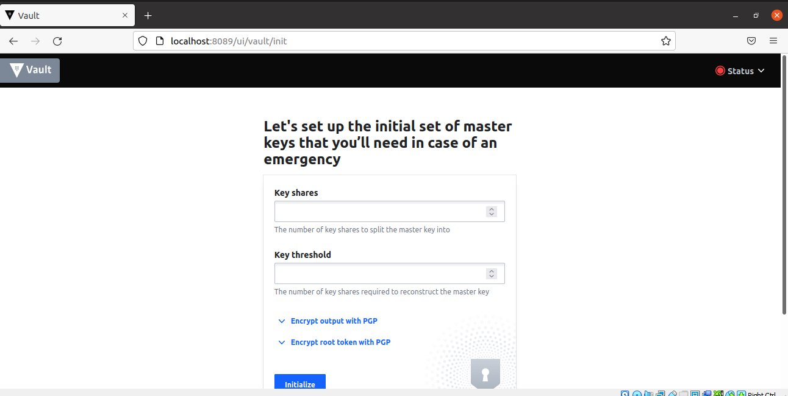
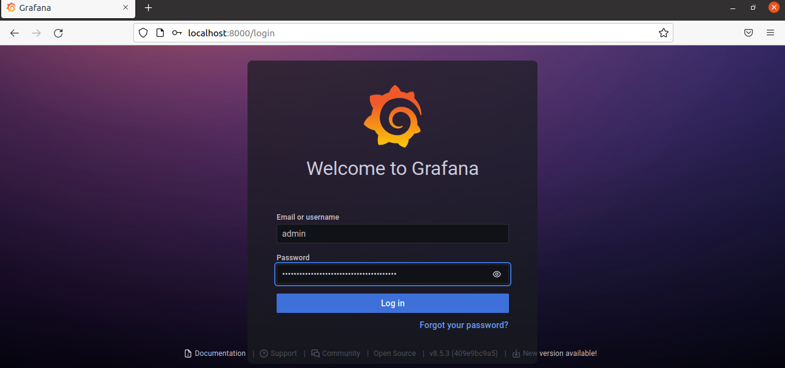
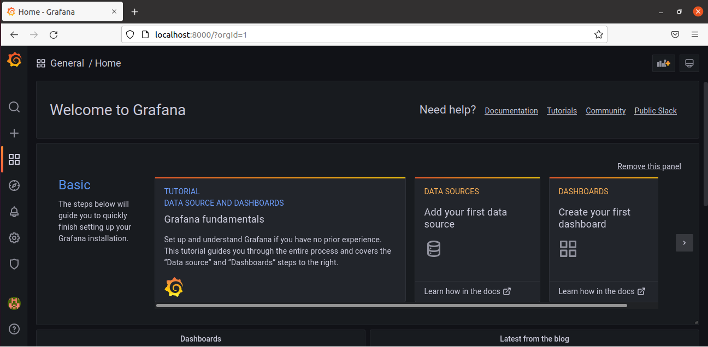

# BUILDING ELASTIC KUBERNETES SERVICE (EKS) WITH TERRAFORM
## INTRODUCTION

In this project, the Elastic Kubernates Service (EKS), which is a managed kubernetes service that takes care of undifferentiated heavy lifting involved in setting up Kubernetes, is provisioned using **Terraform**. And further in the project, **Helm** which is a package manager for Kubernetes is used to deploy multiple applications.

The following outlines the steps;

## STEP 1: Configuring The Terraform Module For EKS

- Creating AWS S3 bucket from a CLI to store the Terraform state:`$ aws s3api create-bucket --bucket eks-terraform-buck --region us-east-1`


- Creating a new directory **eks** for the Terraform file
- Creating a file **backend.tf** for the remote state in S3:
```
resource "aws_dynamodb_table" "terraform_locks" {
  name         = "terraform-locks"
  billing_mode = "PAY_PER_REQUEST"
  hash_key     = "LockID"
  attribute {
    name = "LockID"
    type = "S"
  }
}

terraform {
  backend "s3" {
    bucket         = "eks-terraform-buck"
    key            = "global/s3/terraform.tfstate"
    region         = "us-east-1"
    dynamodb_table = "terraform-locks"
    encrypt        = true
  }
}
```
- Creating the **network.tf** file to provision Elastic IP for Nat Gateway, VPC, Private and public subnets:
```
# reserve Elastic IP to be used in our NAT gateway
resource "aws_eip" "nat_gw_elastic_ip" {
  vpc = true

  tags = {
    Name            = "${var.cluster_name}-nat-eip"
    iac_environment = var.iac_environment_tag
  }
}

module "vpc" {
  source = "terraform-aws-modules/vpc/aws"

  name = "${var.name_prefix}-vpc"
  cidr = var.main_network_block
  azs  = data.aws_availability_zones.available_azs.names

  private_subnets = [
    # this loop will create a one-line list as ["10.0.0.0/20", "10.0.16.0/20", "10.0.32.0/20", ...]
    # with a length depending on how many Zones are available
    for zone_id in data.aws_availability_zones.available_azs.zone_ids :
    cidrsubnet(var.main_network_block, var.subnet_prefix_extension, tonumber(substr(zone_id, length(zone_id) - 1, 1)) - 1)
  ]

  public_subnets = [
    for zone_id in data.aws_availability_zones.available_azs.zone_ids :
    cidrsubnet(var.main_network_block, var.subnet_prefix_extension, tonumber(substr(zone_id, length(zone_id) - 1, 1)) + var.zone_offset - 1)
  ]
  enable_nat_gateway     = true
  single_nat_gateway     = true
  one_nat_gateway_per_az = false
  enable_dns_hostnames   = true
  reuse_nat_ips          = true
  external_nat_ip_ids    = [aws_eip.nat_gw_elastic_ip.id]

  # Add VPC/Subnet tags required by EKS
  tags = {
    "kubernetes.io/cluster/${var.cluster_name}" = "shared"
    iac_environment                             = var.iac_environment_tag
  }
  public_subnet_tags = {
    "kubernetes.io/cluster/${var.cluster_name}" = "shared"
    "kubernetes.io/role/elb"                    = "1"
    iac_environment                             = var.iac_environment_tag
  }
  private_subnet_tags = {
    "kubernetes.io/cluster/${var.cluster_name}" = "shared"
    "kubernetes.io/role/internal-elb"           = "1"
    iac_environment                             = var.iac_environment_tag
  }
}
```
- Creating the **data.tf** file that will pull the available AZs for use:
```
# get all available AZs in our region
data "aws_availability_zones" "available_azs" {
  state = "available"
}
data "aws_caller_identity" "current" {} # used for accesing Account ID and ARN
```
- Creating the **eks.tf** file that will provision EKS cluster:
```
module "eks_cluster" {
  source                          = "terraform-aws-modules/eks/aws"
  version                         = "~> 18.0"
  cluster_name                    = var.cluster_name
  cluster_version                 = "1.22"
  vpc_id                          = module.vpc.vpc_id
  subnet_ids                      = module.vpc.private_subnets
  cluster_endpoint_private_access = true
  cluster_endpoint_public_access  = true

  # Self Managed Node Group(s)
  self_managed_node_group_defaults = {
    instance_type                          = var.asg_instance_types[0]
    update_launch_template_default_version = true
  }
  self_managed_node_groups = local.self_managed_node_groups

  # aws-auth configmap
  create_aws_auth_configmap = true
  manage_aws_auth_configmap = true
  aws_auth_users            = concat(local.admin_user_map_users, local.developer_user_map_users)
  tags = {
    Environment = "prod"
    Terraform   = "true"
  }
}
```
- Creating the **locals.tf** file for local variables because Terraform does not allow assigning variable to variables
```
# render Admin & Developer users list with the structure required by EKS module
locals {
  admin_user_map_users = [
    for admin_user in var.admin_users :
    {
      userarn  = "arn:aws:iam::${data.aws_caller_identity.current.account_id}:user/${admin_user}"
      username = admin_user
      groups   = ["system:masters"]
    }
  ]
  developer_user_map_users = [
    for developer_user in var.developer_users :
    {
      userarn  = "arn:aws:iam::${data.aws_caller_identity.current.account_id}:user/${developer_user}"
      username = developer_user
      groups   = ["${var.name_prefix}-developers"]
    }
  ]

  self_managed_node_groups = {
    worker_group1 = {
      name = "${var.cluster_name}-wg"

      min_size      = var.autoscaling_minimum_size_by_az * length(data.aws_availability_zones.available_azs.zone_ids)
      desired_size  = var.autoscaling_minimum_size_by_az * length(data.aws_availability_zones.available_azs.zone_ids)
      max_size      = var.autoscaling_maximum_size_by_az * length(data.aws_availability_zones.available_azs.zone_ids)
      instance_type = var.asg_instance_types[0].instance_type

      bootstrap_extra_args = "--kubelet-extra-args '--node-labels=node.kubernetes.io/lifecycle=spot'"

      block_device_mappings = {
        xvda = {
          device_name = "/dev/xvda"
          ebs = {
            delete_on_termination = true
            encrypted             = false
            volume_size           = 10
            volume_type           = "gp2"
          }
        }
      }

      use_mixed_instances_policy = true
      mixed_instances_policy = {
        instances_distribution = {
          spot_instance_pools = 4
        }

        override = var.asg_instance_types
      }
    }
  }
}
```
- Creating the **variables.tf** file:
```
# create some variables
variable "cluster_name" {
  type        = string
  description = "EKS cluster name."
}

variable "iac_environment_tag" {
  type        = string
  description = "AWS tag to indicate environment name of each infrastructure object."
}

variable "name_prefix" {
  type        = string
  description = "Prefix to be used on each infrastructure object Name created in AWS."
}

variable "main_network_block" {
  type        = string
  description = "Base CIDR block to be used in our VPC."
}

variable "subnet_prefix_extension" {
  type        = number
  description = "CIDR block bits extension to calculate CIDR blocks of each subnetwork."
}

variable "zone_offset" {
  type        = number
  description = "CIDR block bits extension offset to calculate Public subnets, avoiding collisions with Private subnets."
}

variable "admin_users" {
  type        = list(string)
  description = "List of Kubernetes admins."
}

variable "developer_users" {
  type        = list(string)
  description = "List of Kubernetes developers."
}

variable "asg_instance_types" {
  description = "List of EC2 instance machine types to be used in EKS."
}

variable "autoscaling_minimum_size_by_az" {
  type        = number
  description = "Minimum number of EC2 instances to autoscale our EKS cluster on each AZ."
}

variable "autoscaling_maximum_size_by_az" {
  type        = number
  description = "Maximum number of EC2 instances to autoscale our EKS cluster on each AZ."
}
```
- Creating the **terraform.tfvars** to set values for variables:
```
cluster_name            = "tooling-app-eks"
iac_environment_tag     = "development"
name_prefix             = "somex-io-eks"
main_network_block      = "10.0.0.0/16"
subnet_prefix_extension = 4
zone_offset             = 8

# Ensure that these users already exist in AWS IAM. Another approach is that you can introduce an iam.tf file to manage users separately, get the data source and interpolate their ARN.
admin_users                    = ["somex", "grandol"]
developer_users                = ["alex", "victor"]
asg_instance_types             = [{ instance_type = "t3.small" }, { instance_type = "t2.small" }, ]
autoscaling_minimum_size_by_az = 1
autoscaling_maximum_size_by_az = 5

```
- Creating the **provider.tf** file:
```
provider "aws" {
  region = "us-west-1"
}

provider "random" {
}
```
- Running the **terraform init** command:


- Running the **terraform plan** command to confirm the configuration:


- Running the **terraform apply** command will cause the following the error at some point while creating the resources, that is because for us to connect to the cluster using the kubeconfig, Terraform needs to be able to connect and set the credentials correctly:


- To fixed the error the following configuration is added in the **data.tf** and **provider.tf** file:

**data.tf**
```
# get EKS cluster info to configure Kubernetes and Helm providers
data "aws_eks_cluster" "cluster" {
  name = module.eks_cluster.cluster_id
}
data "aws_eks_cluster_auth" "cluster" {
  name = module.eks_cluster.cluster_id
}
```

**provider.tf**
```
# get EKS authentication for being able to manage k8s objects from terraform
provider "kubernetes" {
  host                   = data.aws_eks_cluster.cluster.endpoint
  cluster_ca_certificate = base64decode(data.aws_eks_cluster.cluster.certificate_authority.0.data)
  token                  = data.aws_eks_cluster_auth.cluster.token
}
```
- Running the **terraform init** and **terraform apply** again


- Creating the **kubeconfig** file using awscli:`$ aws eks update-kubecofig --name tooling-app-eks --region us-west-1 --kubeconfig kubeconfig`

## STEP 2: Installing Helm From Script

- Fetching the script:`$ curl -fsSL -o get_helm.sh https://raw.githubusercontent.com/helm/helm/main/scripts/get-helm-3`
- Changing the permission of the script:`$ chmod 700 get_helm.sh`
- Executing the script:`$ ./get_helm.sh`


## STEP 3: Deploying Jenkins With Helm

- Adding the Jenkins' repository to helm so it can be easily downloaded and deployed:`$ helm repo add jenkins https://charts.jenkins.io`
- Updating helm repo:`$ helm repo update`


- Installing the chart:`$ helm install myjenkins jenkins/jenkins --kubeconfig kubeconfig`


- Running some commands to inspect the installation:


- In order to run the **kubectl** commands without specifying the **kubeconfig** file, a package manager for kubectl called **krew** is installed so that it will enable us to install plugins to extend the functionality of kubectl:


- Installing **Konfig** plugin:`$ kubectl krew install konfig`


- Importing the kubeconfig into the default kubeconfig file:`$ sudo kubectl konfig import --save  kubeconfig`
- To show all the contexts for the clusters configured in my kubeconfig.`$ kubectl config get-contexts`


- Setting the current context to use the one of **tooling-app-eks** for all kubectl and helm commands:`$ kubectl config use-context tooling-app-eks`
- Testing it:`$ kubectl get po`
- To display the current context in use:`$ kubectl config current-context`


- To acquire the Jenkins administrator's password credential:`$ kubectl exec --namespace default -it svc/jenkins -c jenkins -- /bin/cat /run/secrets/chart-admin-password && echo`
- Port forwarding to access Jenkins from the UI:`$ kubectl --namespace default port-forward svc/myjenkins 8080:8080`


- Accessing the Jenkins app from the browser:`http://localhost:8080`


## STEP 4: Deploying Artifactory With Helm

- Adding the Artifactory's repository to helm:`$ helm repo add jfrog https://charts.jfrog.io `
- Updating helm repo:`$ helm repo update`


- Installing the chart:`$ helm upgrade --install artifactory --namespace artifactory jfrog/artifactory`


## STEP 5: Deploying Hashicorp Vault With Helm

- Adding the Hashicorp's repository to helm:`$ helm repo add hashicorp https://helm.releases.hashicorp.com `
- Updating helm repo:`$ helm repo update`
- Installing the chart:`$ helm install vault hashicorp/vault`


- Inspecting the installation:


- Port forwarding to access Hashicorp vault from the UI:`kubectl port-forward svc/vault 8089:8200`


- Accessing the app from the browser:`http://localhost:8089`



## STEP 6: Deploying Prometheus With Helm

- Adding the prometheus's repository to helm:`$ helm repo add prometheus-community https://prometheus-community.github.io/helm-charts`
- Updating helm repo:`$ helm repo update`


- Installing the chart:`$ helm install myprometheus prometheus-community/prometheus`


- Inspecting the installation shows that there are various pods and services created
- Port forwarding to access prometheus for alert manager from the UI:`$ kubectl port-forward svc/myprometheus-alertmanager 8000:80`


- Accessing the app from the browser:`http://localhost:8000`


- Port forwarding to access prometheus for kube state metrics from the UI:`$ kubectl port-forward svc/myprometheus-kube-state-metrics 8000:8080`


- Accessing the app from the browser:`http://localhost:8000`


- Port forwarding to access prometheus for pushgateway from the UI:`$ kubectl port-forward svc/myprometheus-pushgateway 8000:9091`


- Accessing the app from the browser:`http://localhost:8000`


## STEP 6: Deploying Grafana With Helm

- Adding the grafana's repository to helm:`$ helm repo add grafana https://grafana.github.io/helm-charts`
- Updating helm repo:`$ helm repo update`
- Installing the chart:`$ helm install grafana-tool grafana/grafana`


- Port forwarding to access grafana from the UI:`$ kubectl port-forward svc/grafana-tool 8000:80`


- Accessing the app from the browser:`http://localhost:8000`





## STEP 6: Deploying Elasticsearch With Helm

- Adding the Artifactory's repository to helm:`$ helm repo add  `
- Updating helm repo:`$ helm repo update`
- Installing the chart:`$ helm install ...`


