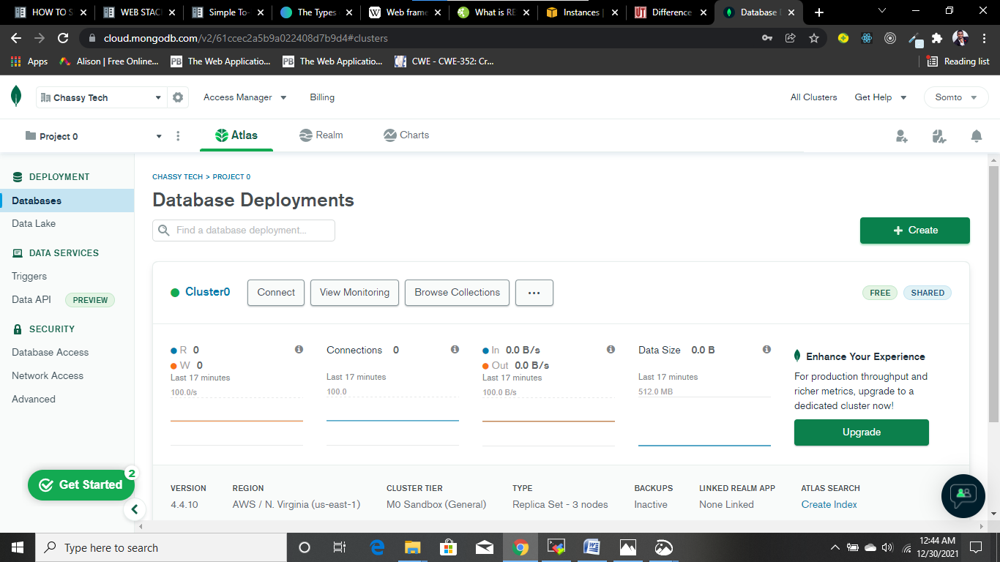

# SETTING UP A MERN STACK AND DEPLOYING A TODO APPLICATION ON AWS CLOUD

A MERN web stack consist of the following components: MongoDB, ExpressJS, ReactJS, and NodeJS.
The following are the steps took to setting up a MERN stack in AWS cloud:

## STEP 1: Setting up a virtual server in the cloud

To setup a virtual server, I Created a new EC2 Instance of t2.nano family with Ubuntu Server 20.04 LTS (HVM) image from aws account which is the free tier(limited) offered by aws. 
After a successful launch of the EC2 instance(ubuntu server), I connected to the EC2 instance from MobaXterm(as a window user) terminal with my private key(.pem file). 

## STEP 2: Server Configuration

The following commands are used to configure the ubuntu server:
-	Update ubuntu : `$ sudo apt update`
-	Upgrade ubuntu: `$ sudo apt upgrade`


-	To get the location of Node.js software from Ubuntu repositories : `$ curl -sL https://deb.nodesource.com/setup_12.x | sudo -E bash –`

## STEP 3: Installing Nodejs on the server

-	Installing Nodejs with the command: $ sudo apt-get install -y nodejs

## STEP 4: Application code setup

-	Creating a new directory: `$ mkdir Todo`
-	To verify that the directory is created: `$ ls`
-	Changing the current directory to work in Todo directory: `$ cd Todo`
-	Initializing my project which will create package.json with this command: `$ npm init`
-	Following the prompt and accept to write out the package.json file


 
## STEP 5: Installing ExpressJs

-	Installing ExpressJS with the command: `$ npm install express`
-	Creating a new file called index.js: `$ touch index.js`
-	Installing the dotenv module: `$ npm install dotenv`


-	Editing the index.js file with this command: `vim index.js`
-	 **Entering the following codes:**
```
      const express = require('express');
      require('dotenv').config();
  
      const app = express();

      const port = process.env.PORT || 5000;

      app.use((req, res, next) => {
      res.header("Access-Control-Allow-Origin", "\*");
      res.header("Access-Control-Allow-Headers", "Origin, X-Requested-With, Content-Type, Accept");
      next();
      });

      app.use((req, res, next) => {
      res.send('Welcome to Express');
      });

      app.listen(port, () => {
      console.log(`Server runninchange g on port ${port}`)
      });
  ```
  
  **Save and quit the editor by typing :wq**
  
-	Starting the server: `$ node index.js`
-	Configuring the security group of the EC2 instance to be able to listen to port 5000


-	Opening up the browser to access the server’s public IP followed by port 5000: `(https://<Public IP or Public DNS>:5000)`

## STEP 6: Creating Routes
  
Setting up routes that will be able to handle these three actions for the Todo application:
1.	Create a new task
2.	Display list of all tasks
3.	Delete a completed task
  
-	Creating a folder for our routes: $ mkdir routes
-	Changing directory to routes: `$ cd routes`
-	Creating a file called api.js: `$ touch api.js`
-	Opening the file with the command: `$ vim api.js`
-	**Entering the following code:**

```
    const express = require ('express');
    const router = express.Router();

    router.get('/todos', (req, res, next) => {

    });

    router.post('/todos', (req, res, next) => {

    });

    router.delete('/todos/:id', (req, res, next) => {

    })

    module.exports = router;
 ```

## STEP 7: Creating a schema and a Model

-	Installing a Nodejs package called mongoose which makes working with mongodb easier. Changing directory back to Todo folder by entering the command: `$ cd .. ` and then 	 installing Mongoose: `$ npm install mongoose`
-	Creating a new folder called models: `$ mkdir models`
-	Changing the directory to models: `$ cd models`
-	Creating a new file called todo.js: `$ touch todo.js`


-	**Open the todo.js file with vim todo.js command and enter the following code**
```
    const mongoose = require('mongoose');
    const Schema = mongoose.Schema;

    //create schema for todo
    
    const TodoSchema = new Schema({
    action: {
    type: String,
    required: [true, 'The todo text field is required']
    }
    })

    //create model for todo
    
    const Todo = mongoose.model('todo', TodoSchema);

    module.exports = Todo;
 ```

-	**Updating the routes file in the routes directory in order to work with the new model created and entering the code**:
```
    const express = require ('express');
    const router = express.Router();
    const Todo = require('../models/todo');

    router.get('/todos', (req, res, next) => {

    //this will return all the data, exposing only the id and action field to the client
    
    Todo.find({}, 'action')
    .then(data => res.json(data))
    .catch(next)
    });

    router.post('/todos', (req, res, next) => {
    if(req.body.action){
    Todo.create(req.body)
    .then(data => res.json(data))
    .catch(next)
    }else {
    res.json({
    error: "The input field is empty"
    })
    }
    });

    router.delete('/todos/:id', (req, res, next) => {
    Todo.findOneAndDelete({"_id": req.params.id})
    .then(data => res.json(data))
    .catch(next)
    })

    module.exports = router;
 ```

## STEP 8: Working with MongoDB database
 
  Working with mlab which provides MongoDB database as a service solution(DBaaS). The following steps are taken to set up:
  - Creating an account with mlab
-	Creating a MongoDB database and collection inside mLab
-	Creating a .env file in Todo directory: `$ touch .env`
-	Opening the file: `$ vi .env`
-	Adding the connection string to access the database in it(the username, password and network-address are replaced with the credentials used in creating the mongodb database):     
       ` DB = 'mongodb+srv://<username>:<password>@<network-address>/<dbname>?retryWrites=true&w=majority'`


-	updating the index.js file to reflect the use of .env so that Node.js can connect to the database by opening it with this command: vim index.js, deleting the content by 	typing `:%d` and pressing the enter key, tap I to enter insert mode  and entering the following code:

```
    const express = require('express');
    const bodyParser = require('body-parser');
    const mongoose = require('mongoose');
    const routes = require('./routes/api');
    const path = require('path');
    require('dotenv').config();
	
    const app = express();

    const port = process.env.PORT || 5000;

    //connect to the database
    
    mongoose.connect(process.env.DB, { useNewUrlParser: true, useUnifiedTopology: true })
    
    .then(() => console.log(`Database connected successfully`))
    .catch(err => console.log(err));
	
     //since mongoose promise is depreciated, we overide it with node's promise
     mongoose.Promise = global.Promise;

     app.use((req, res, next) => {
     res.header("Access-Control-Allow-Origin", "\*");
     
     res.header("Access-Control-Allow-Headers", "Origin, X-Requested-With, Content-Type, Accept");
     next();
     });
	
     app.use(bodyParser.json());

     app.use('/api', routes);

     app.use((err, req, res, next) => {
     console.log(err);
     next();
     });
 
     app.listen(port, () => {
     console.log(`Server running on port ${port}`)
     });
```

- Save and quit and starting the server at the Todo directory



- Starting the server: `$ node index.js`


## STEP 9: Testing the Backend code with Postman

To test the code in the backend:
-	Opening a postman and creating a POST request to the api  `http://<PublicIP-or-PublicDNS>:5000/api/todos`


-	Creating a GET request to the API on `http://<PublicIP-or-PublicDNS>:5000/api/todos` which retrieves all existing records from the Todo application 


-	Creating a DELETE request to the API on `http://<PublicIP-or-PublicDNS>:5000/api/todos/<id of the post>`


## STEP 10: Creating the Frontend 

To create the frontend with react, the following steps are taken:
-	Running the command to scaffold the Todo application in the root directory: `$ npx create-react-app client`


**Installing some dependencies**
-	Installing concurrently: `$ npm install concurrently –save-dev`
-	Installing nodemon: `$ npm install nodemon --save-dev`


-	**Replacing the script tag in the package.json in the Todo directory with the following code:**
 ```
    "scripts": {
    "start": "node index.js",
    "start-watch": "nodemon index.js",
    "dev": "concurrently \"npm run start-watch\" \"cd client && npm start\""
    },
  ```
- **configuring proxy in package.json in the client directory**
- `$ cd client`
- `$ vi package.json`
- Adding the following: `"proxy": "http://localhost:5000"`
- Starting the server in the Todo directly by entering the following command: `$ npm run dev`


- Configuring the security group of my EC2 instance to be able to listen to TCP port 3000


## STEP 11: Creating my React Components
- `$ cd client`
- `$ cd src`
- `$ mkdir components`
- `$ cd components`
- Creating the following files: `$ touch Input.js ListTodo.js Todo.js`
- Opening the Input.js file: `$ vi Input.js`
-  **Entering the following code:**
```
    import React, { Component } from 'react';
    import axios from 'axios';

     class Input extends Component {

     state = {
     action: ""
     }

     addTodo = () => {
     const task = {action: this.state.action}

     if(task.action && task.action.length > 0){
      axios.post('/api/todos', task)
        .then(res => {
          if(res.data){
            this.props.getTodos();
            this.setState({action: ""})
          }
        })
        .catch(err => console.log(err))
    }else {
      console.log('input field required')
    }

}

  handleChange = (e) => {
  this.setState({
  action: e.target.value
  })
  }

  render() {
  let { action } = this.state;
  return (
  <div>
  <input type="text" onChange={this.handleChange} value={action} />
  <button onClick={this.addTodo}>add todo</button>
  </div>
  )
  }
  }

  export default Input
```

- Moving to the client folder to install axios using the command:  `$ cd .. `
- Install axios: `$ npm install axios`


- Going back to the components folder using: `cd src/components`
- Opening ListTodo.js: `$ vi ListTodo.js`
- **Entering the following code:**

```
    import React from 'react';

    const ListTodo = ({ todos, deleteTodo }) => {

    return (
    <ul>
    {
    todos &&
    todos.length > 0 ?
    (
    todos.map(todo => {
    return (
    <li key={todo._id} onClick={() => deleteTodo(todo._id)}>{todo.action}</li>
    )
    })
    )
    :
    (
    <li>No todo(s) left</li>
    )
    }
    </ul>
    )
    }

    export default ListTodo
 ```
    
 - **Open Todo.js file in the components folder and enter the following code**:
 ```
    import React, {Component} from 'react';
    import axios from 'axios';

    import Input from './Input';
    import ListTodo from './ListTodo';

    class Todo extends Component {

    state = {
    todos: []
    }

    componentDidMount(){
    this.getTodos();
    }

    getTodos = () => {
    axios.get('/api/todos')
    .then(res => {
    if(res.data){
    this.setState({
    todos: res.data
    })
    }
    })
    .catch(err => console.log(err))
    }

    deleteTodo = (id) => {

    axios.delete(`/api/todos/${id}`)
      .then(res => {
        if(res.data){
          this.getTodos()
        }
      })
      .catch(err => console.log(err))

     }

     render() {
     let { todos } = this.state;

     return(
      <div>
        <h1>My Todo(s)</h1>
        <Input getTodos={this.getTodos}/>
        <ListTodo todos={todos} deleteTodo={this.deleteTodo}/>
      </div>
     )

    }
    }

    export default Todo;
```

- **Editing the App.js file in the src folder by deleting the contents and entering the following code** :

```
  import React from 'react';

  import Todo from './components/Todo';
  import './App.css';

  const App = () => {
  return (
  <div className="App">
  <Todo />
  </div>
  );
  }

  export default App;
 ```
 
 - **Editing the App.css file in the src directory by deleting the contents and entering the following code**:
```
.App {
        text-align: center;
        font-size: calc(10px + 2vmin);
        width: 60%;
        margin-left: auto;
        margin-right: auto;
}

input {
        height: 40px;
        width: 50%;
        border: none;
        border-bottom: 2px #101113 solid;
        background: none;
        font-size: 1.5rem;
        color: #787a80;
}

input:focus {
        outline: none;
}

button {
        width: 25%;
        height: 45px;
        border: none;
        margin-left: 10px;
        font-size: 25px;
        background: #101113;
        border-radius: 5px;
        color: #787a80;
        cursor: pointer;
}

button:focus {
        outline: none;
}

ul {
        list-style: none;
        text-align: left;
        padding: 15px;
        background: #171a1f;
        border-radius: 5px;
}

li {
        padding: 15px;
        font-size: 1.5rem;
        margin-bottom: 15px;
        background: #282c34;
        border-radius: 5px;
        overflow-wrap: break-word;
        cursor: pointer;
}

@media only screen and (min-width: 300px) {
        .App {
                width: 80%;
        }

        input {
                width: 100%
        }

        button {
          width: 100%;
          margin-top: 15px;
          margin-left: 0;
        }
}

@media only screen and (min-width: 640px) {
        .App {
                width: 60%;
        }

        input {
                width: 50%;
        }

        button {
                width: 30%;
                margin-left: 10px;
                margin-top: 0;
        }
}
```
- **Editing the index.css file in the src folder by deleting the contents and entering the following codes**:
```
body {
        margin: 0;
        padding: 0;
        font-family: -apple-system, BlinkMacSystemFont, "Segoe UI", "Roboto", "Oxygen",
                "Ubuntu", "Cantarell", "Fira Sans", "Droid Sans", "Helvetica Neue",sans-serif;
        -webkit-font-smoothing: antialiased;
        -moz-osx-font-smoothing: grayscale;
        box-sizing: border-box;
        background-color: #282c34;
        color: #787a80;
}

code {
        font-family: source-code-pro, Menlo, Monaco, Consolas, "Courier New", monospace;
}
```
## Final STEP: Launching the Todo Application

To launch the application:
- move to the Todo directory: `$ cd ../..`
- run the server: `npm run dev`
- Testing on the browser with my public IP address


