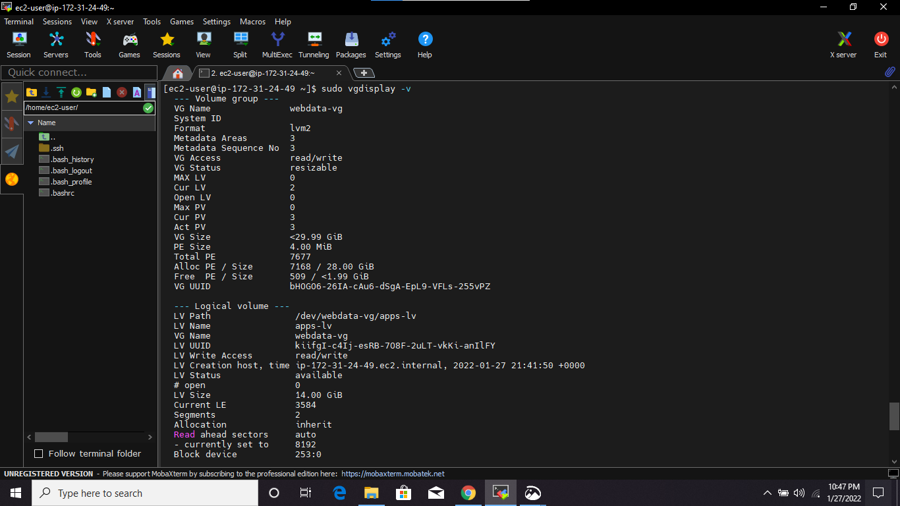
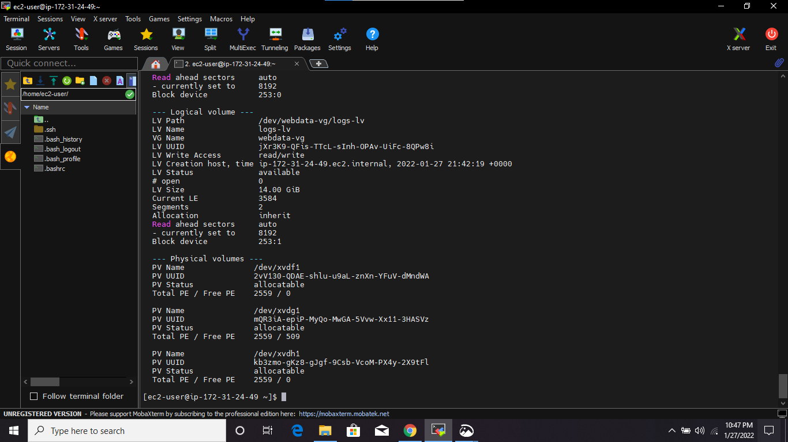
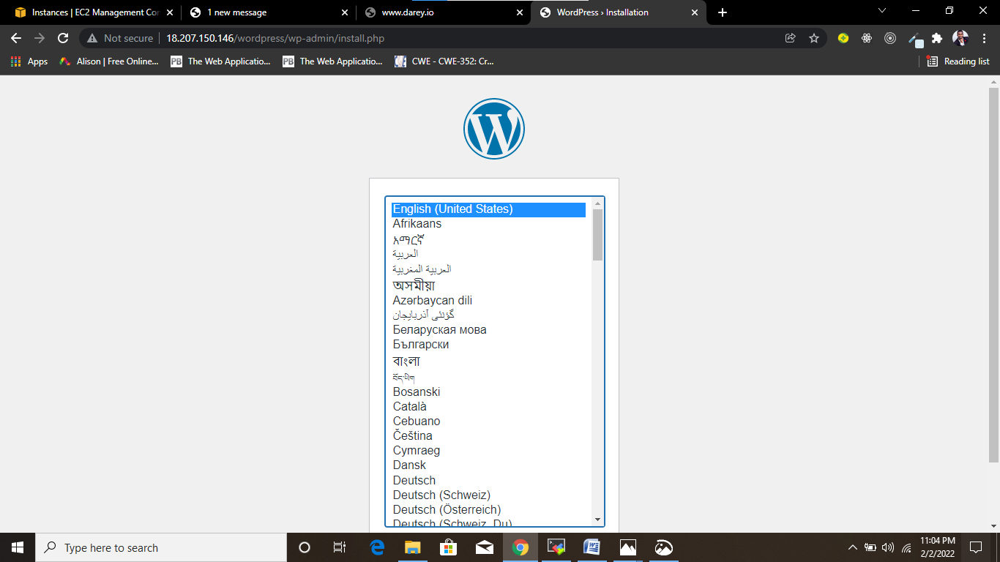
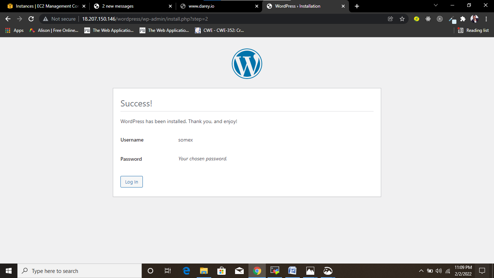
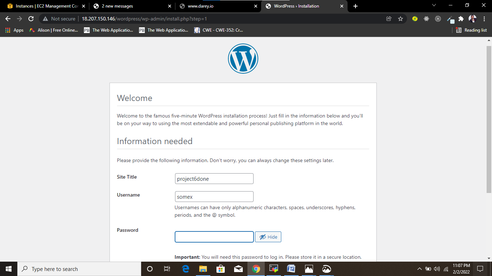
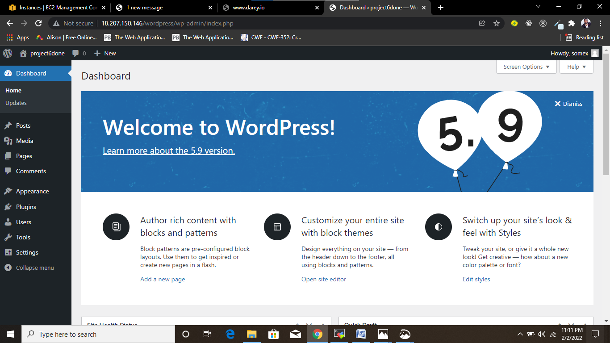

# IMPLEMENTING LOGICAL VOLUME MANAGEMENT AND WORDPRESS WEB SOLUTION PROJECT
## INTRODUCTION:
In this project, storage infrastructure is prepared to implement a Three-tier Architecture(in this case - a laptop to serve as a client, an EC2 linux server as a web server and an EC2 Linux server as a database server) of which the web solution used is wordpress and the disks used to store files are adequately partitioned and managed through programs such as gdisk and LVM respectively.

The following are the steps I took to implementing LVM and basic web solution-wordpress:

## STEP 1:	SETTING UP AND ATTACHING EBS VOLUMES TO AN EC2 SERVER FOR THE “WEB SERVER”
-	Launching a new EC2 instance(Red Hat Enterprise Linux 8 HVM) that will serve as a “web server”.
-	Creating 3 EBS volumes in the same Availability Zone with my EC2 instance created and attaching them to the EC2 instance.


## STEP 2:	PARTITIONING THE VOLUMES ATTACHED TO THE EC2 INSTANCE AND CREATING LOGICAL VOLUME WITH IT
After a successful ssh connection to the EC2 instance on my terminal, running the following commands:
-	To inspect what block devices are attached to the server: `$ lsblk`
-	To see all mounts and free space: `$	df –h`


**Creating a single partition on each of the 3 disks:**
-	**For xdvf disk:** `$ gdisk /dev/xvdf`
-	Entering the ‘p’ key to ensure that it has not been partitioned
-	Entering ‘n’ key to add a new partition
-	Accepting all the defaults settings and selecting Linux LVM type of partition by entering 8E00 code and hit enter
-	Entering the ‘w’ key to write the new partition created and confirming with the ‘y’ and hit enter.


 **Following the same process to create single partition for the xvdg and xvdh drives:**
 
 
 
 
-	Installing lvm2 package: `$ sudo yum install lvm2`


-	Checking for available partitions: `$ sudo lvmdiskscan`


-	To mark each of the 3 disks as physical volume: `$ sudo pvcreate /dev/xvdf1 /dev/xvdg1 /dev/xvdh1`


-	To verify that it has been created:`$ sudo pvs`


-	Adding the 3 PVs to a volume group(VG) called ‘webdata-vg’: `sudo vgcreate webdata-vg /dev/xvdf1 /dev/xvdh1 /dev/xvdg1`
-	To verify that the VG has been created: `$ sudo vgs`
-	Creating 2 logical volumes called ‘apps-lv’ and ‘logs-lv’ and allocating a size of 14G on each of them: 

`$ sudo lvcreate –n apps-lv –L 14G webdata-vg`

`$ sudo lvcreate –n logs-lv –L 14G webdata-vg`
-	To verify that the logical volumes are created: `$ sudo lvs`


-	Verifying the entire setup: `$ sudo vgdisplay –v`





## STEP 3: FORMATTING AND MOUNTING THE LOGICAL VOLUMES
-	Formatting the 2 logical volumes with ext4 filesystem: 

`$ sudo mkfs –t ext4 /dev/webdata-vg/apps-lv`

`$ sudo mkfs –t ext4 /dev/webdata-vg/logs-lv`


-	Creating a directory where the website files will be stored: `$ sudo mkdir –p /var/www/html`
-	Mounting apps-lv logical volume on /var/www/html: `$ sudo mount /dev/webdata-vg/apps-lv /var/www/html`
-	Creating directory to store backup of log data: `$ sudo mkdir –p /home/recovery/logs`
-	Using rsync utility to backup all the files in the log directory ***/var/log into /home/recovery/logs***: `$ sudo rsync –av /var/log/. /home/recovery/logs/`


-	Mounting logs-lv logical volume on ***/var/log directory***: `$ sudo mount /dev/webdata-vg/logs-lv /var/log`
-	 Restoring the log files back into ***/var/log***: `$ sudo rsync –av /home/recovery/logs. /var/log`


-	Updating the fstab file so that mount configuration will persist after restart of the server: `$ sudo vi /etc/fstab`


-	To know the UUID of the device to mount: `$ sudo blkid`


-	Testing  configuration and reloading the daemon:

`$ sudo mount –a`

`$ sudo systemctl daemon-reload`
-	Verifying the setup: `$ df -h`


## STEP 4: PREPARING THE DATABASE SERVER

In setting up an EC2 instance for Database server, The whole setup for the web server EC2 instance from step 1 to step 3 are repeated with an exception that the name db-lv is used in place of apps-lv logical volume while using lvcreate to create logical volume.

-	Creating the two logical volumes db-lv and logs-lv


-	Verifying the whole setup


-	Formatting the logical volumes


-	Performing rsync operation and mounting the two logical volumes


-	Updating the fstab file


-	Verifying the whole setup


## STEP 5: INSTALLING WORDPRESS ON THE WEB SERVER EC2 INSTANCE
1.	Updating the server: `$ sudo yum -y update`


2. Installing wget, Apache and its dependencies: `$ sudo yum -y install wget httpd php php-mysqlnd php-fpm php-json`


3. Starting Apache:
-	`$ sudo systemctl enable httpd`

-	`$ sudo systemctl start httpd`


4. **Installing PHP and its dependencies:**

```
sudo yum install https://dl.fedoraproject.org/pub/epel/epel-release-latest-8.noarch.rpm
sudo yum install yum-utils http://rpms.remirepo.net/enterprise/remi-release-8.rpm
sudo yum module list php
sudo yum module reset php
sudo yum module enable php:remi-7.4
sudo yum install php php-opcache php-gd php-curl php-mysqlnd
sudo systemctl start php-fpm
sudo systemctl enable php-fpm
setsebool -P httpd_execmem 1
 ```
 
  - **Results from the installations**
  
  
  
  
  
  
  
  
  
  
- Restarting Apache: `$ sudo systemctl restart httpd`

6.	**Downloading wordpress:**
-	Creating a folder and entering into it: `$ mkdir wordpress && cd wordpress`
-	Downloading wordpress: `$ sudo wget http://wordpress.org/latest.tar.gz`
-	Extracting the file: `$ sudo tar xzvf latest.tar.gz`


-	Removing the archived folder: `$ sudo rm -rf latest.tar.gz`
-	Renaming the file ***wp-config-sample.php*** to ***wp-config.php***: `$ cp wordpress/wp-config-sample.php wordpress/wp-config.php`
-	Copying the wordpress folder into ***/var/www/html*** directory: `$ sudo cp -R wordpress /var/www/html

7.	**Configuring SELinux Policies:**
-	Changing the ownership of the wordpress directory: `$ sudo chown -R apache:apache /var/www/html/wordpress`
-	Setting the SELinux Policies: `$ sudo setsebool -P httpd_can_network_connect=1`


## STEP 6: INSTALLING MYSQL ON THE DATABASE SERVER EC2 INSTANCE
-	Configuring the database server: `$ sudo yum update`


-	Installing MySQL: `$ sudo yum install mysql-server`


-	Restarting mysqld services: `$ sudo systemctl restart mysqld`
-	Enabling mysqld services: `$ sudo systemctl enable mysqld`


## STEP 7: CONFIGURING DB TO WORK WITH WORDPRESS
-	Activating the mysql shell: `$ sudo mysql`
-	Creating a database called ‘wordpress’: `mysql> CREATE DATABASE wordpress;`
-	Creating a remote user: `mysql> CREATE USER 'somex'@'18.207.150.146' IDENTIFIED BY 'mypass';`
-	Granting all privileges to the user: `mysql> GRANT ALL ON wordpress.* TO 'somex'@'18.207.150.146';`
- Flushing the privileges so that MySQL will begin to use them: ` mysql> FLUSH PRIVILEGES;`
-	Exiting from MySQL shell: `mysql> exit`


-	Adding a rule to the database server security group to be able to listen to TCP port 3306 and allow access to the web server IP address only.


  
## STEP 8: CONFIGURING WORDPRESS IN THE WEB SERVER TO CONNECT TO REMOTE DATABASE
-	Installing mysql client: `$ sudo yum install MySQL`


-	Connecting to the database server with MySQL: ` $ sudo mysql -u somex -p -h 172.31.29.209`


-	Updating the **wp-config.php** file settings:


-	Adding a rule to the web server security group to be able listen to TCP port 80 and allow connection from any IP address.


**RESULTS**
-	Accessing the web server with its IP address from my browser: `http://18.207.150.146/wordpress/`






