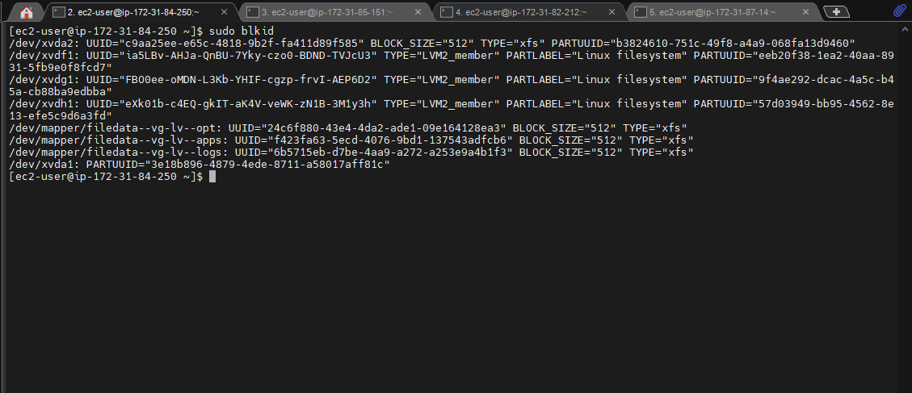
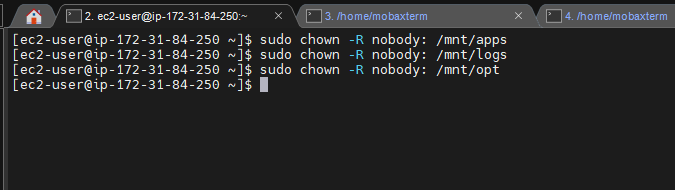
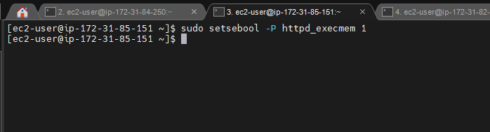

# IMPLEMENTATION OF WEB APPLICATION ARCHITECTURE WITH A SINGLE DATABASE AND NFS SERVER
## INTRODUCTION
In this project, I implemented a DevOps tooling website solution which makes access to DevOps tools with the following components: 
1.	**Infrastructure:** AWS
2.	**3 Linux Webservers:** Red Hat Enterprise Linux 8 that will serve the DevOps tooling weebsite  
3.	**A Database Server:** Ubuntu 20.04 for reads and write 
4.	**A Storage Server:** Red Hat Enterprise Linux 8 that will serve as NFS Server for storing shared files that the 3 Web Servers will use
5.	**Programming Language:** PHP
6.	**Code Repository:** GitHub

The following are the steps I took to set up this 3-tire Web Application Architecture with a single database and an NFS server as a shared file storage:

## Step 0: Preparing The Servers To Be Used
I launched 4 linux EC2 instances from AWS which are Red Hat Enterprise Linux 8, one is used as an NFS sever while the remaining 3 is used as webservers which will be connected to the NFS server to make it stateless.

## Step 1:  Setting Up The NFS Server
After launching the EC2 instances, I created 3 volumes from the AWS EBS volume tab, 5G each and attached them to the EC2 instance that will be used as the NFS server.

**creating the volume*


**Attaching the 3 volumes to the EC2 Instance for NFS server**


## Step 2: Creating And Mounting Logical Volumes On The EC2 Instance For The NFS Server
I connected to the EC2 instance with mobaxterm via ssh connection and ran the following commands inorder to create a logical volume:
1.	To confirm if the 3 disks are really attached to the instance: `$ lsblk`
2.	Partitioning the 3 disks with gdisk utility:
-	For **xvdf** disk: `$ sudo gdisk /dev/xvdf`
-	Entering the **p** key to confirm that there are no partitions available on the disk
-	Entering the key **n** to create new partition and selecting the default settings by hitting enter
-	The partition type I selected is linux file system by entering its HEX code **8300**
-	Entering the **p** key to confirm the partition is created
-	Entering the **w** key to write the partition and confirming with **y** key


-	For **xvdg** disk: `$ sudo gdisk /dev/xvdf`
-	Entering the **p** key to confirm that there are no partitions available on the disk
-	Entering the key **n** to create new partition and selecting the default settings by hitting enter
-	The partition type I selected is linux file system by entering its HEX code **8300**
-	Entering the **p** key to confirm the partition is created
-	Entering the **w** key to write the partition and confirming with **y** key


-	For **xvdh** disk: `$ sudo gdisk /dev/xvdf`
-	Entering the **p** key to confirm that there are no partitions available on the disk
-	Entering the key **n** to create new partition and selecting the default settings by hitting enter
-	The partition type I selected is linux file system by entering its HEX code **8300**
-	Entering the **p** key to confirm the partition is created
-	Entering the **w** key to write the partition and confirming with **y** key


3.	Confirming that the partitions are successfully created: `$ lsblk`


4.	Installing lvm2 utility: `$ sudo yum install lvm2`


5.	To check for available partition: `$ sudo lvmdiskscan`


6.	Creating a physical volume from the partitions: `$ sudo pvcreate /dev/xvdf1 /dev/xvdg1 /dev/xvdh1`


7.	To confirm that the physical volume is created `$ sudo pvs`


8.	Creating a volume group called ‘filedata-vg’: `$ sudo vgcreate filedata-vg  /dev/xvdf1 /dev/xvdg1 /dev/xvdh1`


9.	To confirm that the volume group is created: `$ sudo vgs`


10.	Creating 3 logical volumes ‘lv-apps’, ‘lv-logs’ and ‘lv-opt’ from the volume group and allocating 4.9G to each: 
-	`$ sudo lvcreate –n lv-opt –L 4.9G filedata-vg`
-	`$ sudo lvcreate –n lv-apps –L 4.9G filedata-vg`
-	`$ sudo lvcreate –n lv-logs –L 4.9G filedata-vg`


11.	To verify that logical volume is created successfully: `$ sudo lvs`


12.	To verify the whole setup: `$ sudo vgdisplay -v`


13.	Formatting the logical volumes created with xfs filesystem:
-	`$ sudo mkfs –t xfs /dev/filedata-vg/lv-opt`
-	`$ sudo mkfs –t xfs /dev/filedata-vg/lv-apps`
-	`$ sudo mkfs –t xfs /dev/filedata-vg/lv-logs`


14.	Creating a directory where the 3 logical volumes will be mounted in */mnt* directory:
-	`$ sudo mkdir /mnt/opt`
-	`$ sudo mkdir /mnt/apps`
-	`$ sudo mkdir /mnt/logs`


15.	Mounting the 3 logical volumes:
-	`$ sudo mount /dev/filedata-vg/lv-logs /mnt/logs`	
-	`$ sudo mount /dev/filedata-vg/lv-apps /mnt/apps`
-	`$ sudo mount /dev/filedata-vg/lv-opt /mnt/opt`


16.	To verify the mounts:`$ df -h`


17.	To get information on the UUID of the disk mounted: `$ sudo blkid`


18.	Configuring the fstab file to enable the mounts to persist on boot: `$ sudo vi /etc/fstab`


19.	Testing the configuration and reloading the daemon:
-	`$ sudo mount -a`
-	`$ sudo systemctl daemon-reload`


## Step 2: Configuring The NFS Server
1.	Updating the server: `$ sudo yum update`


2.	Installing NFS server utilities:`$ sudo yum install nfs-utils -y `


3.  Starting and enabling the nfs server service:
-	`$ sudo systemctl start nfs-server.service`
-	`$ sudo systemctl enable nfs-server.service`


4.	To check the status of the nfs service: `$ sudo systemctl status nfs-server.service`


5.	Changing the ownership of the 3 directories where disks are mounted:
-	`$ sudo chown -R nobody: /mnt/apps`
-	`$ sudo chown -R nobody: /mnt/logs`
-	`$ sudo chown -R nobody: /mnt/opt`



6.	Changing the permission of the 3 directories where disks are mounted:
-	`$ sudo chmod -R 777 /mnt/apps`
-	`$ sudo chmod -R 777 /mnt/logs`
-	`$ sudo chmod –R 777 /mnt/opt`
-	Restarting the nfs service: `$ sudo systemctl restart nfs-server.service`


7.	Configuring access to NFS server for clients within the same subnet(the subnet cidr of my webservers is 172.31.80.0/20):
-	Opening the NFS export file `$ sudo vi /etc/exports`
-	Entering the following configuration:

```
	/mnt/apps 172.31.80.0/20(rw,sync,no_all_squash,no_root_squash)
	/mnt/logs 172.31.80.0/20(rw,sync,no_all_squash,no_root_squash)
	/mnt/opt 172.31.80.0/20(rw,sync,no_all_squash,no_root_squash)
```


-	Exporting the configuration to make the mounts directory available for NFS clients to mount: `$ sudo exportfs -arv`


-	Checking the port used by NFS: `$ rpcinfo –p | grep nfs`


-	Opening the port in the security group of the NFS server including TCP 111, UDP 111, UDP 2049:


## Step 3: Setting Up And Configuring The Database Server
I launched another EC2 instance(Ubuntu 20.04) from AWS to be used as database server. Then I connected to it from my terminal via ssh connection and performed the following commands in setting up mysql database:
-	Updating and upgrading the server:
	
`$ sudo apt update`

`$ sudo apt upgrade`


-	Installing mysql server: `$ sudo apt install mysql-server`


-	Creating a database called ‘tooling’ and creating a remote user called ’webaccess’ with the subnet cidr of the webservers as its IP address and granting the user permission  to do anything only from the webservers subnet cidr:
```
mysql> CREATE DATABASE tooling;
mysql> CREATE USER ‘webaccess’@’172.31.80.0/20’ IDENTIFIED BY ‘password1234’;
mysql> GRANT ALL PRIVILEGES ON ‘tooling’.* TO ‘webaccess’@’172.31.80.0/20’;
```


-	Adding a rule in the database security group to listen to TCP port 3306 and only allow access from webservers’ subnet cidr:


-	Editing the mysqld.cnf file `$ sudo vi /etc/mysql/mysql.conf.d/mysqld.cnf` and changing the bind-address value from ‘127.0.0.1’ to ‘0.0.0.0’:


-	Restarting the mysql service:`$ sudo systemctl restart mysql`


## Step 4: Configuring The Webservers
I connected to the remaining 3 EC2 instances launched, which is to be used as webservers, via ssh connection on my terminal and performed the following commands inorder to configure the webservers:
-	Updating the 3 servers: `$ sudo yum update`

**for webserver A**


**for webserver B**


**for webserver C**


-	Installing nfs clients on the 3 severs:`$ sudo yum install nfs-utils nfs4-acl-tools –y`

**For webserver A**


**For webserver B**


**For webserver C**


-	Creating the directory where to serve our devops tooling web content: `$ sudo mkdir /var/www` and Targeting the NFS exports for apps with the NFS server’s private IP address and mounting it on /var/www directory:
	
` $ sudo mount -t nfs -o rw,nosuid 172.31.84.250:/mnt/apps /var/www`

**For webserver A**


**For webserver B**


**For webserver C**


-	Verifying that NFS is successfully mounted:`$ df -h`


-	Editing the fstab configuration to ensure that the mount persist:`$ sudo vi /etc/fstab`
-	And entering the following configuration:
`172.31.84.250:/mnt/apps /var/www nfs defaults 0 0`

**For webserver A**


**For webserver B**


**For webserver C**


-	Installing Apache:`$ sudo yum install httpd -y`

**For webserver A**


**For webserver B**


**For webserver C**


-	Installing EPEL from Fedora repository: `$ sudo dnf install https://dl.fedoraproject.org/pub/epel/epel-release-latest-8.noarch.rpm`

**For webserver A**


**For webserver B**


**For webserver C**


-	Installing from remi repo: `$ sudo dnf install dnf-utils http://rpms.remirepo.net/enterprise/remi-release-8.rpm`

**For webserver A**


**For webserver B**


**For webserver C**


-	To enable the installation of a newer PHP release: 
	
  ```
  $ sudo dnf module reset php
	$ sudo dnf module enable php:remi-7.4
  ```
  
**For webserver A**


**For webserver B**


**For webserver C**


-	installing PHP and most of its module:`$ sudo dnf install php php-opcache php-gd php-curl php-mysqlnd`

**For webserver A**


**For webserver B**


**For webserver C**


-	Starting the FPM service and enabling it to automatically start on boot: 

 `$ sudo systemctl start php-fpm`
 
 `$ sudo systemctl enable php-fpm`
 
 **For webserver A**
 
 
 **For webserver B**
 
 
 **For webserver C**
  
  
-	Executing the Setsebool command:`$ sudo setsebool -P httpd_execmem 1`

 **For webserver A**
 
 
 
 **For webserver B**
 
 
 
 **For webserver C**


-	Verifying that the apache files and directories are available on both the webservers in /var/www and on the NFS server in the /mnt/apps directory:

**On the webserver**


**On the NFS server**


-	Mounting the Apache log folder on the webservers to NFS server’s export for logs:` $ sudo mount -t nfs -o rw,nosuid 172.31.84.250:/mnt/logs /var/log/httpd`

**for webserver A**


**for webserver B**


**for webserver C**


-	Updating the fstab config file to make the mount persist on boot: `sudo vi /etc/fstab`

**for webserver A**


**for webserver B**


**for webserver C**


-	Installing git to be able to clone a github repo:`$ sudo yum install git`


-	Forked the Darey’s repo into my github account and cloning it from the terminal:`$ git clone https://github.com/apotitech/tooling.git`


-	Copying the html folder from the cloned repo to /var/www/html:`$ sudo cp –R html/. /var/www/html`


-	Adding a rule in the security group of the webservers to be able to listen to port 80:


-	Disabling SELInux :`$ sudo setenforce 0`


-	Opening the SELinux file and disabling SELinux option:`$ sudo vi /etc/sysconfig/selinux`


-	Updating the website configuration to connect to the database: `$ sudo vi /var/www/html/functions.php`


- Installing mysql client on the webserver:`$ sudo yum install mysql`


-	Executing the tooling-db.sql script with the database private IP address to load data in tooling database from the webserver:`$ mysql -h 172.31.27.76 -u webaccess -p tooling < tooling-db.sql`

- verifying that tooling-db.sql executed successfully:


-	Starting the apache service to serve the web content on my browser:`$ sudo systemctl start httpd`


## Step 5:  Adding A New User In The Tooling Database
-	Activating the mysql shell in the database server terminal:`$ sudo mysql`
-	Switching to tooling database:`mysql> use tooling;`
-	Creating the new user:`mysql> INSERT INTO users (id,username,password,email,user_type,status) VALUES(1, ‘myuser’, ‘password’,‘user@mail.com’,‘admin’,‘1’);`


## Final step: Result
Testing the DevOps Tooling website in my browser:

**For webserver A:** http://3.94.55.87/index.php


**For webserver B:** http://44.203.88.57/index.php


**For webserver C:** http://54.211.180.27/index.php


