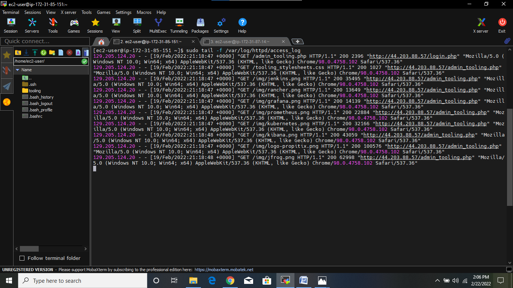
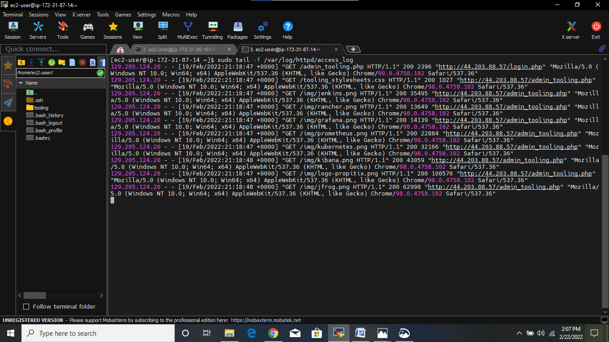
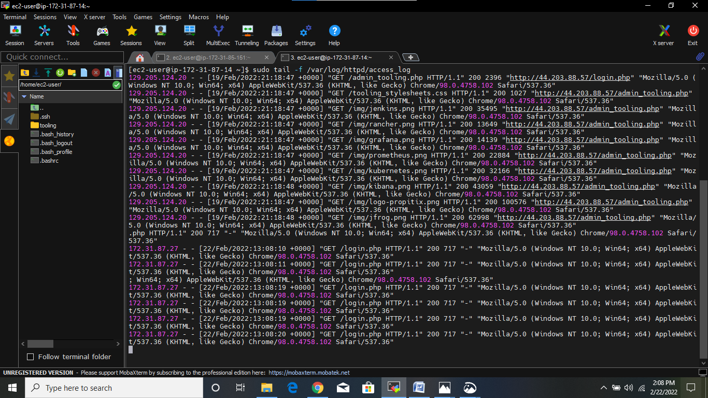
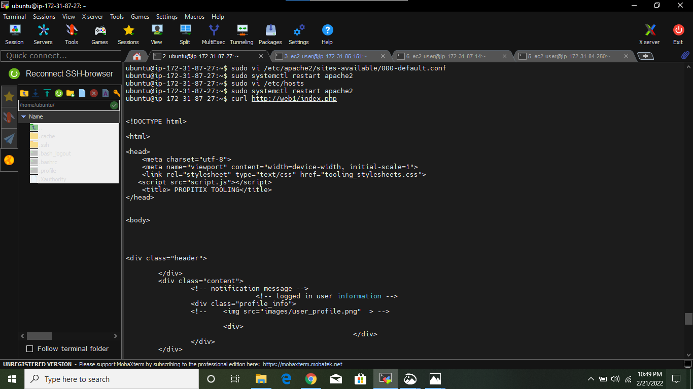
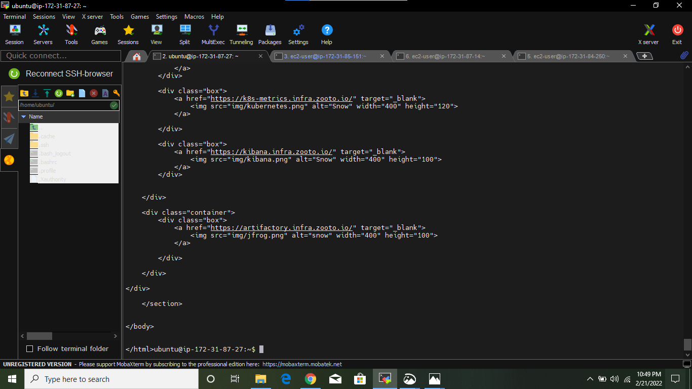

# LOAD BALANCER SOLUTION WITH APACHE
## INTRODUCTION
In this project, I implemented a load balancer solution using Apache which points traffic to two of the webservers in the 3-tier Web Application Architecture that I setup in [project 7](./project7.md).

The following are the steps I took in implementing a load balancer solution:

## Step 0:  Launching The Severs
I launched a new EC2 Instance(Ubuntu 20.04) that will serve as the load balancer and starting the EC2 Instances used in my [project 7](./project7.md). But in this case, out of the 3 EC2 Instances initially launched which are tagged as webservers only 2 were used instead.


## Step 1: Configuring Apache As A Load Balancer In The Ubuntu server
1.	Updating and upgrading the server:

`$ sudo apt update`


`$ sudo apt upgrade`


2.	Installing Apache:`$ sudo apt install apache2 -y`


3.	Installing libxml2-dev: `$ sudo apt install libxml2-dev`


4.	Enabling the following modules:
-	`$ sudo a2enmode rewrite`


-	`$ sudo a2enmode proxy`


-	`$ sudo a2enmode proxy_balancer`


-	`$ sudo a2enmode proxy_http`


-	`$ sudo a2enmode headers`


-	`$ sudo a2enmode lbmethod_bytraffic`


5.	Restarting Apache:`$ sudo systemctl restart apache2`


6.	To ensure that Apache is running:`$ sudo systemctl status apache2`


7.	Opening TCP port 80 on the security group to listen to http request and allow access from any IP address


## Step 2: Configuring The Load Balancer
-	To configure the load balancer, opening the **000-default.conf** file:`$ sudo vi /etc/apache2/sites-available/000-default.conf`
-	Entering the following configuration:
```
        <Proxy "balancer://mycluster">
	               BalancerMember http://<WebServer1-Private-IP-Address>:80 loadfactor=5 timeout=1
	               BalancerMember http://<WebServer2-Private-IP-Address>:80 loadfactor=5 timeout=1
	               ProxySet lbmethod=bytraffic
	               # ProxySet lbmethod=byrequests
	        </Proxy>
	
	        ProxyPreserveHost On
	        ProxyPass / balancer://mycluster/
	        ProxyPassReverse / balancer://mycluster/
```


-	Restarting the Apache server:`$ sudo systemctl restart apache2`


## Step 3: Testing The Configuration
-	In order to test the configurations by inspecting the apache log files of the 2 webservers, the ‘/var/log/httpd’ mount made on the webservers to the NFS server on [project 7](./project7.md) was unmounted  in order to make the web servers has its own log directory.
`$ sudo umount /var/log/httpd`

**For webserver A**


**For webserver B**


-	Executing the following command on the terminal of the two webservers to see how the load balancer works:`$ sudo tail –f /var/log/httpd/access_log`

**For webserver A**



**For weserver B**



-	Entering the IP address of the load balancer on my web browser: http://100.24.24.6/index.php


-	Refreshing the page several times.
-	Viewing the change made in both the terminal:

**For webserver A**


**For webserver B**



## Optional Steps:  Configure Local DNS Names Resolution
-	Editing the hosts file on the Load balancer to assign names(web1 and web2) to the 2 webservers’ private IP addresses: `$ sudo vi /etc/hosts`
-	Adding the following configuration:
```
172.31.85.151 web1
172.31.82.212 web2
```


-	Updating the load balancer config file with those names instead of IP address: `$ sudo vi /etc/apache2/sites-available/000-default.conf`
```
	BalancerMember http://Web1:80 loadfactor=5 timeout=1
	BalancerMember http://Web2:80 loadfactor=5 timeout=1
```


-	Using curl to test the configuration on my load balancer locally: `$ curl http://web1/index.php`



