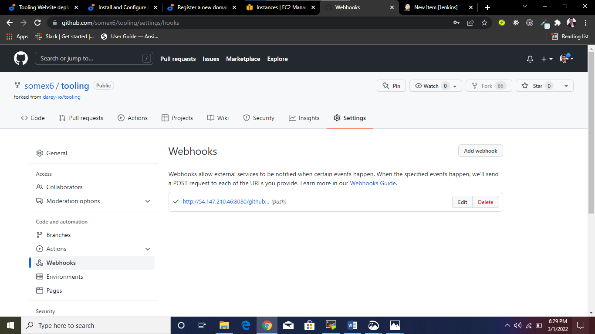

# WORKING WITH JENKINS- CI/CD PROJECT
## INTRODUCTION
In this project, the web application architecture in [project 8](./project8.md) is enhanced by adding Jenkins server, whereby a job is configured to automatically build on trigger by a webhook whenever there is a change in the tooling repository and sends the artifacts remotely to the NFS server.

The following outlines the steps I took in setting up this project:

## STEP 0: Launching Of EC2 Instance
I launched an EC2 Instance(Ubuntu server 20.04) that will be used as Jenkins Server. I connected to the server on my terminal through ssh connection.

## STEP 1: Installing And Configuring The Jenkins Server
-	Updating and upgrading the server:

`$ sudo apt update`

`$ sudo apt upgrade`

-	Installing the Java Development Kit(JDK):`$ sudo apt install default-jdk-headless`

-	Acquiring the Jenkins key:`$ wget -q -O - https://pkg.jenkins.io/debian-stable/jenkins.io.key | sudo apt-key add -`

-	Adding to the source file the path to Jenkins installation:`$ sudo sh -c 'echo deb https://pkg.jenkins.io/debian-stable binary/ > /etc/apt/sources.list.d/jenkins.list'`

-	Updating the server again:`$ sudo apt update`

-	Installing Jenkins: `$ sudo apt-get install jenkins`

-	To ensure that Jenkins is up and running:`$ sudo systemctl status jenkins`

-	Opening TCP port 8080 on the security group:

## STEP 2: Performing Initial Jenkins Setup
-	Entering the ubuntu server’s public IP on port 8080 on the web browser: http://54.147.210.46:8080

-	Retrieving the password from the server:`$ sudo cat /var/lib/jenkins/secrets/initialAdminPassword`
-	Selecting **install suggested plugin**

-	After installation, I created an admin user after which I got my Jenkins server address

-	Jenkins is ready to be used

## STEP 3: Configuring Jenkins To Retrieve Source Codes From GitHub Using Webhooks

-	Enabling webhooks in my Github account which will trigger a build task, that will retrieve codes from Github and store it locally on Jenkins server. And this is done by going to the Github settings of the tooling repository and clicking on webhooks and inputing the Jenkins public Ip address as the payload URL and saving the settings:

-	Creating a freestyle project on the Jenkins web console by clicking on **New Item**

-	Copying the URL of the tooling repository in order to connect it to the freestyle project created

-	Pasting the tooling repository URL and setting my credentials so Jenkins can access files in the repository and saving the whole configuration

-	Clicking on **build now** to ensure that the configuration works and that the build is successful.

-	To make the build to run automatically whenever a change happens in the tooling repository by the help of webhook, going back to the configuration by clicking on “Configure”
-	On the **Build Triggers** section, selecting **GitHub hook trigger for GITScm polling**

-	And on the **Post-build Actions**, clicking on **Add post-build action** and selecting **Archive the artifacts** to archive all the files resulted from the build

-	Then going to the tooling repository on my Github account and making a change in the ReadMe.md file and pushing the change to the master branch
-	Going back to Jenkins web console to confirm that a new build has been triggered automatically:

-	To locate the artifacts on the Jenkins server:`$ ls /var/lib/jenkins/jobs/tooling_github/builds/<build_number>/archive/`

## OPTIONAL STEP: Configuring Jenkins To Send Artifacts To NFS Server
- Installing **Publish Over SSH** from **Manage Jenkins > Manage plugin** option in the Jenkins web console and restart:

- Configuring the **publish over ssh** on the **Manage Jenkins > Configure system** settings to connect to the NFS server and setting the remote directory path to the **/mnt/opt**. Using the NFS server Private IP as the Hostname:

- Enabling the **tooling_github** job to send artifacts to the NFS server by clicking on **Configure** option
- On the **Post-build Action**, selecting **Send build artifacts over ssh** and selecting the NFS Server configuration and click save:

- Running the build:

- Confirming whether the artifacts are suucessfully sent to NFS server in the /mnt/opt directory:

- This shows that the Jenkins server is connected successfully to the NFS server

