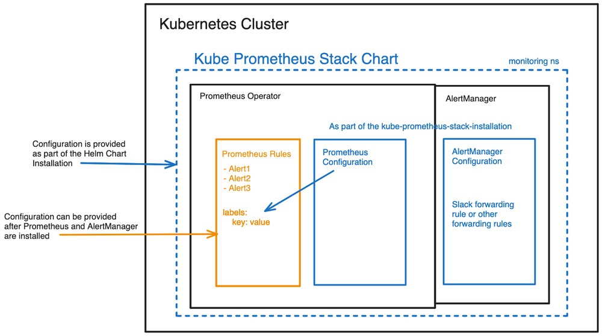
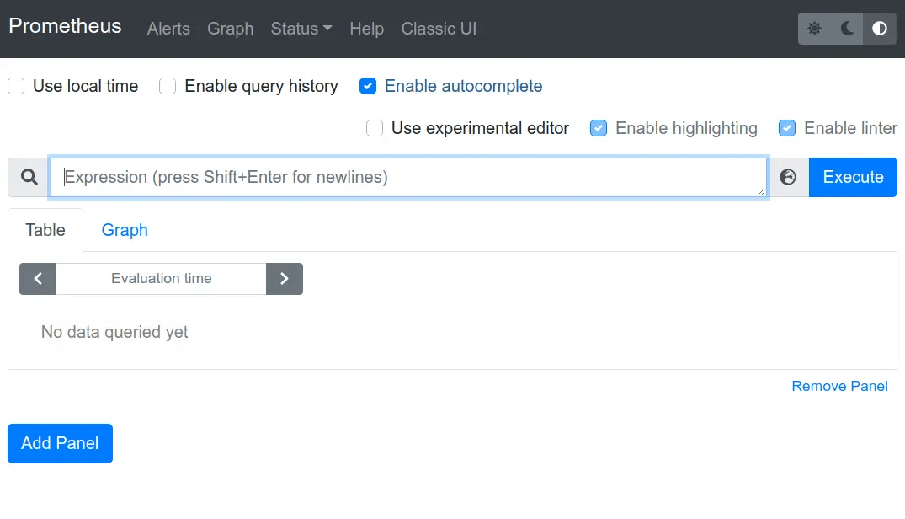
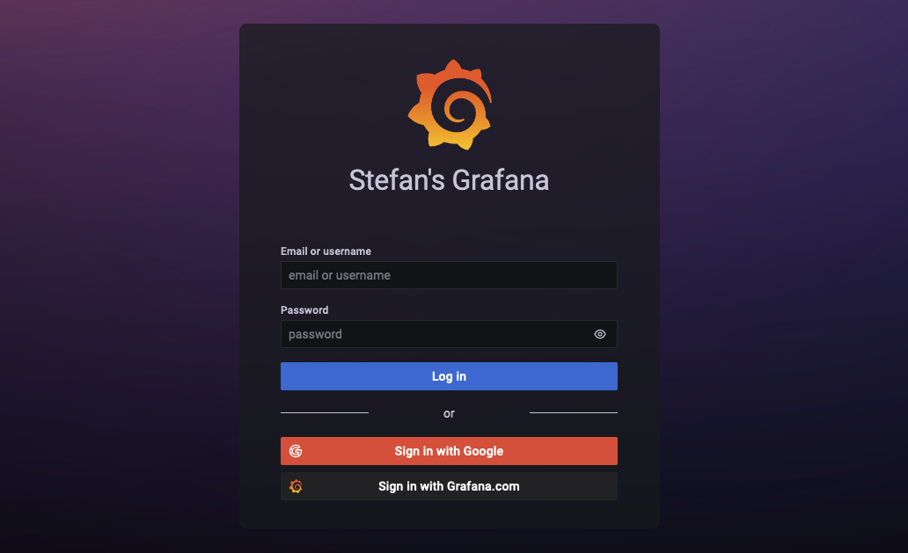

- [Real-world Prometheus Deployment: A Practical Guide for Kubernetes Monitoring](#real-world-prometheus-deployment-a-practical-guide-for-kubernetes-monitoring)
  - [Aim Of The Project:](#aim-of-the-project)
  - [Project architecture:](#project-architecture)
  - [Prerequisites](#prerequisites)
  - [Apply our k8s-yaml resources:](#apply-our-k8s-yaml-resources)
  - [Lets Understand All Kubernetes resources:](#lets-understand-all-kubernetes-resources)
    - [Deployment](#deployment)
      - [API Version and Kind:](#api-version-and-kind)
      - [Metadata:](#metadata)
      - [Specification (`spec`):](#specification-spec)
      - [Selector:](#selector)
      - [Template:](#template)
      - [Pod Specification (`spec` inside the template):](#pod-specification-spec-inside-the-template)
    - [Service](#service)
      - [API Version and Kind:](#api-version-and-kind-1)
      - [Metadata:](#metadata-1)
      - [Specification (`spec`):](#specification-spec-1)
    - [ServiceMonitor](#servicemonitor)
      - [API Version and Kind:](#api-version-and-kind-2)
      - [Metadata:](#metadata-2)
      - [Specification (`spec`):](#specification-spec-2)
    - [PrometheusRules](#prometheusrules)
      - [API Version and Kind:](#api-version-and-kind-3)
      - [Metadata:](#metadata-3)
      - [Specification (`spec`):](#specification-spec-3)
    - [Alertmanagerconfig](#alertmanagerconfig)
      - [API Version and Kind:](#api-version-and-kind-4)
      - [Metadata:](#metadata-4)
      - [Specification (`spec`):](#specification-spec-4)
  - [Acknowledgment](#acknowledgment)

# Real-world Prometheus Deployment: A Practical Guide for Kubernetes Monitoring

## Aim Of The Project:

The primary goal of this Prometheus Lab project is to provide hands-on experience and guidance in setting up a Prometheus monitoring system on a Kubernetes cluster. By following the step-by-step instructions and understanding the associated Kubernetes resources, participants will gain practical insights into deploying Prometheus for efficient system observability.

## Project architecture:



## Prerequisites

**To install `k3d`, you can use the following command:**

```bash
curl -s https://raw.githubusercontent.com/rancher/k3d/main/install.sh | bash
```
**Check out my GitHub Repo:**
```text
https://github.com/panchanandevops/Learning-Prometheus.git
```
**Create a Namespace for `Monitoring`:

```bash
kubectl create namespace monitoring
```

**Add Helm Repository:**

```bash
helm repo add prometheus-community https://prometheus-community.github.io/helm-charts
helm repo update
```
**Store Default values.yaml**

```bash
helm show values prometheus-community/kube-prometheus-stack > values.yaml
```

**Install `kube-prometheus-stack` Helm Chart in `monitoring` Namespace:**

```bash
helm install prometheus-stack prometheus-community/kube-prometheus-stack -n monitoring
```

**Verify Deployment, after some time:**

```bash
kubectl get pods -n monitoring
```

**Access Prometheus Dashboard:**

```bash
kubectl port-forward svc/prometheus-stack-prometheus -n monitoring 9090:9090
```
- Open your web browser and navigate to `http://localhost:9090` to access the Prometheus dashboard.

 

**Access Grafana Dashboard:**

```bash
kubectl port-forward svc/prometheus-stack-grafana -n monitoring 8080:80
```

- Open your web browser and navigate to `http://localhost:8080`.



**Login with the default credentials:**
Username: admin. Retrieve the password using the following command:

```bash
kubectl get secret prometheus-stack-grafana -n monitoring -o jsonpath='{.data.admin-password}' | base64 --decode ; echo
```
**Change in values.yaml**

In order to select `AltermanagerConfig`, we need to change our `values.yaml` file. 

Search in values.yaml for `alertmanagerConfigSelector`

then replace that section with the following section

```yaml
altermanagerConfigSelector:
    matchLabels:
      release: prometheus
```

## Apply our k8s-yaml resources:

```bash
kubectl apply -f <your-path>/k8s-yaml/
```


## Lets Understand All Kubernetes resources:

### Deployment
Let's break down the Kubernetes Deployment YAML file in a clear and simple way:

#### API Version and Kind:
```yaml
apiVersion: apps/v1
kind: Deployment
```
This part specifies the API version (`apps/v1`) and the type of Kubernetes resource (`Deployment`) we're defining.

#### Metadata:
```yaml
metadata:
  name: my-deployment
  labels:
    app: api
```
In this part, we provide metadata for our Deployment. The `name` is set to `my-deployment`, and it carries a label (`app: api`) for identification.

#### Specification (`spec`):

#### Selector:
```yaml
selector:
  matchLabels:
    app: api
```
Here, we define a selector with labels. Pods controlled by this Deployment will have labels matching `app: api`.

#### Template:
```yaml
template:
  metadata:
    labels:
      app: api
  spec:
```
In the template, we describe the pods created by our Deployment. Metadata labels are set, ensuring they match the selector labels.

#### Pod Specification (`spec` inside the template):
```yaml
    containers:
      - name: mycontainer
        image: panchanandevops/myexpress:v0.1.0
        resources:
          limits:
            memory: "128Mi"


            cpu: "500m"
        ports:
          - containerPort: 3000
```
Within the pod, we define a container named `mycontainer`. It uses the Docker image `panchanandevops/myexpress:v0.1.0`, has resource limits for memory and CPU, and exposes port `3000`.

### Service
Let's break down the Kubernetes Service YAML file in a clear and simple way:

#### API Version and Kind:
```yaml
apiVersion: v1
kind: Service
```
This section specifies the API version (`v1`) and the type of Kubernetes resource (`Service`) we're defining.

#### Metadata:
```yaml
metadata:
  name: my-service
  labels:
    job: node-api
    app: api
```
Here, we provide metadata for our Service. The `name` is set to `my-service`, and it carries labels for identifying the associated job (`node-api`) and application type (`api`).

#### Specification (`spec`):
```yaml
spec:
  type: ClusterIP
  selector:
    app: api
  ports:
    - name: web
      protocol: TCP
      port: 3000
      targetPort: 3000
```
In this part, we define the specifications for our Service:

- `type: ClusterIP`: Specifies that the Service is of type ClusterIP.
- `selector`: Used to match pods for this service, and in this case, it selects pods with the label `app: api`.
- `ports`: Defines a port named `web` with TCP protocol, available on port `3000`, targeting the pods on their port `3000`.


### ServiceMonitor
Let's break down the Kubernetes ServiceMonitor YAML file in a clear and simple way:

#### API Version and Kind:
```yaml
apiVersion: monitoring.coreos.com/v1
kind: ServiceMonitor
```
This section specifies the API version (`monitoring.coreos.com/v1`) and the type of Kubernetes resource (`ServiceMonitor`) we're defining.

#### Metadata:
```yaml
metadata:
  name: api-service-monitor
  labels:
    release: prometheus
    app: prometheus
```
Here, we provide metadata for our `ServiceMonitor`. The `name` is set to `api-service-monitor`, and it carries labels for release association (`release: prometheus`) and identifying the application type (`app: prometheus`).

#### Specification (`spec`):
```yaml
spec:
  jobLabel: job
  selector:
    matchLabels:
      app: api
  endpoints:
    - port: web
      path: /swagger-stats/metrics
```
In this part, we define the specifications for our `ServiceMonitor`:

- `jobLabel: job`: Specifies the label (`job`) used to identify the job for Prometheus.
- `selector`: Used to match pods for monitoring; it selects pods with the label `app: api`.
- `endpoints`: Defines the endpoints to scrape metrics. In this case, it specifies a port named `web` and the path `/swagger-stats/metrics` to fetch metrics from.


### PrometheusRules
Let's break down the Kubernetes PrometheusRules YAML file in a clear and simple way:

#### API Version and Kind:
```yaml
apiVersion: monitoring.coreos.com/v1
kind: PrometheusRule
```
This section specifies the API version (`monitoring.coreos.com/v1`) and the type of Kubernetes resource (`PrometheusRule`) we're defining.

#### Metadata:
```yaml
metadata:
  name: api-prometheus-rule
  labels:
    release: prometheus
```
Here, we provide metadata for our `PrometheusRule`. The `name` is set to `api-prometheus-rule`, and it carries labels for release association (`release: prometheus`).

#### Specification (`spec`):
```yaml
spec:
  groups:
    - name: api
      rules:
        - alert: down
          expr: up == 0
          for: 0m
          labels:
            severity: Critical
          annotations:
            summary: Prometheus target missing {{$labels.instance}}
```
In this part, we define the specifications for our `PrometheusRule`:

- `groups`: An array of rule groups. In this case, we have one group named `api`.
  - `name: api`: Name of the rule group.
  - `rules`: An array of rules within the group.
    - `alert: down`: Name of the alert.
    - `expr: up == 0`: Expression to trigger the alert when the metric 'up' is equal to 0.
    - `for: 0m`: Minimum duration for which the alert condition must be true to trigger the alert.
    - `labels`: Additional labels associated with the alert (e.g., severity).
    - `annotations`: Annotations provide additional information about the alert (e.g., summary).

### Alertmanagerconfig
Let's break down the Kubernetes Alertmanagerconfig YAML file in a clear and simple way:

#### API Version and Kind:
```yaml
apiVersion: monitoring.coreos.com/v1
kind: AlertmanagerConfig
```
This section specifies the API version (`monitoring.coreos.com/v1`) and the type of Kubernetes resource (`AlertmanagerConfig`) we're defining.

#### Metadata:

```yaml
metadata:
  name: alertmanager-config
  labels:
    release: prometheus
```
Here, we provide metadata for our `AlertmanagerConfig`. The `name` is set to `alertmanager-config`, and it carries labels for release association (`release: prometheus`).

#### Specification (`spec`):

1. **Part 1: Route Configuration:**
    ```yaml
      spec:
        route:
          groupBy: ["severity"]
          groupWait: 30s
          groupInterval: 5m
          repeatInterval: 12h
          receiver: "team-notifications"
    ```
2. **Part 2: Receiver Configuration:**
    ```yaml
      spec:
        receivers:
          - name: "team-notifications"
            emailConfigs:
              - to: "team@example.com"
                sendResolved: true
    ```
    - `- name: "team-notifications"`: Name of the receiver.
    - `emailConfigs:` Email-specific configuration.
        -  `- to: "team@example.com"`: Email address to which notifications are sent.
        -  `sendResolved: true`: Indicates whether to send notifications when alerts are resolved.

## Acknowledgment
Special thanks to my teacher [**Sir Sanjeev Thiyagarajan**](https://github.com/Sanjeev-Thiyagarajan) for his guidance, and to the [KodeKloud](https://youtu.be/6xmWr7p5TE0) YouTube channel for valuable insights into DevOps practices.

I extend my sincere gratitude to all the readers who have dedicated their valuable time and exhibited patience in exploring this content. Your commitment to learning and understanding is truly appreciated.
