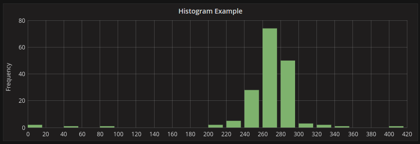

- [Decoding PromQL: A Deep Dive into Prometheus Query Language](#decoding-promql-a-deep-dive-into-prometheus-query-language)
  - [Introduction to PromQL](#introduction-to-promql)
  - [Data Types of PromQL](#data-types-of-promql)
    - [Scalar:](#scalar)
    - [String:](#string)
    - [Instant Vector:](#instant-vector)
    - [Range Vector:](#range-vector)
  - [Operators in PromQL](#operators-in-promql)
    - [Aggregation Operators:](#aggregation-operators)
    - [Binary Operators:](#binary-operators)
    - [Range Operator:](#range-operator)
    - [Offset Operator:](#offset-operator)
  - [Types of Prometheus Metrics for Data Storage and Organization](#types-of-prometheus-metrics-for-data-storage-and-organization)
    - [Counter:](#counter)
    - [Gauge:](#gauge)
    - [Histogram:](#histogram)
    - [Summary:](#summary)
  - [Begin Your Monitoring Journey!](#begin-your-monitoring-journey)
---


# Decoding PromQL: A Deep Dive into Prometheus Query Language
---
## Introduction to PromQL

PromQL, short for Prometheus Query Language, is the dedicated language designed for **querying** and **extracting valuable insights** from the **time-series** data stored in Prometheus. As the backbone of Prometheus' querying capabilities, PromQL enables users to navigate and analyze metrics, providing a powerful tool for **monitoring** and **troubleshooting.** This section will provide a foundational understanding of PromQL, setting the stage for exploring its various aspects and applications in the realm of system observability.

## Data Types of PromQL

PromQL has **scalar**, **instant vector**, **range vector**, **string**, and **boolean** data types for **querying** and **analyzing** Prometheus metrics.

Lets explore each in detail.

### Scalar:

The scalar data type in Prometheus Query Language (PromQL) represents a single numeric value at a specific point in time. Scalars are fundamental to expressing instantaneous measurements or metrics that don't vary over a range.

**Key characteristics of the scalar data type:**

1. **Single Value:** Scalars represent a solitary numeric value at a specific instance in time, offering a snapshot of a metric's value without time series information.

2. **Direct Representation:** Scalars are direct representations of metrics' current states, making them suitable for instantaneous measurements such as the current CPU load, available memory, or a count at a specific time.

3. **Fundamental Building Block:** Scalars serve as fundamental components for arithmetic operations, comparisons, and as basic inputs for computations and analyses within PromQL.

**Here are examples illustrating the characteristics of the scalar data type in PromQL:**


1. **Single Value:**
   
     ```
     cpu_temperature
     ```
   - Returns the current temperature of the CPU as a scalar value, representing the temperature at the latest timestamp.
   

2. **Direct Representation:**
   
     ```
     available_memory_bytes
     ```
   - The query returns the current available memory in bytes as a scalar, providing a direct representation of the available memory at the latest observation.
   

3. **Fundamental Building Block:**
   
     ```
     cpu_usage + memory_usage
     ```
   - In this example, the query adds the current CPU usage and memory usage, leveraging scalars as fundamental building blocks for arithmetic operations and analysis.
   
### String:

The string data type in Prometheus represents a sequence of characters and is commonly used for labeling and metadata in the metric data model.

**Key characteristics of the string data type in Prometheus:**

1. **Character Sequence:** Strings represent a sequence of characters, which can include letters, numbers, symbols, and whitespace.

2. **Labeling:** Strings are commonly used as labels in the metric data model, providing additional context or categorization for time series data.

3. **Metadata:** Strings serve as a means to convey metadata information, such as labels describing service names, instance identifiers, or any descriptive information associated with a metric.

4. **Quoting:** Strings in PromQL are enclosed in either single quotes (`'`) or double quotes (`"`), and they are used to define label values or string literals in queries.

**Here are examples illustrating the characteristics of the string data type in Prometheus:**

1. **Character Sequence:**
   ```plaintext
   'service_name'
   ```
   - This string literal represents the character sequence 'service_name' and might be used as a label value.

2. **Labeling:**
   ```plaintext
   http_requests_total{environment="production"}
   ```
   - In this query, the string "production" is used as a label value to filter for HTTP requests in the production environment.

3. **Metadata:**
   ```plaintext
   instance="webserver-01"
   ```
   - This string label provides metadata about the specific instance 'webserver-01' associated with a metric.

4. **Quoting:**
   ```plaintext
   "metric_name" or 'metric_name'
   ```
   - Strings in PromQL are enclosed in either single or double quotes, as shown in these examples defining the string literals "metric_name" or 'metric_name'.

5. **Usage:**
   ```plaintext
   up{job="api", environment='staging'}
   ```
   - This query selects time series with the label "job" having the value "api" and the label "environment" having the value 'staging'.

### Instant Vector:

The instant vector in Prometheus is a set of time series data, each associated with a single value at a specific point in time. Instant vectors are commonly used in PromQL queries to retrieve and analyze metric values at a specific timestamp.

**Key characteristics of the instant vector:**

1. **Snapshot in Time:** Instant vectors represent a snapshot of metric values at a specific timestamp, providing a point-in-time view of the data.

2. **Single Value per Time Series:** Each time series within an instant vector contains a single value corresponding to the specified timestamp.

3. **Time Series Selection:** Queries using instant vectors can filter and aggregate time series based on labels, allowing for targeted analysis of specific metrics.

4. **Mathematical Operations:** Instant vectors can be involved in mathematical operations, enabling calculations, comparisons, and transformations within PromQL queries.


**Here are examples illustrating the characteristics of the instant vector data type in Prometheus:**


1. **Current CPU Usage:**
   ```plaintext
   cpu_usage
   ```
   - This query returns an instant vector representing the current CPU usage for all relevant time series.

2. **High Memory Utilization Instances:**
   ```plaintext
   node_memory_MemUsage_bytes > 80e9
   ```
   - The query filters instant vectors to select time series where the memory usage exceeds 80 gigabytes.

3. **Rate of HTTP Requests:**
   ```plaintext
   rate(http_requests_total[5m])
   ```
   - This query calculates the per-second rate of HTTP requests over the last 5 minutes, returning an instant vector.

4. **Combined Network Traffic:**
   ```plaintext
   sum(rate(network_traffic_bytes{direction="in"}[1h])) + sum(rate(network_traffic_bytes{direction="out"}[1h]))
   ```
   - The query computes the sum of the rates of incoming and outgoing network traffic over the last hour, providing an instant vector.

### Range Vector:

The Range Vector in Prometheus is a set of time series data, each associated with a range of values over a specified time interval. Range Vectors are commonly used in PromQL queries to analyze and evaluate metrics over a duration, allowing for calculations, aggregations, and comparisons over time.

Key characteristics of the Range Vector data type:

1. **Time Series Over a Range:**
   - The Range Vector provides a set of time series data, each representing a range of values over a specified time interval.

2. **Single Value per Time Series per Timestamp:**
   - Each time series within a Range Vector contains a set of values corresponding to multiple timestamps within the specified interval.

3. **Time Series Selection:**
   - Similar to instant vectors, Range Vectors can filter and aggregate time series based on labels for targeted analysis.

4. **Time Shifts:** 
   - PromQL allows for time shifting operations on Range Vectors, such as using the offset modifier to shift the time range, enabling comparison of values at different points in time.

5. **Alerting Conditions:** 
   - Range Vectors are commonly used in alerting conditions to detect and trigger alerts based on abnormal behavior or patterns observed over a defined duration.


**Here are examples illustrating the characteristics of the Range Vector data type in Prometheus:**


1. **Sum of HTTP Request Rates over the Last 5 Minutes:**
   ```plaintext
   sum(rate(http_requests_total[5m]))
   ```
   - This query calculates the sum of the per-second rate of HTTP requests over the last 5 minutes.

2. **Average CPU Usage over the Last Hour:**
   ```plaintext
   avg(cpu_usage_percent[1h])
   ```
   - The query computes the average CPU usage percentage over the last hour.

3. **Total Disk Space Used in Bytes over the Last 30 Minutes:**
   ```plaintext
   sum(node_filesystem_size_bytes - node_filesystem_free_bytes) offset 30m
   ```
   - This query determines the total disk space used by subtracting free space from total size over the last 30 minutes.

4. **Rate of Error Responses in the Past 15 Minutes:**
   ```plaintext
   rate(http_responses_error_total[15m])
   ```
   - The query calculates the per-second rate of error responses in HTTP requests over the past 15 minutes.

5. **Changes in Available Memory over the Last 10 Minutes:**
   ```plaintext
   changes(node_memory_MemAvailable_bytes[10m])
   ```
   - This query identifies the number of changes in available memory values over the last 10 minutes.

6. **90th Percentile Response Time for API Requests in the Last 20 Minutes:**
   ```plaintext
   histogram_quantile(0.9, rate(api_request_duration_seconds_bucket[20m]))
   ```
   - The query computes the 90th percentile response time for API requests over the last 20 minutes using a histogram.


**Boolean:**

The boolean data type in Prometheus represents true or false values and is commonly used in logical expressions and conditions within PromQL queries.

**Key characteristics of the boolean data type:**

1. **True or False:** Booleans can have two possible values: true or false, representing binary logic.

2. **Logical Operators:** Booleans are often used with logical operators such as `==` (equals), `!=` (not equals), `and`, `or`, and `unless` to construct conditional expressions in PromQL queries.

3. **Comparison Operators:** Boolean expressions often involve comparison operators like `<`, `>`, `<=`, and `>=` to evaluate conditions based on metric values.

4. **Filtering and Filtering Conditions:** Booleans are used to filter time series data based on specific conditions, allowing for selective analysis and alerting.


**Here are examples illustrating the characteristics of the Boolean data type in Prometheus:**

1. **Combining Conditions:**
   ```plaintext
   up == 1 and http_requests_total > 100
   ```
   - This query combines two conditions using the logical AND operator, checking if the `up` metric is equal to 1 and the `http_requests_total` metric is greater than 100.

2. **Negating Conditions:**
   ```plaintext
   not job{job="api"} == 0
   ```
   - Here, the `not` operator negates the condition, checking if any time series with the label `job` equal to "api" has a value not equal to 0.

3. **Conditional Expression:**
   ```plaintext
   rate(http_requests_total[5m]) > 10 or (node_memory_MemFree_bytes / node_memory_MemTotal_bytes) < 0.2
   ```
   - This query uses a conditional expression, checking if the per-second rate of HTTP requests over the last 5 minutes is greater than 10 or if the ratio of free memory to total memory is less than 0.2.


---

## Operators in PromQL

### Aggregation Operators:

They will only use **instant vectors** as **input** and **return** instant vectors as the operator's **output.** 
**`Aggregation (<instant vector>) => <instant vector>`**.

PromQL includes various aggregation operators that serve different purposes in summarizing and analyzing time series data. Here are some types of aggregation operators:

1. **Basic Aggregation:**
   - `sum()`: Calculates the total sum of values across time series.
   - `avg()`: Computes the average value across time series.
   - `min()`: Identifies the minimum value across time series.
   - `max()`: Identifies the maximum value across time series.
   - `count()`: Counts the number of time series matching a given condition.

2. **Rate and Increase:**
   - `rate()`: Calculates the per-second rate of increase for counters.
   - `increase()`: Computes the total increase in a counter over a specified time range.

3. **Statistical Aggregation:**
   - `stddev()`: Computes the standard deviation of values across time series.
   - `quantile()`: Calculates specified quantiles (e.g., 90th percentile) of values.

4. **Top and Bottom K:**
   - `topk()`: Identifies the top k time series based on a specified metric.
   - `bottomk()`: Identifies the bottom k time series based on a specified metric.

5. **Time Series Aggregation:**
   - `sum_over_time()`: Aggregates total sums over a specified time range.
   - `avg_over_time()`: Aggregates average values over a specified time range.
   - `min_over_time()`: Aggregates minimum values over a specified time range.
   - `max_over_time()`: Aggregates maximum values over a specified time range.


### Binary Operators:

1. **Arithmetic Binary Operators:**
   - `+` (Addition), `-` (Subtraction), `*` (Multiplication), `/` (Division)

2. **Comparison Binary Operators:**
   - `==` (Equal), `!=` (Not Equal), `<` (Less Than), `>` (Greater Than), `<=` (Less Than or Equal), `>=` (Greater Than or Equal)

3. **Logical Binary Operators:**
   - `and` (Logical AND), `or` (Logical OR), `unless` (Logical NOT)

4. **Set Binary Operators:**
   - `=~` (Regex Match), `!~` (Negative Regex Match)

5. **Mathematical Binary Operators:**
   - `^` (Exponentiation), `%` (Modulo)

### Range Operator:
With the range operator, you can specify a time duration that will filter vectors between now and specific timing.

`[time unit]`

**Time Durations Format:**
Time durations are specified as a number, followed immediately by one of the following units:

- `ms` - milliseconds
- `s` - seconds
- `m` - minutes
- `h` - hours
- `d` - days (assuming a day has always 24h)
- `w` - weeks (assuming a week has always 7d)
- `y` - years (assuming a year has always 365d)


### Offset Operator:
With offset, you can request the value from a certain amount of time before the moment the query was done.

1. **`offset` for Rate Shifting:**
   
   - Shifts the time range for rate comparison, allowing historical analysis. 
    
   ```
    rate(http_requests_total[5m]) > offset 1h rate(http_requests_total[5m])
    ```

2. **`offset` for Value Comparison:**
   - Compares metric values at different time ranges, aiding in trend analysis.
    
   ```
   cpu_temperature > offset 1d cpu_temperature
   ```

3. **`offset` for Rate of Change:**
   - Utilizes offset to compare the rate of change in metrics over time. 
   
   ```
   rate(cpu_usage[1h]) - rate(cpu_usage[2h])
   ```

4. **`offset` for Historical Comparisons:**
   - Enables historical comparisons of metric values over a specified time range. 
    
   ```
    http_requests_total > offset 7d http_requests_total
   ```


## Filter Data with the @ modifier in PromQL

The `@` modifier in PromQL is used to query the value of a time series at a specific timestamp. It allows retrieving the value of a metric at a precise point in time.

Lets understand it through an example

```plaintext
http_requests_total @ 1632315600
```

In this example, `@ 1632315600` retrieves the value of the `http_requests_total` metric at the UNIX timestamp 1632315600 (representing a specific moment in time).

This enables querying historical or specific values of metrics at exact timestamps for analysis or comparison purposes.

---

## Types of Prometheus Metrics for Data Storage and Organization

Prometheus metrics primarily come in four types: **Counter**, **Gauge**, **Histogram**, **Summary.**

Lets explore each in detail.

### Counter:
A Prometheus Counter is a metric type that represents a **cumulative value** that can **only monotonically increase** over time.

<div style="text-align:center;">
  
</div>


**Key characteristics of a Prometheus Counter:**

1. **Monotonicity:** Counters always move in the positive direction, starting from zero and increasing over time. They do not decrease.

2. **Cumulative:** Counters represent cumulative values, making them suitable for tracking totals or counts of events that continuously accumulate.

3. **No Arbitrary Units:** Counters are dimensionless and have no specific unit attached to them. They represent a simple count or quantity.

4. **Common Use Cases:** Counters are often used for measuring the total number of occurrences of an event, such as request counts, error counts, or other cumulative metrics in a system.

5. **Querying for Rate:** Derivative operations in queries are commonly applied to counters to calculate rates of change over time, providing insights into the frequency of events.

**Example Queries**

1. **Total Count:**
   ```plaintext
   http_requests_total
   ```

   - Returns the total count of HTTP requests.

2. **Rate of Change (Requests Per Second):**
    ```plaintext
    rate(http_requests_total[1m])
    ```
   - Calculates the rate of change of HTTP requests per second over the last 1 minute.

3. **Error Rate as a Percentage:**
    ```
    100 * (http_errors_total / http_requests_total)
    ```
   - Calculates the percentage of HTTP requests that resulted in errors.

4. **Increase in Count Since Last Hour:**
    ```
    increase(http_requests_total[1h])
    ```
   -  Shows the total increase in HTTP requests count over the last hour.

### Gauge:

A gauge is a metric that represents a single numerical value that can arbitrarily go up and down.

Gauges are typically used for measured values like temperatures or current memory usage, but also "counts" that can go up and down, like the number of concurrent requests.


<div style="text-align:center;">
  
</div>


**Key characteristics of a Gauge:**

1. **Non-Cumulative:** Gauges do not accumulate values over time; they represent the latest observed value at a specific point in time.

2. **Fluctuating Values:** Gauges can capture fluctuations in a metric, making them ideal for metrics that may vary, such as CPU usage, memory utilization, or the number of active connections.

3. **No Automatic Resets:** Gauges retain their last observed value until a new value is recorded. They do not reset automatically, allowing continuous monitoring of changing conditions.

4. **Arbitrary Units:** Gauges can have arbitrary units based on the metric they measure. For example, a gauge measuring temperature might have units in degrees Celsius or Fahrenheit.


**Example Queries**

1. **Current CPU Usage:**
   
   ```
   cpu_usage 
   ```
   - Returns the current CPU usage as a gauge value.


2. **Average Memory Utilization over 5 Minutes:**
   
    ```
    avg_over_time(memory_usage[5m])
    ```
   - Calculates the average memory utilization as a gauge value over the last 5 minutes.

3. **Number of Active Connections:**
   
    ```
    http_connections
    ```
   - Retrieves the current count of active HTTP connections as a gauge value.

4. **Disk Space Utilization:**
   
    ```
    100 - (disk_free / disk_total) * 100
    ```
   - Calculates the disk space utilization percentage as a gauge value.

### Histogram:

A Prometheus Histogram is a metric type used to sample and observe the distribution of values in a dataset. It is particularly useful for measuring the spread of data, such as response times or request latencies. Histograms automatically bucketize data into configurable ranges (buckets) and provide aggregated information about the data distribution, including count, sum, and quantiles.


<div style="text-align:center;">
  
</div>


**Key characteristics of a Prometheus Histogram:**

1. **Bucketization:** Histograms automatically group observed values into predefined buckets based on their magnitudes. Each bucket represents a range of values.

2. **Dynamic Ranges:** Histograms allow dynamic adjustments of bucket ranges, making them adaptable to changes in the data distribution.

3. **Non-Cumulative:** Unlike counters, histograms do not accumulate values over time. They provide a snapshot of the data distribution at the time of observation.

4. **Bucket Labels:** Each bucket is labeled with an upper bound (`le` label) representing the maximum value that falls into that bucket.

5. **Querying Percentiles:** Prometheus provides functions like **`histogram_quantile`** to query specific percentiles of a histogram, allowing users to analyze the distribution of values.


**Example Queries**

1. **Average Duration:**
   
    ```
    rate(http_request_duration_seconds_sum[1m]) / rate(http_request_duration_seconds_count[1m])
    ```
   - Calculates the average duration of HTTP requests over the last 1 minute.

2. **90th Percentile Response Time:**
   
    ```
    histogram_quantile(0.9, sum(rate(http_request_duration_seconds_bucket[1m])) by (le))
    ```
   - Retrieves the 90th percentile response time of HTTP requests over the last 1 minute.

3. **Bucket Counts:**
   
   ```
   http_request_duration_seconds_count
   ```
   - Returns the count of HTTP requests in each bucket of the duration histogram.

4. **Sum of Request Durations in Top 3 Buckets:**

    ```
    sum(http_request_duration_seconds_bucket{le=~"0.1|0.5|1.0"})
    ```
   - Calculates the sum of request durations in the top 3 buckets (0.1s, 0.5s, 1.0s) of the duration histogram.
   
### Summary:

A Prometheus Summary is a metric type designed to measure and track the distribution of observed values over time, particularly for quantiles and other percentile-based analyses. Similar to histograms, summaries provide insights into the variability and spread of data, but they do so by calculating quantiles over a sliding time window. Summaries are useful for monitoring metrics with changing distributions, such as request latencies.


**Key characteristics of a Summary:**

1. **Dynamic Ranges:** Summaries allow dynamic adjustments of quantile ranges, making them adaptable to changes in the data distribution.

2. **No Explicit Bucketization:** Unlike histograms, summaries do not use predefined buckets. Instead, they directly calculate quantiles from the observed values.

3. **Count and Sum:** Summaries track the count of observations and the sum of observed values over time, providing aggregated information for the entire dataset.

4. **Non-Cumulative:** Similar to histograms, summaries do not accumulate values over time. They offer a snapshot of the data distribution within the specified time window.

5. **Querying Percentiles:** Prometheus provides functions like `quantile` to query specific percentiles of a summary, enabling users to analyze the distribution of values.

**Example Queries**

1. **Average Duration over Last 5 Minutes:**

   ```
   rate(http_request_duration_seconds_sum[5m]) / rate(http_request_duration_seconds_count[5m])
   ```
   - Calculates the average duration of HTTP requests over the last 5 minutes.

2. **90th Percentile Response Time:**
   
   ```
   quantile(0.9, http_request_duration_seconds)
   ```
   - Retrieves the 90th percentile response time of HTTP requests.

3. **Count of Requests in the Last Hour:**
   
   ```
   http_request_duration_seconds_count[1h]
   ```
   - Returns the count of HTTP requests observed in the last hour.

4. **Sum of Response Durations in the Last 10 Minutes:**
   
   ```
   sum(rate(http_request_duration_seconds_sum[10m]))
   ```
   - Calculates the sum of response durations for HTTP requests over the last 10 minutes.

---

## Begin Your Monitoring Journey! 

Get ready to navigate your metrics with **confidence!** Stay tuned for more insights, tips, and tricks to keep your monitoring game strong. Keep exploring, keep learning, and keep monitoring! **Happy monitoring!** 📊👀😊


