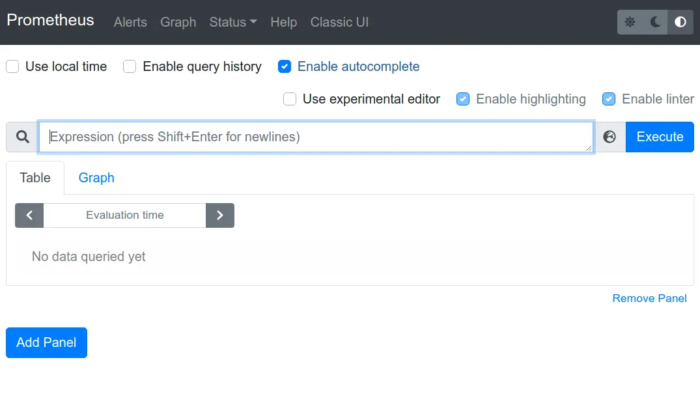

# Table of Contents

- [Table of Contents](#table-of-contents)
  - [What Is Prometheus?](#what-is-prometheus)
    - [Why Do We Need Prometheus?](#why-do-we-need-prometheus)
  - [Prometheus Architecture: In K8S](#prometheus-architecture-in-k8s)
  - [Deploying Prometheus on Kubernetes](#deploying-prometheus-on-kubernetes)
    - [Create a Namespace for Monitoring](#create-a-namespace-for-monitoring)
    - [Add Helm Repository](#add-helm-repository)
    - [Install kube-prometheus-stack Helm Chart in monitoring Namespace](#install-kube-prometheus-stack-helm-chart-in-monitoring-namespace)
    - [Verify Deployment](#verify-deployment)
    - [Access Prometheus Dashboard](#access-prometheus-dashboard)
    - [Access Grafana Dashboard](#access-grafana-dashboard)
    - [Login with the default credentials:](#login-with-the-default-credentials)
  - [Begin Your Monitoring Journey! 🚀](#begin-your-monitoring-journey-)


## What Is Prometheus?

Prometheus, an open-source monitoring toolkit, excels in dynamic system monitoring with a versatile data model and efficient time-series collection. Notable for its built-in alerting, adaptability, and strong community support, Prometheus empowers users to proactively manage and optimize system performance.

### Why Do We Need Prometheus?

Lets understand Through a **Real-World** Example.

**Scenario: Managing a Real-Time Messaging App**

Imagine overseeing a real-time messaging app connecting millions worldwide. The app includes services like user authentication, message processing, and notifications. As the user base grows, ensuring smooth communication becomes a top priority.

**Challenges:**

1. **Interconnected Services:**

   - Messaging involves many services working together. Understanding how each service affects communication is crucial but complicated.

2. **Variable Workloads:**

   - Messaging apps deal with fluctuating workloads, especially during peak times. Predicting the exact resources needed for optimal performance is tricky, requiring a flexible approach to scaling.

3. **Latency and Optimization:**
   - Fast message delivery is vital for a great user experience. Pinpointing services causing latency issues demands detailed insights often lacking in traditional monitoring tools.

**How Prometheus Helps:**

1. **Dynamic Service Discovery:**

   - Prometheus automatically discovers and monitors new services as the app scales. No manual setup is needed, ensuring all parts are effectively monitored.

2. **Flexible Monitoring:**

   - Prometheus adapts to changing workloads by collecting time-series data. This helps in closely monitoring performance and making smart decisions on resource allocation and scaling.

3. **Alerts for Latency:**
   - Using Prometheus's alerting, you can set rules to catch latency issues in specific services. Proactive alerts allow the team to address potential problems before users notice.

## Prometheus Architecture: In K8S

<div style="text-align:center;">
  
</div>

1. **Prometheus Server:**

   - Runs as a dedicated Pod in the Kubernetes cluster.
   - Scrapes and collects metrics from configured endpoints or services.
   - Utilizes Kubernetes ServiceMonitors or service discovery for dynamic service monitoring.

2. **Time-Series Database (TSDB):**

   - Serves as the repository for time-series data collected by Prometheus.
   - Configurable retention policies for efficient data storage.
   - Can use persistent volumes for data storage across Prometheus restarts.

3. **Alertmanager:**

   - Often deployed as a separate Pod alongside Prometheus.
   - Manages and dispatches alerts based on predefined rules and conditions.
   - Receives alerts from Prometheus for forwarding to various channels.

4. **Exporters:**

   - Agents or sidecar containers exposing metrics from Kubernetes pods or services.
   - Types include Node Exporter, kube-state-metrics, and others for collecting specific metrics.

5. **Service Discovery:**

   - Kubernetes ServiceMonitors facilitate automatic service discovery and monitoring based on labels.

6. **Grafana Integration:**
   - Used with Prometheus for advanced metric visualization.
   - Offers pre-configured dashboards for rich and customizable visual representations.

## Deploying Prometheus on Kubernetes

To set up Prometheus and its related components on your Kubernetes cluster, follow these steps:

###  Create a Namespace for Monitoring

```bash
kubectl create namespace monitoring
```

### Add Helm Repository

```bash
helm repo add prometheus-community https://prometheus-community.github.io/helm-charts
helm repo update
```

### Install kube-prometheus-stack Helm Chart in monitoring Namespace

```bash
helm install prometheus-stack prometheus-community/kube-prometheus-stack -n monitoring
```

### Verify Deployment

Wait for the deployment to complete, and then check the status:

```bash
kubectl get pods -n monitoring
```

### Access Prometheus Dashboard

```bash
kubectl port-forward svc/prometheus-stack-prometheus -n monitoring 9090:9090
```

Open your web browser and navigate to **`http://localhost:9090`** to access the **Prometheus dashboard.**

<div style="text-align:center; margin-bottom: 20px;">
  
</div>


Remember to keep the port-forwarding terminal open as long as you need to access the dashboard.

### Access Grafana Dashboard

Use the following command to port forward to the Grafana service:

```bash
kubectl port-forward svc/prometheus-stack-grafana -n monitoring 8080:80
```

Open your web browser and navigate to **`http://localhost:8080.`**

<div style="text-align:center;">
  
</div>


### Login with the default credentials:

**Username:** admin
**Password:** (Retrieve the password using the following command):

```bash
kubectl get secret prometheus-stack-grafana -n monitoring -o jsonpath='{.data.admin-password}' | base64 --decode ; echo
```
Understand the grafana UI by yourself. The following resources can be helpful.

  1. [Grafana Documentation](https://grafana.com/docs/)
  2. [ YOUTUBE LINK: Grafana Setup & Simple Dashboard ](https://www.youtube.com/watch?v=EGgtJUjky8w)

## Begin Your Monitoring Journey! 🚀

Start exploring system observability with Prometheus and Grafana. Learn from the [Grafana Documentation](https://grafana.com/docs/), set up Prometheus easily on Kubernetes, and join active communities. Whether you're experienced or new, keep learning to master these tools. Improve your systems and enjoy monitoring!📊👀😊

