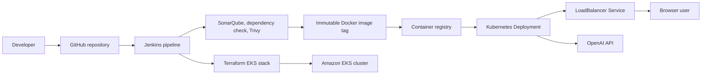

# Portfolio Runbook: OpenAI Chatbot on EKS

This project demonstrates a hardened delivery path for a Next.js chatbot UI: local development, container build, Jenkins quality gates, EKS infrastructure provisioning with Terraform, Kubernetes deployment, and controlled teardown.

## Architecture



## Configuration

Use examples as templates and keep real values out of git:

```bash
cp Chatbot-UI/.env.example Chatbot-UI/.env.local
cp Chatbot-UI/EKS-TF/terraform.tfvars.example Chatbot-UI/EKS-TF/terraform.tfvars
```

Key points:

- `ALLOW_SERVER_OPENAI_API_KEY=false` is the safer default because users provide their own key in the UI.
- If server-side fallback is required, set `ALLOW_SERVER_OPENAI_API_KEY=true` only in a secret manager, Jenkins credential, or Kubernetes Secret.
- Keep `terraform.tfvars`, kubeconfigs, API keys, and registry credentials outside source control.
- Replace placeholder resource names in `terraform.tfvars` with tagged AWS resources owned by this lab.

## Deploy

From `Chatbot-UI`:

```bash
npm ci
npm run lint
npm test -- --run
npm run build
docker build -t chatbot-ui:local .
```

From `Chatbot-UI/EKS-TF`:

```bash
terraform init
terraform fmt -check
terraform validate
terraform plan -var-file=terraform.tfvars
terraform apply -var-file=terraform.tfvars
aws eks update-kubeconfig --name "$(terraform output -raw cluster_name 2>/dev/null || echo <cluster-name>)" --region us-east-1
```

Deploy the workload:

```bash
kubectl apply -f ../k8s/chatbot-ui.yaml
kubectl rollout status deployment/chatbot
kubectl get svc chatbot-service
```

## Run Validation

```bash
kubectl get pods -l app=chatbot
kubectl describe deployment chatbot
kubectl port-forward deploy/chatbot 3000:3000
curl -fsS http://127.0.0.1:3000/api/health
```

Browser validation:

- Load the service DNS or local port-forward URL.
- Save a user-provided OpenAI API key in the UI.
- Send a short prompt and confirm a response.
- Confirm no server-side API key appears in browser devtools, logs, or repository files.

## Security Notes

- Build and deploy immutable image tags such as the Jenkins build number or git SHA; avoid mutable `latest` tags.
- Keep `imagePullPolicy: IfNotPresent` only for fixed tags; use `Always` when testing mutable tags.
- Review `k8s/chatbot-ui.yaml` before production use: probes, resource limits, non-root execution, dropped Linux capabilities, and `RuntimeDefault` seccomp are expected.
- Restrict Jenkins credentials to least privilege: registry push, EKS update, and Terraform state access should be separate credentials.
- Use `kubectl create secret generic chatbot-openai --from-literal=OPENAI_API_KEY=...` if server-side fallback is enabled, then reference the secret in the manifest.

## Cost Controls

- Keep node group desired capacity low for demos and destroy the cluster after validation.
- Prefer short-lived namespaces and fixed image tags so cleanup is predictable.
- Set AWS cost allocation tags on all prerequisite resources used by `EKS-TF`, for example `Project=project-28-openai-chatbot-eks`, `Environment=demo`, `Owner=<name>`, and `TTL=<date>`.
- Watch for LoadBalancer charges. Deleting only the Deployment is not enough; delete the Service or destroy Terraform-managed infrastructure.

## Destroy

```bash
kubectl delete -f Chatbot-UI/k8s/chatbot-ui.yaml --ignore-not-found
cd Chatbot-UI/EKS-TF
terraform destroy -var-file=terraform.tfvars
```

After destroy:

```bash
aws elbv2 describe-load-balancers --region us-east-1
aws eks describe-cluster --name <cluster-name> --region us-east-1
```

The EKS describe command should fail with `ResourceNotFoundException` after cleanup completes.
