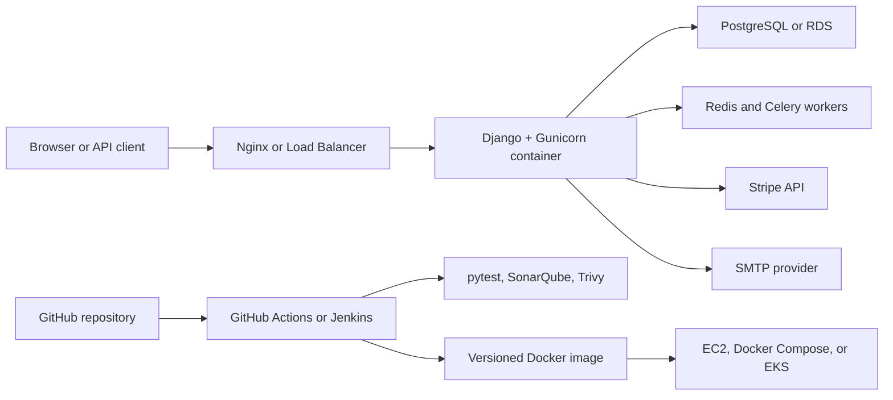

# Portfolio Runbook: Django SaaS Ecommerce

This project demonstrates a production-minded Django ecommerce service with local Docker execution, health checks, environment-driven settings, AWS EC2/Terraform deployment notes, Kubernetes deployment examples, and CI security scanning.

## Architecture



## Configuration

Start from the example file:

```bash
cp .env.example .env
```

Production expectations:

- `DEBUG=False`
- `DJANGO_SECRET_KEY` comes from a secret manager or CI/CD secret store.
- `ALLOWED_HOSTS` contains only the production hostnames and load balancer DNS names.
- `SECURE_SSL_REDIRECT=True`, `SESSION_COOKIE_SECURE=True`, and `CSRF_COOKIE_SECURE=True` when TLS terminates upstream.
- Database, Stripe, SMTP, and superuser credentials stay in runtime secrets, not committed files.

## Local Deploy

```bash
python3 -m venv .venv
. .venv/bin/activate
pip install -r requirements.txt
python manage.py check
python manage.py migrate
python manage.py test
docker compose up --build
```

Validate:

```bash
curl -fsS http://127.0.0.1:8585/healthz
curl -fsS http://127.0.0.1:8585/swagger/
```

## AWS EC2 Terraform Deploy

The EC2 Terraform example lives in `deployments/terraform/terraform-aws-ec2-tf/terraform`.

```bash
cd deployments/terraform/terraform-aws-ec2-tf/terraform
cp terraform.tfvars.example terraform.tfvars
terraform init
terraform fmt -check
terraform validate
terraform plan -var-file=terraform.tfvars
terraform apply -var-file=terraform.tfvars
```

Before applying, lock down ingress in `variables.tf` or an override tfvars file. SSH, PostgreSQL, Jenkins, and application ports should not stay open to `0.0.0.0/0` outside a throwaway lab.

## Kubernetes Deploy

The root `deployment.yaml` is a tutorial manifest. For a portfolio-grade deployment:

- Replace the image tag with an immutable release tag.
- Inject Django settings through Kubernetes Secrets and ConfigMaps.
- Add readiness/liveness probes against `/healthz`.
- Use a managed database instead of a database container in the app pod.
- Put TLS and host routing behind an ingress controller or managed load balancer.

```bash
kubectl apply -f deployment.yaml
kubectl rollout status deployment/prodxcloud-django-web
kubectl get svc load-balancer
```

## Security Notes

- Never commit `.env`, private keys, kubeconfigs, or Terraform state.
- Keep `DJANGO_CREATE_SUPERUSER=false` by default and create admin users through a controlled one-off task.
- Run `python manage.py check --deploy` before production.
- Run image and filesystem scans in CI: Trivy, Grype, or equivalent.
- Use least-privilege IAM for deployment automation and separate build credentials from runtime secrets.

## Cost Controls

- Prefer `t3.micro` or `t3.small` for demos and stop or destroy EC2 instances after validation.
- Use RDS only when needed; local Docker PostgreSQL is cheaper for demos.
- Add AWS tags to EC2, security groups, volumes, RDS, and load balancers: `Project=project-47-django-saas-ecommerce`, `Environment=demo`, `Owner=<name>`, `ManagedBy=terraform`, and `TTL=<date>`.
- Avoid orphaned EBS volumes, Elastic IPs, NAT gateways, and load balancers after test runs.

## Destroy

```bash
docker compose down --remove-orphans
kubectl delete -f deployment.yaml --ignore-not-found
cd deployments/terraform/terraform-aws-ec2-tf/terraform
terraform destroy -var-file=terraform.tfvars
```

Then confirm there are no leftover public endpoints, EC2 instances, unattached volumes, or load balancers for this project tag set.
