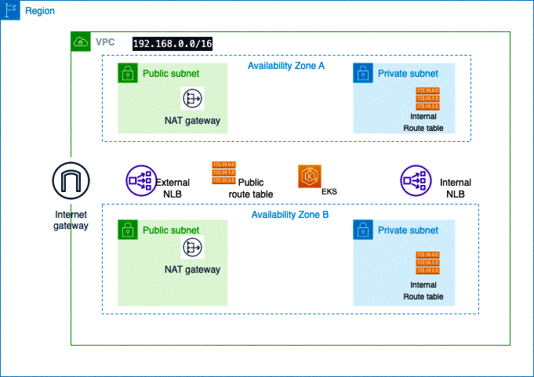

# TERRAFORM + AWS + EKS 
```
𝘈𝘶𝘵𝘰𝘮𝘢𝘵𝘦 𝘗𝘳𝘰𝘷𝘪𝘴𝘪𝘰𝘯𝘪𝘯𝘨 𝘰𝘧 𝘒𝘶𝘣𝘦𝘳𝘯𝘦𝘵𝘦𝘴 𝘊𝘭𝘶𝘴𝘵𝘦𝘳𝘴 𝘰𝘯 𝘈𝘞𝘚 𝘸𝘪𝘵𝘩 𝘛𝘦𝘳𝘳𝘢𝘧𝘰𝘳𝘮
```

## 🛡️ 2026 DevSecOps Enhancements (What You Will Learn)
This repository contains raw Terraform code for EKS provisioning. In a 2026 DevSecOps context, raw IaC execution is prohibited without the following guardrails:
1. **IaC Static Analysis:** Before `terraform apply` is ever run, the code must be scanned by tools like **tfsec**, **kics**, or **checkov** within the CI pipeline to ensure the EKS cluster isn't provisioned with public API endpoints or unencrypted EBS volumes.
2. **OpenTofu Migration:** Due to Terraform's licensing changes, 2026 DevSecOps standards heavily favor **OpenTofu** as the open-source, drop-in replacement for Terraform to maintain vendor neutrality and community-driven governance.

## Architectural Design



For a text-based architecture diagram, deploy/destroy workflow, security notes, run validation, tagging guidance, and cost controls, see [docs/portfolio-runbook.md](docs/portfolio-runbook.md).

## Deploy Notes

The public EKS API allow list is controlled by `cluster_endpoint_public_access_cidrs`. The default is the documentation CIDR `203.0.113.0/24`; replace it with your current operator/admin IP before planning:

```bash
cp terraform.tfvars.example terraform.tfvars
terraform plan -var-file=terraform.tfvars
```

The Kubernetes sample no longer stores database passwords directly in `deployment.yaml`. Create a real secret from the template before applying the workload:

```bash
cp db-secret.template.yaml db-secret.yaml
# edit db-secret.yaml locally, then:
kubectl apply -f db-secret.yaml
kubectl apply -f deployment.yaml -f service.yaml
```

The deployment includes HTTP/TCP probes, resource requests/limits, and basic pod/container security contexts. For production, split MySQL into its own StatefulSet or use a managed database; the sidecar-style MySQL container remains here only to keep the tutorial self-contained.

## Thanks for watching

```
Harshhaa Vardhan Reddy
                           -- Devops Engineer 
```
