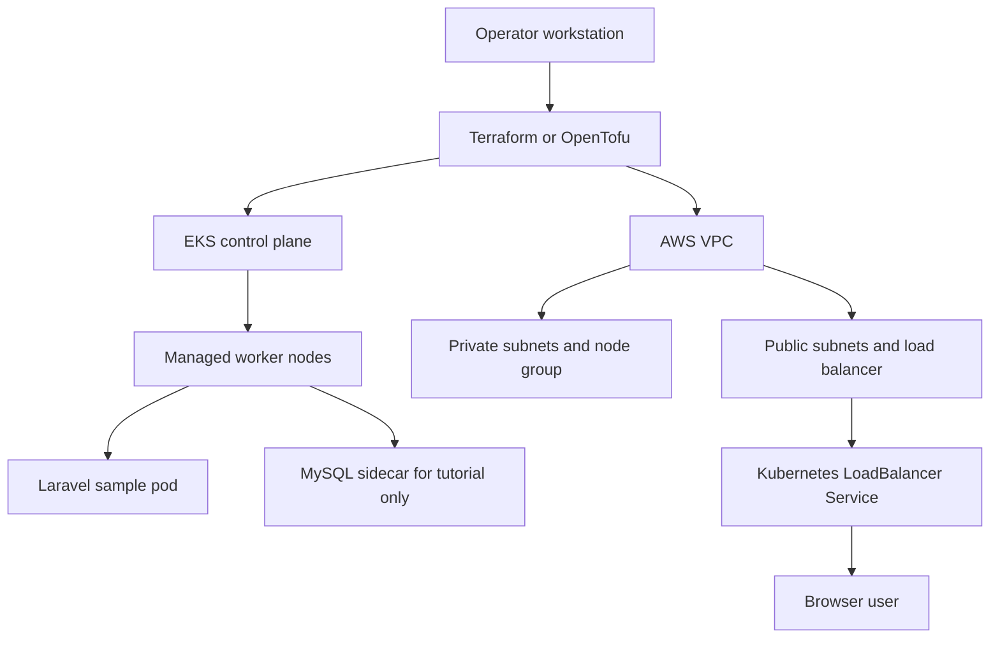

# Portfolio Runbook: Terraform AWS EKS

This project provisions an EKS cluster, VPC networking, managed node group, and a sample Kubernetes workload. The runbook is designed for a portfolio walkthrough where the cluster is created, validated, and destroyed in one session.

## Architecture



## Configuration

```bash
cp terraform.tfvars.example terraform.tfvars
```

Replace the API allow list with your current public IP:

```bash
curl -fsS https://checkip.amazonaws.com
```

Use `/32` CIDRs for individual operators where possible.

## Deploy

```bash
terraform init
terraform fmt -check
terraform validate
terraform plan -var-file=terraform.tfvars
terraform apply -var-file=terraform.tfvars
aws eks update-kubeconfig --name eks --region us-east-1
```

Create the database secret from the template, then deploy:

```bash
cp db-secret.template.yaml db-secret.yaml
# edit db-secret.yaml locally
kubectl apply -f db-secret.yaml
kubectl apply -f deployment.yaml -f service.yaml
kubectl rollout status deployment/laravel
```

## Run Validation

```bash
kubectl get nodes -o wide
kubectl get pods -l app=laravel
kubectl describe deployment laravel
kubectl get svc laravel-service
```

Application validation:

```bash
kubectl port-forward deploy/laravel 8080:80
curl -fsS http://127.0.0.1:8080/
```

Infrastructure validation:

```bash
aws eks describe-cluster --name eks --region us-east-1 --query 'cluster.resourcesVpcConfig.publicAccessCidrs'
aws ec2 describe-tags --filters "Name=value,Values=*eks*"
```

## Security Notes

- Keep `cluster_endpoint_public_access_cidrs` narrow; do not use `0.0.0.0/0`.
- Keep worker nodes in private subnets and expose only the Kubernetes Service or ingress layer.
- Treat `db-secret.yaml` as local-only. Commit only `db-secret.template.yaml`.
- The sample MySQL sidecar keeps the tutorial self-contained. Production should use RDS or a separate StatefulSet with storage, backups, and rotation.
- Run IaC scanning before apply: `checkov -d .`, `tfsec .`, or `trivy config .`.

## Cost Controls

- The managed node group is intentionally sized at one `t3.small`; keep it that way for demos.
- NAT gateways, LoadBalancers, and EBS volumes can continue billing after app tests. Destroy quickly after validation.
- Add or preserve tags for cost allocation: `Project=project-48-terraform-aws-eks`, `Environment=demo`, `Owner=<name>`, `ManagedBy=terraform`, and `TTL=<date>`.
- Prefer short-lived applies. Record screenshots and command output, then destroy the stack.

## Destroy

```bash
kubectl delete -f service.yaml -f deployment.yaml --ignore-not-found
kubectl delete -f db-secret.yaml --ignore-not-found
terraform destroy -var-file=terraform.tfvars
```

After destroy:

```bash
aws eks describe-cluster --name eks --region us-east-1
aws elbv2 describe-load-balancers --region us-east-1
```

The cluster lookup should fail after Terraform finishes. Investigate any remaining load balancers or volumes immediately.
