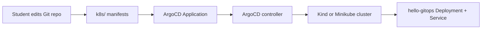

# Project 50: ArgoCD GitOps Home Lab


Student-friendly GitOps lab for running a simple Kubernetes app locally with Kind or Minikube and deploying it through ArgoCD.

## What You Learn

- How GitOps differs from manual `kubectl apply`
- How ArgoCD watches Git and reconciles cluster state
- How to structure app manifests for dev/staging style promotion
- How sync, drift, rollback, and health checks work

## Architecture



## Prerequisites

- Docker
- Kind for the one-command workflow, or Minikube if you prefer manual setup
- `kubectl`
- ArgoCD CLI, optional but useful

## One-Command Local Workflow

```bash
make validate
make up
make logs
make down
```

`make up` creates a local Kind cluster named `gitops-lab`, installs ArgoCD, and applies `argocd/application.yaml`.

## Manual Quick Start

```bash
kind create cluster --name gitops-lab
kubectl create namespace argocd
kubectl apply -n argocd -f https://raw.githubusercontent.com/argoproj/argo-cd/stable/manifests/install.yaml
kubectl wait --for=condition=available --timeout=180s deployment/argocd-server -n argocd
kubectl apply -f argocd/application.yaml
kubectl get applications -n argocd
```

Update `argocd/application.yaml` so `repoURL` points to your fork before using it with a real GitHub repo.

## Validation

```bash
make validate
```

This parses the Kubernetes and ArgoCD YAML locally, so it works before a cluster or ArgoCD CRD exists.

## Troubleshooting

- `no matches for kind "Application"`: install ArgoCD before applying the manifest to a cluster; `make validate` is only a local YAML check.
- `repoURL` sync fails: fork this repository and update `argocd/application.yaml` to your fork URL and branch.
- App namespace missing: confirm `syncOptions` still includes `CreateNamespace=true`.
- Kind cluster already exists: run `make down`, or use `CLUSTER=my-gitops-lab make up`.

## Cleanup

```bash
make down
```

For Minikube users:

```bash
minikube delete
```

## Stretch Goals

- Add a `staging` overlay.
- Add ArgoCD sync waves.
- Add image automation.
- Break the deployment and use ArgoCD rollback.
