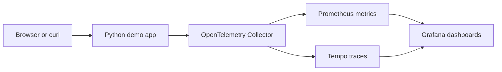

# Project 51: OpenTelemetry Observability Home Lab


Docker Compose lab for learning traces, metrics, and logs with a small Python app, OpenTelemetry Collector, and Grafana LGTM components.

## What You Learn

- How an app emits telemetry
- What the OpenTelemetry Collector does
- How traces, logs, and metrics fit together
- How to run a local observability stack without cloud cost

## Architecture



## Prerequisites

- Docker
- Docker Compose plugin

## One-Command Local Workflow

```bash
make validate
make up
make logs
make down
```

Open:

- App: `http://localhost:8080`
- Grafana: `http://localhost:3000` with `admin` / `admin`
- Prometheus: `http://localhost:9090`

Generate traffic:

```bash
curl http://localhost:8080/
curl http://localhost:8080/slow
curl http://localhost:8080/error
```

## Validation

```bash
make validate
```

This runs `docker compose config` so students catch indentation, service, port, and volume mistakes before starting the stack.

## Troubleshooting

- Port conflict on `3000`, `8080`, or `9090`: stop the other local service or edit the left side of the port mapping in `docker-compose.yml`.
- Grafana has no data: run the `curl` commands above, then refresh Explore or dashboards.
- Collector cannot start: check `otel-collector.yaml` with `make logs` and confirm the mounted file path exists.
- Images take time on first run: the first `make up` pulls Grafana, Tempo, Prometheus, and Collector images.

## Cleanup

```bash
make down
```

This stops the containers and removes lab volumes so the next run starts clean.

## Student Exercises

- Add a new endpoint and create a custom span.
- Add a dashboard panel for request count.
- Change the collector pipeline to drop noisy logs.
- Add an alert for repeated `/error` calls.
