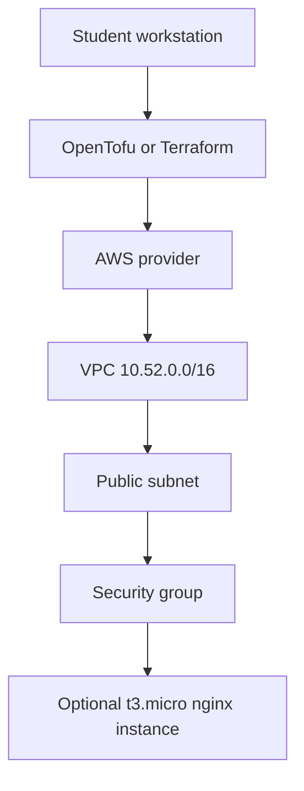

# Project 52: OpenTofu AWS Free-Tier Lab


Beginner-friendly infrastructure-as-code lab that creates a tiny AWS VPC, public subnet, security group, and optional free-tier EC2 instance with OpenTofu or Terraform.

## What You Learn

- How OpenTofu/Terraform plans and applies infrastructure
- How providers, variables, outputs, and state work
- Why tags and destroy steps matter for cost control
- How to keep cloud labs small and reviewable

## Architecture



## Cost Warning

This lab can create AWS resources. Use free-tier eligible instance types, confirm your region, restrict SSH to your own IP, and destroy everything when done.

## Prerequisites

- AWS account
- AWS CLI configured
- OpenTofu, or Terraform with `TF=terraform`

## One-Command Local Validation

```bash
make validate
```

Validation is local: it checks formatting, initializes providers without a backend, and runs `validate`. It does not create AWS resources.

## Review-Then-Apply Workflow

```bash
cp terraform.tfvars.example terraform.tfvars
make plan
make up
make logs
make down
```

Use Terraform instead of OpenTofu:

```bash
TF=terraform make validate
TF=terraform make plan
TF=terraform make up
TF=terraform make down
```

`make up` refuses to run until `make plan` has created `tfplan`, so students review the cloud changes first.

## Troubleshooting

- `tofu: command not found`: install OpenTofu or prefix commands with `TF=terraform`.
- AWS credential errors: run `aws sts get-caller-identity` and confirm the expected account appears.
- SSH is open to the world: set `allowed_ssh_cidr` in `terraform.tfvars` to your public IP with `/32`.
- Duplicate names or stale state: run `make logs` to inspect outputs, then `make down` when you are done.

## Cleanup

```bash
make down
rm -f tfplan
```

Always confirm the destroy plan before approving it.

## Student Exercises

- Add an S3 backend for remote state.
- Add a second subnet in another Availability Zone.
- Add a budget alarm.
- Convert the EC2 instance into a reusable module.
