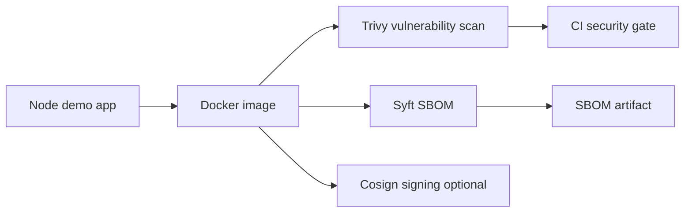

# Project 53: Supply Chain Security Lab


Student-friendly lab for learning image scanning, SBOM generation, and image signing concepts with GitHub Actions, Trivy, Syft, and Cosign.

## What You Learn

- How container images move through a security pipeline
- How to scan for vulnerabilities and secrets
- How to generate an SBOM
- Why image signing matters
- How CI gates protect deployments

## Architecture



## Prerequisites

- Node.js for local syntax validation
- Docker
- Trivy for vulnerability scanning
- Syft for SBOM generation
- Cosign, optional for signing

## One-Command Local Workflow

```bash
make validate
make up
make logs
make scan
make down
```

`make up` builds the local image and runs it at `http://localhost:8080`.

## Beginner Local Flow

```bash
docker build -t supply-chain-demo:local ./app
trivy image --severity HIGH,CRITICAL supply-chain-demo:local
syft supply-chain-demo:local -o spdx-json > sbom.spdx.json
```

Optional signing flow:

```bash
cosign generate-key-pair
cosign sign --key cosign.key supply-chain-demo:local
```

## Validation

```bash
make validate
```

This runs `node --check app/server.js` and parses the GitHub Actions workflow when PyYAML is installed.

## CI Flow

The sample workflow in `.github/workflows/security.yml` builds the image, scans it, and writes an SBOM artifact.

## Troubleshooting

- `trivy: command not found`: install Trivy, or run only `make validate` and `make up` for the beginner path.
- `syft: command not found`: install Syft before generating `sbom.spdx.json`.
- Docker cannot connect: start Docker Desktop or your local Docker engine.
- Signing a local image fails: push to a registry first, or use the signing step as a concept exercise.

## Cleanup

```bash
make down
rm -f sbom.spdx.json cosign.key cosign.pub
```

## Student Exercises

- Add a vulnerable dependency and watch Trivy fail.
- Add `.trivyignore` with a documented exception.
- Push the image to GHCR.
- Sign the GHCR image with keyless Cosign.
