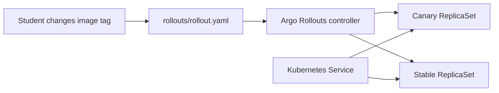

# Project 54: Progressive Delivery Home Lab


Local Kubernetes lab for learning canary releases and automated rollback with Argo Rollouts.

## What You Learn

- Why progressive delivery is safer than all-at-once deploys
- How canary steps work
- How service selectors route traffic during rollout
- How to pause, promote, and abort a rollout

## Architecture



## Prerequisites

- Docker
- Kind for the one-command workflow, or Minikube if you prefer manual setup
- `kubectl`
- Argo Rollouts kubectl plugin, optional but recommended

## One-Command Local Workflow

```bash
make validate
make up
make logs
make down
```

`make up` creates a local Kind cluster named `rollout-lab`, installs Argo Rollouts, and applies the sample rollout.

## Manual Quick Start

```bash
kind create cluster --name rollout-lab
kubectl create namespace argo-rollouts
kubectl apply -n argo-rollouts -f https://github.com/argoproj/argo-rollouts/releases/latest/download/install.yaml
kubectl wait --for=condition=available --timeout=180s deployment/argo-rollouts -n argo-rollouts
kubectl apply -f rollouts/
kubectl argo rollouts get rollout demo-rollout -n progressive-delivery --watch
```

Change the image tag in `rollouts/rollout.yaml`, apply it again, and watch the canary steps.

## Validation

```bash
make validate
```

This parses the namespace, service, and rollout YAML locally, so it works before a cluster or Argo Rollouts CRD exists.

## Troubleshooting

- `no matches for kind "Rollout"`: install Argo Rollouts before applying the manifest to a cluster; `make validate` is only a local YAML check.
- Rollout never progresses: check pod readiness with `make logs`, then inspect the image tag in `rollouts/rollout.yaml`.
- Argo Rollouts plugin missing: use `kubectl get rollout -n progressive-delivery` for a basic status view.
- Kind cluster already exists: run `make down`, or use `CLUSTER=my-rollout-lab make up`.

## Cleanup

```bash
make down
```

For Minikube users:

```bash
minikube delete
```

## Student Exercises

- Add an analysis template.
- Introduce a bad image tag and abort the rollout.
- Change canary weights.
- Compare this with a normal Kubernetes Deployment.
